WebアプリケーションエンジニアもAWSが使えて当たり前な時代になってきている中で、私自身はクラウド・インフラ関連のスキルが全然足りていないことを日々痛感しておりまして、一方でAWSのスキルを伸ばしたいけどHow？な状況なので、まずは第一歩としてAWSを使ってこのワードプレスのブログを公開する、ところまでを試行錯誤しながらやってみました。

結構なボリュームになってしまったので全3回に分けました。

* part1
    * EC2インスタンス起動 Elastic IPアドレス割当てまで
* [part2](../20210816-start-wordpress-part2)
    * part1で作成したEC2にDocker, docker-composeをインストール
    * docker-comopseでwordpress & MySQLを構築
* [part3](../20210817-start-wordpress-part3)
    * 独自ドメイン取得
    * Route53でDNS設定
    * Certificate Managerで証明書作成
    * ALB作成
    * 完成！

## EC2インスタンスを起動する

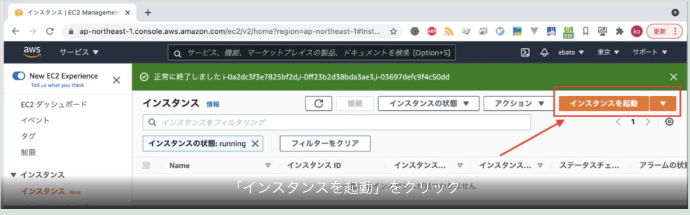

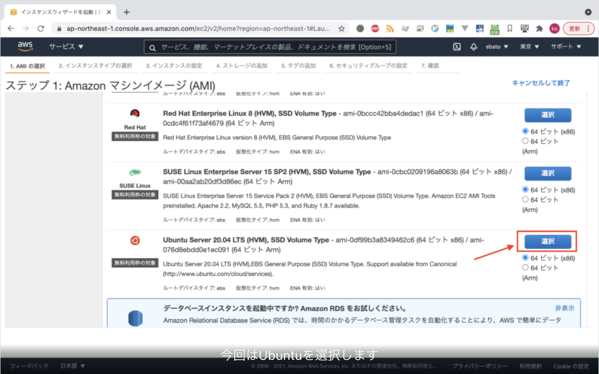

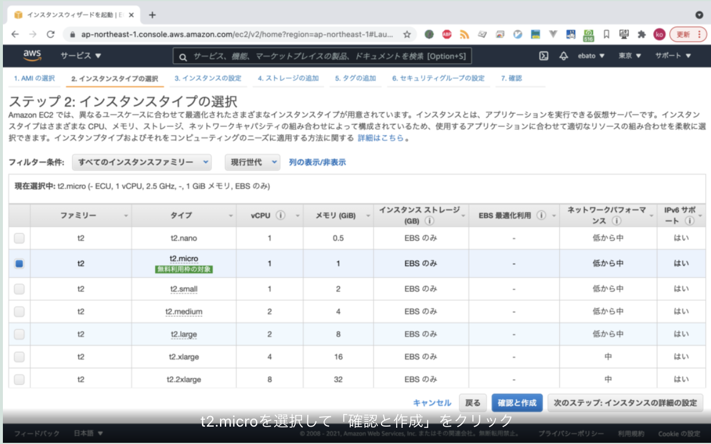

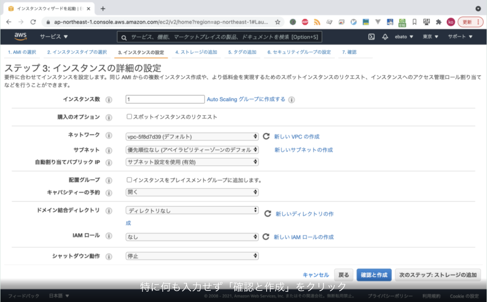

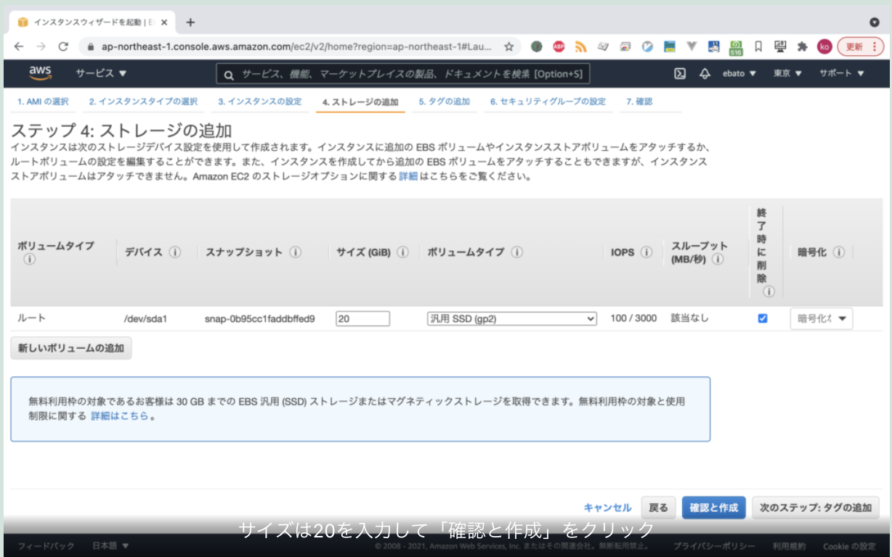

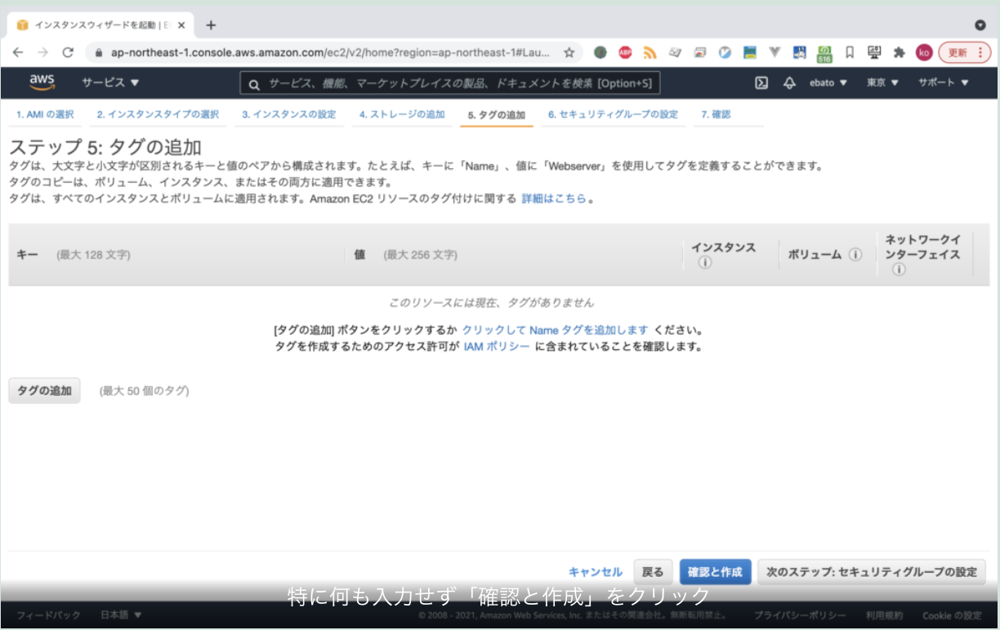

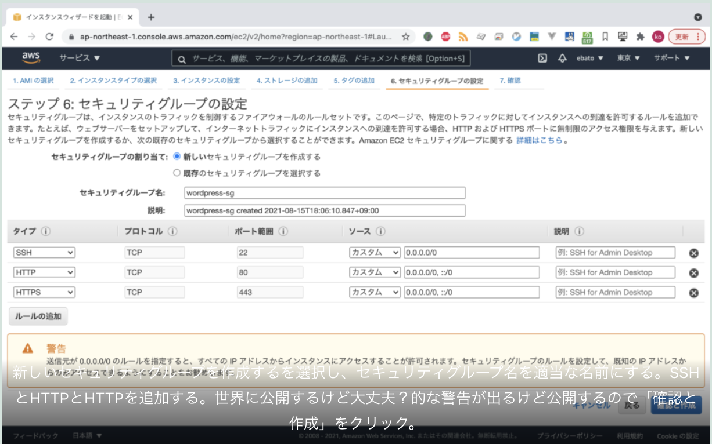

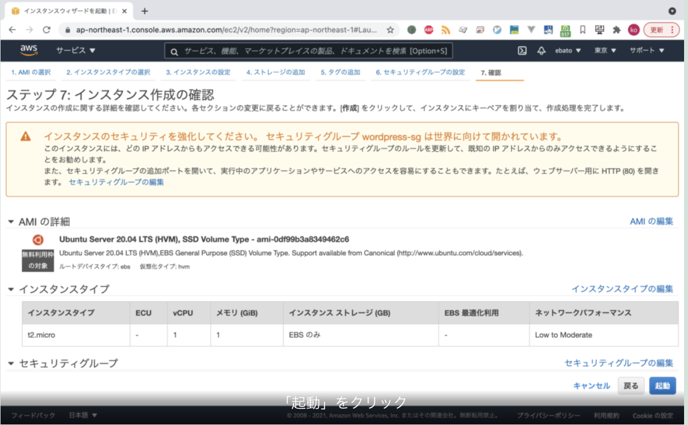

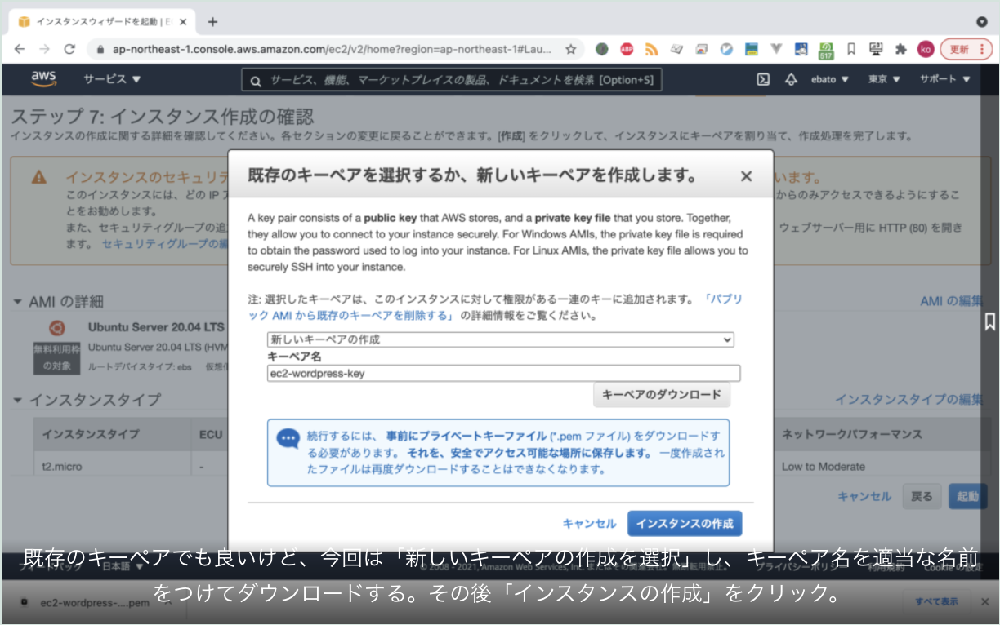

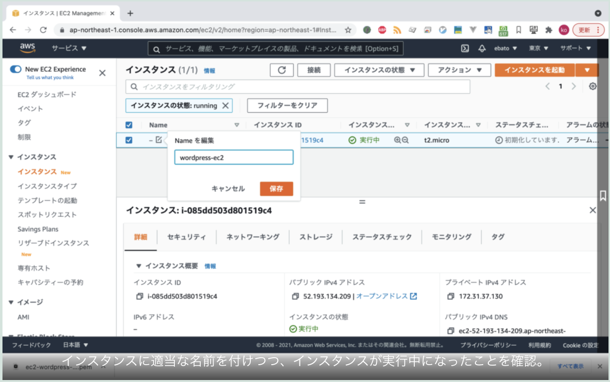

## ElasticIPアドレスを設定する

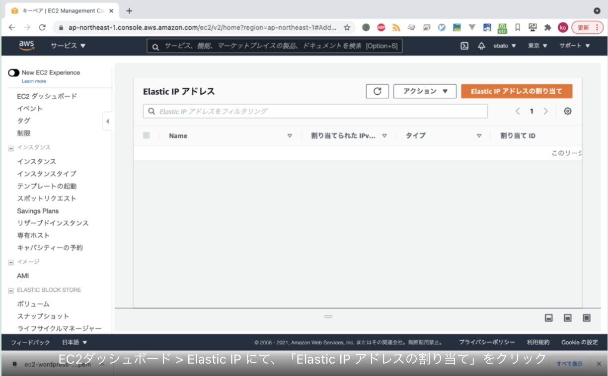

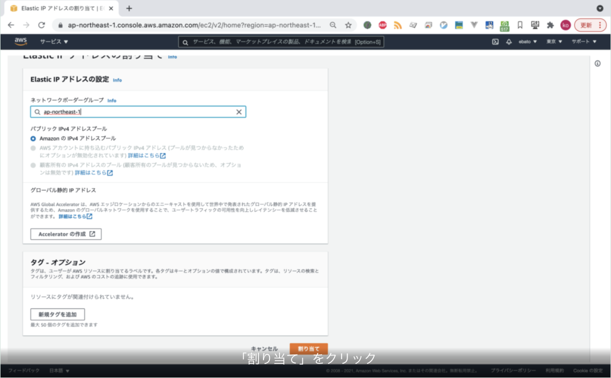

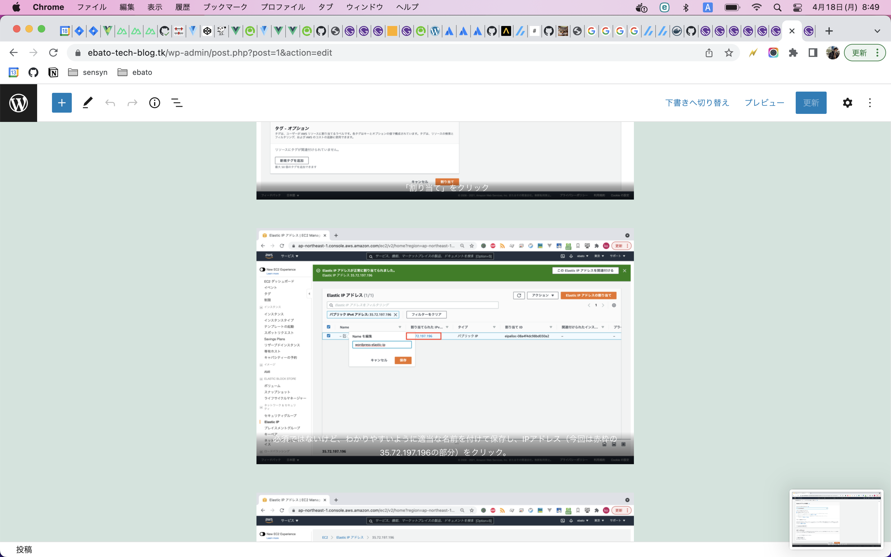

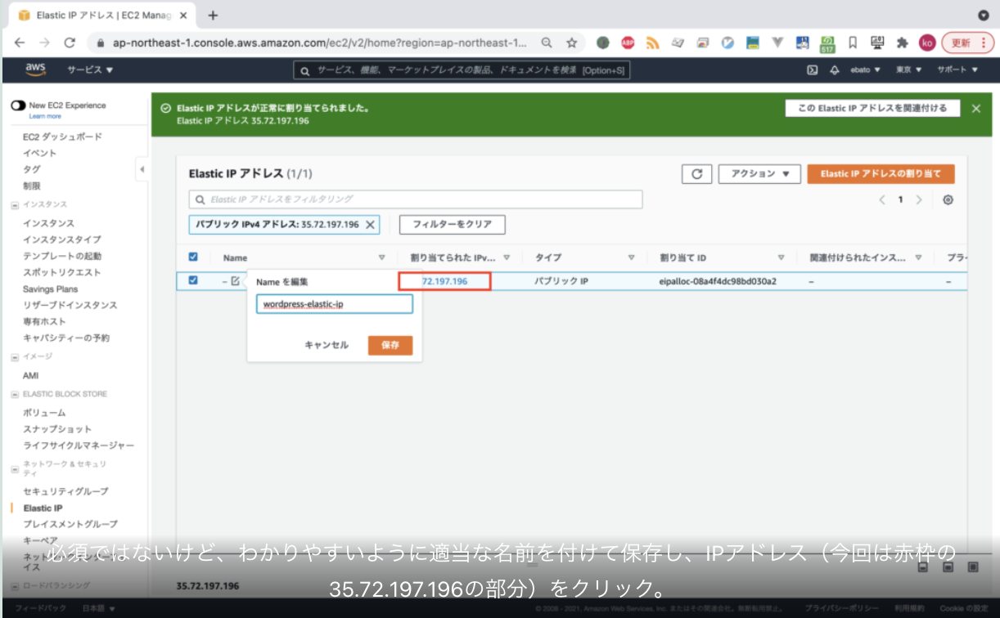

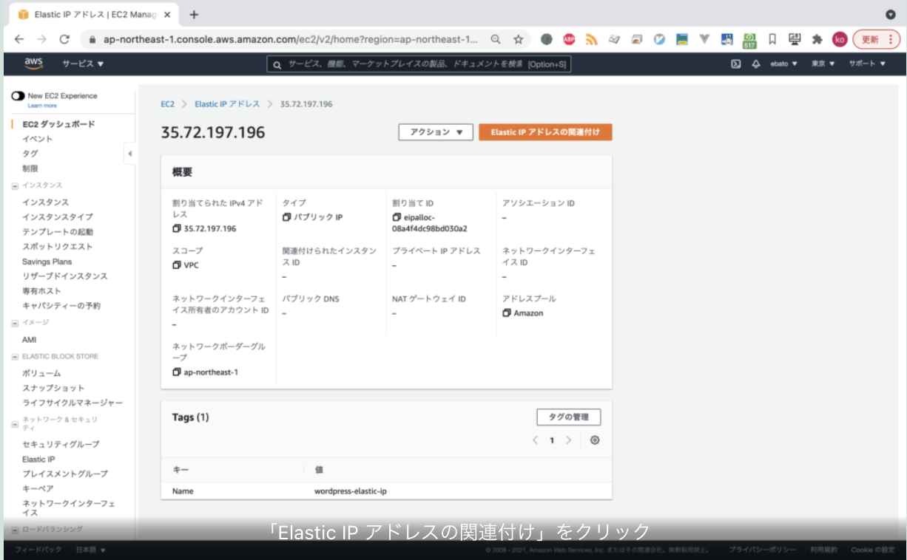

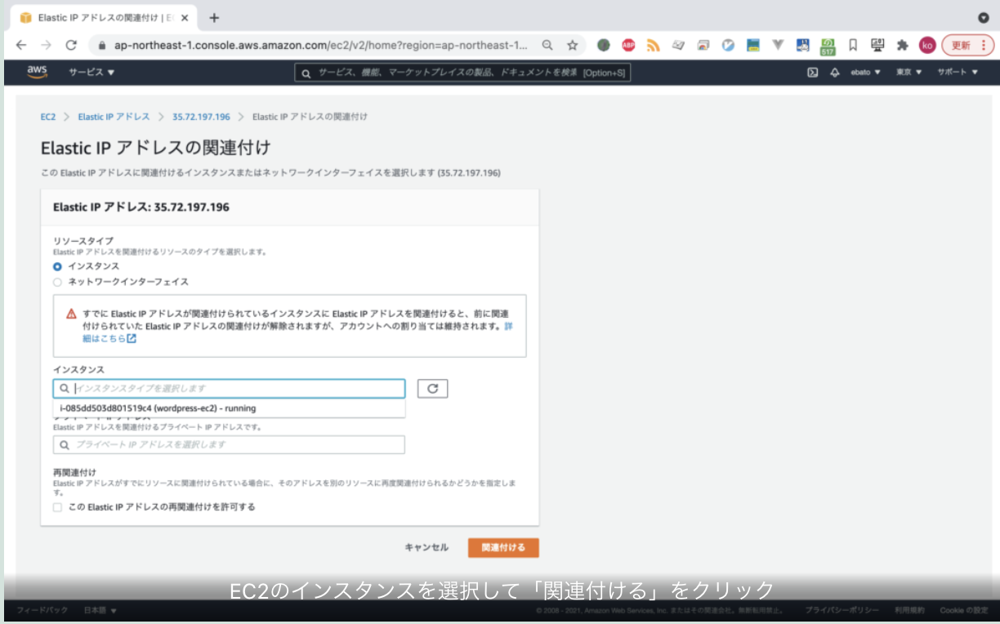
