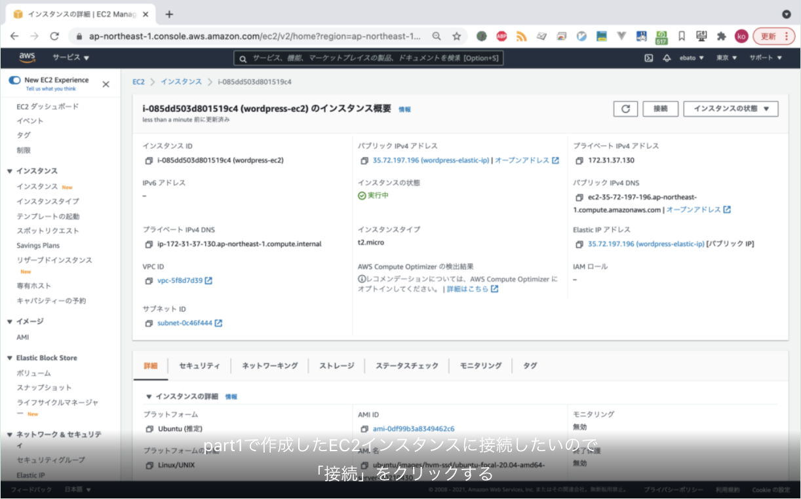
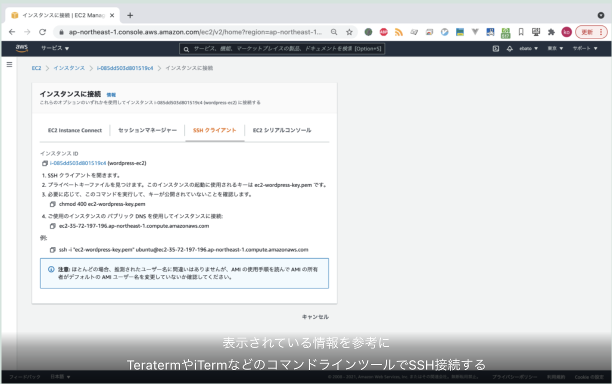
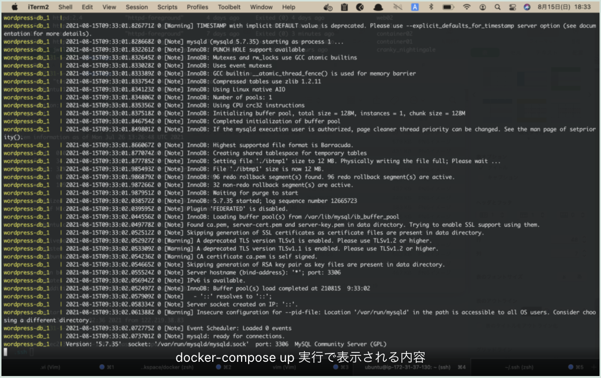
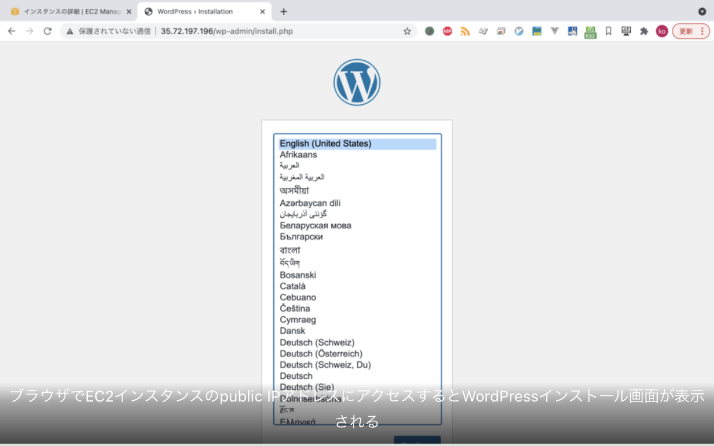

* [part1](../20210815-start-wordpress-part1)
    * EC2インスタンス起動 Elastic IPアドレス割当てまで
* part2
    * part1で作成したEC2にDocker, docker-composeをインストール
    * docker-comopseでwordpress & MySQLを構築
* [part3](../20210817-start-wordpress-part3)
    * 独自ドメイン取得
    * Route53でDNS設定
    * Certificate Managerで証明書作成
    * ALB作成
    * 完成！


## EC2にSSHで接続する





## LinuxにDocker & Docker-composeをインストールする

公式ドキュメント通りにインストールする
* Dockerインストール
<a href="https://docs.docker.com/engine/install/ubuntu/" target="_blank">https://docs.docker.com/engine/install/ubuntu/</a>

```bash
$ sudo apt-get update
$ sudo apt-get install \
    apt-transport-https \
    ca-certificates \
    curl \
    gnupg \
    lsb-release
$ curl -fsSL https://download.docker.com/linux/ubuntu/gpg | sudo gpg --dearmor -o /usr/share/keyrings/docker-archive-keyring.gpg
$ echo \
  "deb [arch=amd64 signed-by=/usr/share/keyrings/docker-archive-keyring.gpg] https://download.docker.com/linux/ubuntu \
  $(lsb_release -cs) stable" | sudo tee /etc/apt/sources.list.d/docker.list &gt; /dev/null
$ sudo apt-get update
$ sudo apt-get install docker-ce docker-ce-cli containerd.io
```

* docker-composeインストール
<a href="https://docs.docker.com/compose/install/" target="_blank">(https://docs.docker.com/compose/install/</a>

```bash
$ sudo curl -L "https://github.com/docker/compose/releases/download/1.29.2/docker-compose-$(uname -s)-$(uname -m)" -o /usr/local/bin/docker-compose
$ sudo chmod +x /usr/local/bin/docker-compose
```

* dockerコマンドubuntuユーザでも使えるようにする
```bash
$ sudo gpasswd -a ubuntu docker
```

exitで抜けて再度SSHで接続するとubuntuユーザでdockerコマンドが使えるようになっている。

## docker-composeでWordPressとMySQLをインストールする

Docker, Docker-Composeがインストールできたら、下記のdocker-compose.ymlを作成する。※ パスワードは適宜変更してください

```yml
version: "3"

services:
  wordpress-db:
    image: mysql:5.7
    networks:
      - wordpressnet
    volumes:
      - wordpress_db_volume:/var/lib/mysql
    restart: always
    environment:
      MYSQL_ROOT_PASSWORD: myrootpassword
      MYSQL_DATABASE: wordpress
      MYSQL_USER: wordpress
      MYSQL_PASSWORD: wordpress

  wordpress-app:
    depends_on:
      - wordpress-db
    image: wordpress
    networks:
      - wordpressnet
    ports:
      - 80:80
    restart: always
    environment:
      WORDPRESS_DB_HOST: wordpress-db
      WORDPRESS_DB_NAME: wordpress
      WORDPRESS_DB_USER: wordpress
      WORDPRESS_DB_PASSWORD: wordpress

networks:
  wordpressnet:

volumes:
  wordpress_db_volume:
```

docker-compose.ymlを作成したら、下記コマンドを実行する

```bash
$ docker-compose up
```





part3でhttps化 + 独自ドメインにします。
