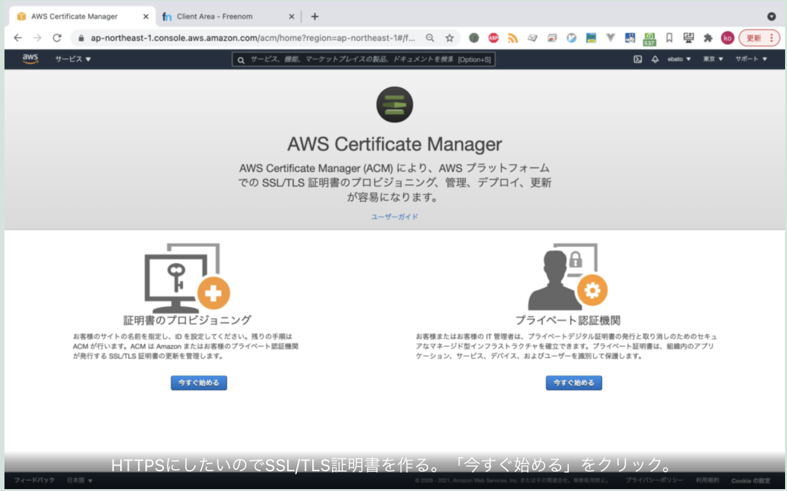
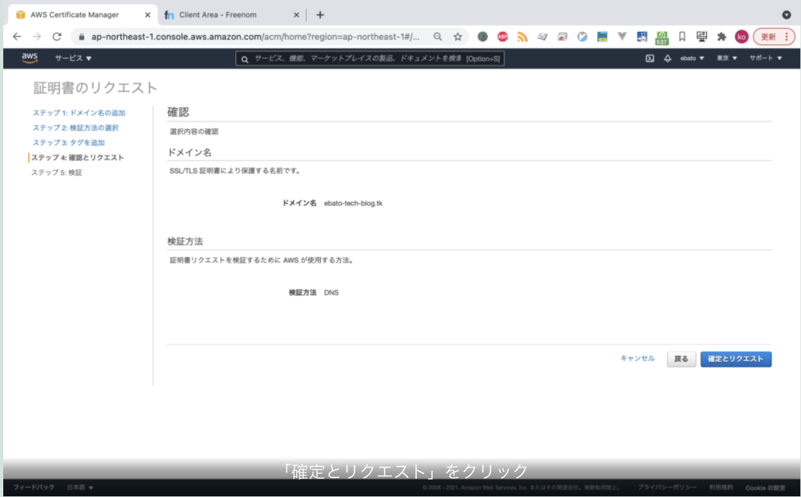
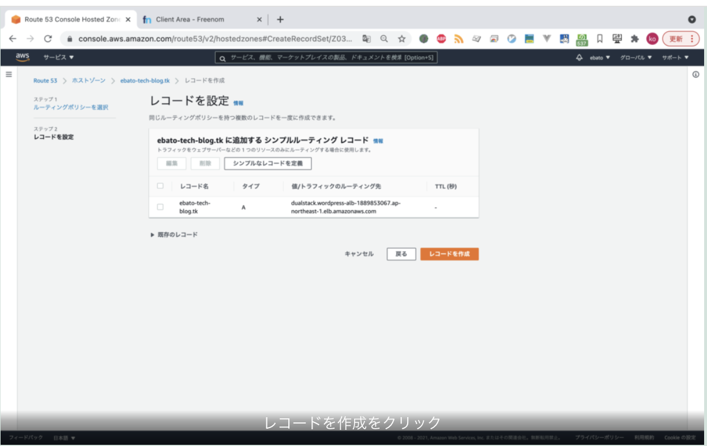

* [part1](../20210815-start-wordpress-part1)
    * EC2インスタンス起動 Elastic IPアドレス割当てまで
* [part2](../20210816-start-wordpress-part2)
    * part1で作成したEC2にDocker, docker-composeをインストール
    * docker-comopseでwordpress & MySQLを構築
* part3
    * 独自ドメイン取得
    * Route53でDNS設定
    * Certificate Managerで証明書作成
    * ALB作成
    * 完成！

