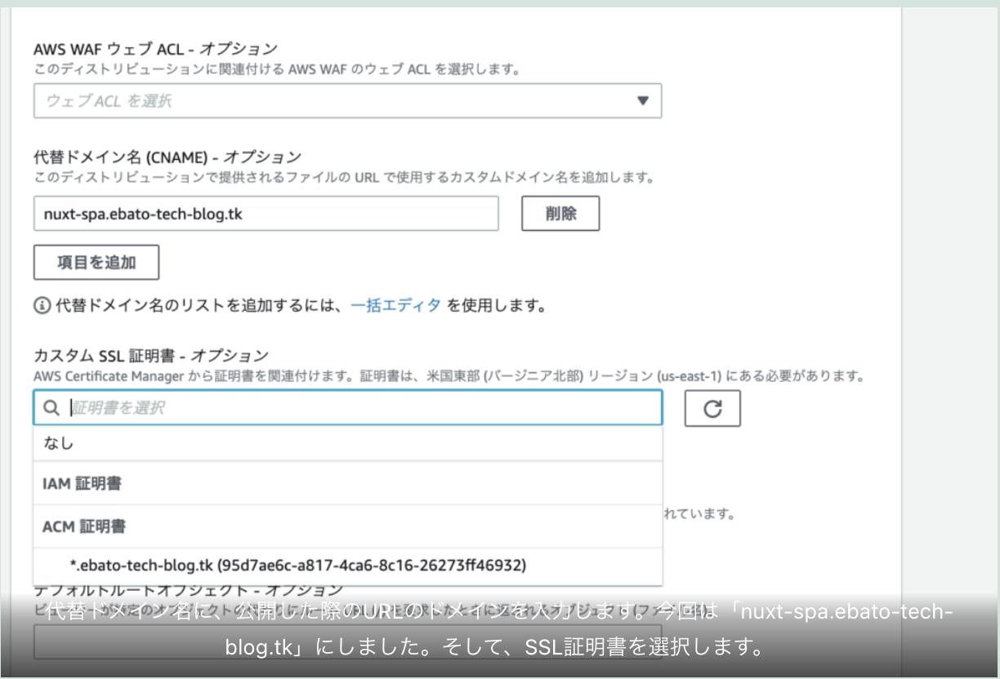

タイトルにある通りですが今回は「Nuxt.jsのSPAをAWSのS3 + Cloudfront + Route53で配信」に挑戦してみました。※Nuxt.jsでSPAを作成する方法は割愛します。

先に完成したものをお見せします↓このブログのサブドメイン（nuxt-spa)で公開しました

<a href="https://nuxt-spa.ebato-tech-blog.tk/" target="_blank">`https://nuxt-spa.ebato-tech-blog.tk/`</a>

それでは、手順を記載していきます。

## S3にバケットを作成する

## Nuxt.jsのSPAを作成する

詳細は割愛しますが、node.jsとnpxが入っている環境で「npx create-nuxt-app {プロジェクト名}」を実行し、途中でRendering modeはSPA or SSR？と聞かれるのでSPAを選択してください。こんな感じ↓

## dist/ 以下をS3にアップロードします

## CloudFrontを設定する

上記で証明書が何もプルダウンに出てこない場合は、AWS Certificate Managerで作成する必要があります。上の画像にも表示されている通り、リージョン（us-east-1）で作成する必要があるので要注意。以前「*.ebato-tech-blog.tk」で証明書を取得したので、今回の「nuxt-spa.ebato-tech-blog.tk」もカバーしていることになります。

上記画像のドメイン名に表示されているが、CloudFrontが発行したドメイン名にhttpsでブラウザで表示してみます。今回は、「https://d2g1b4immm849y.cloudfront.net/sample」になります。先程S3にアップロードしたSPAが表示できればCloudFrontの設定は完了です。

## Route53でドメインを割り当てる

上記の赤枠の部分が今回割り当てたサブドメインの設定です。AとAAAAの違いはIPv4 or IPv6ということみたいです。レコード名にサブドメインを含めたドメイン名を設定し、値/トラフィックルーティング先にCloudFrontで発行したドメイン名を設定し、しばらく待つと「https://nuxt-spa.ebato-tech-blog.tk/」が表示れました↓

