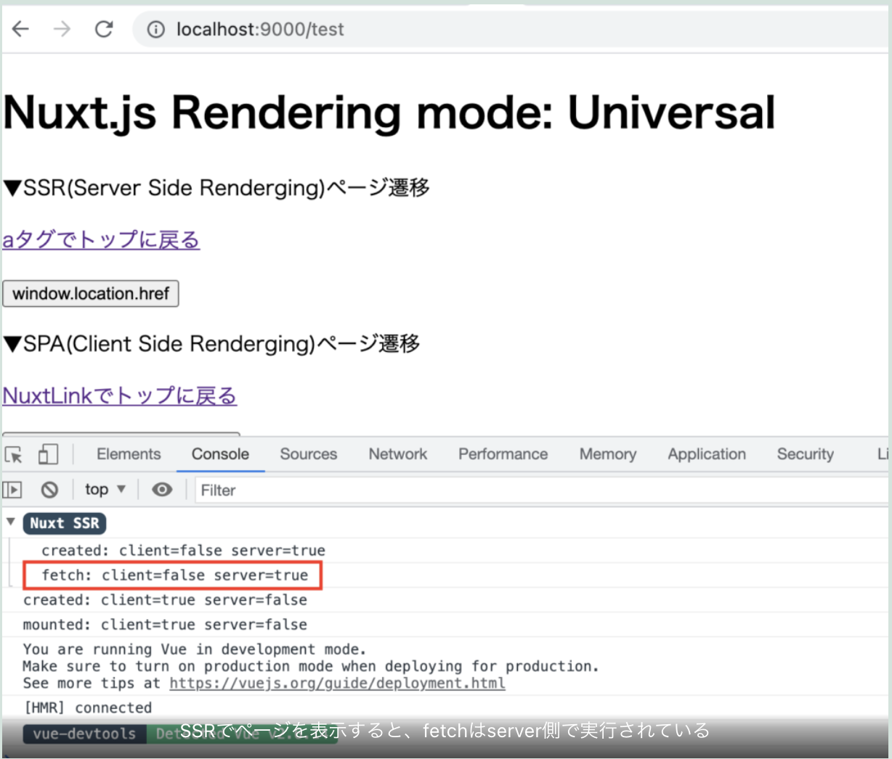
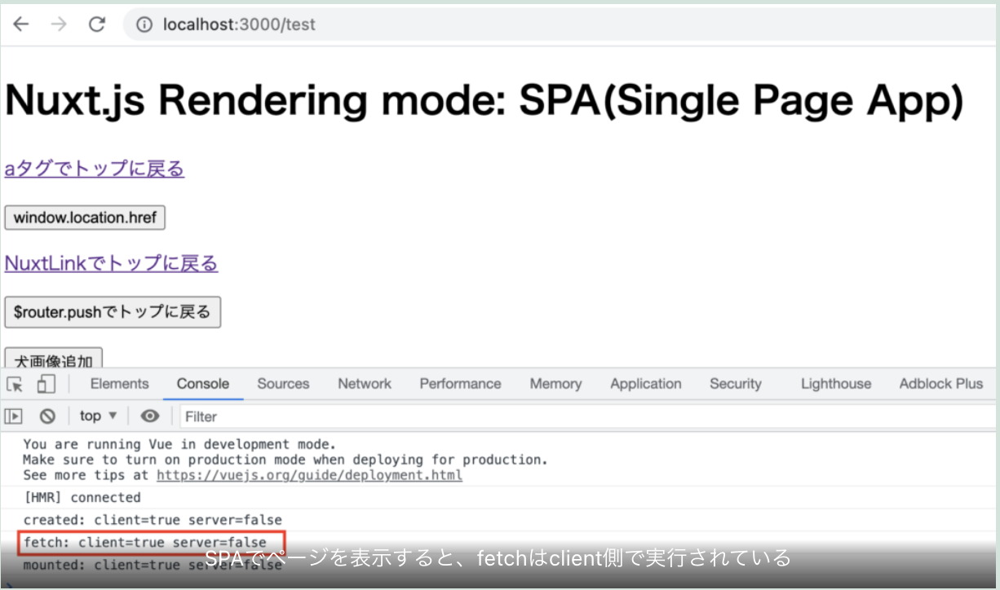
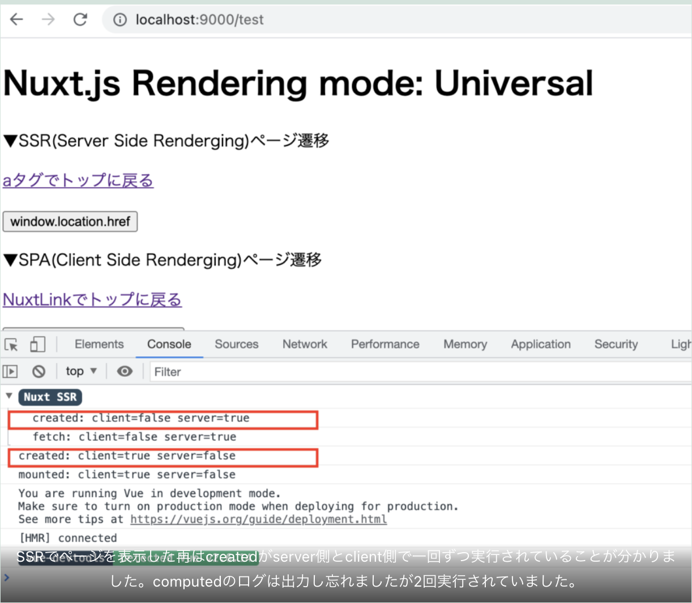
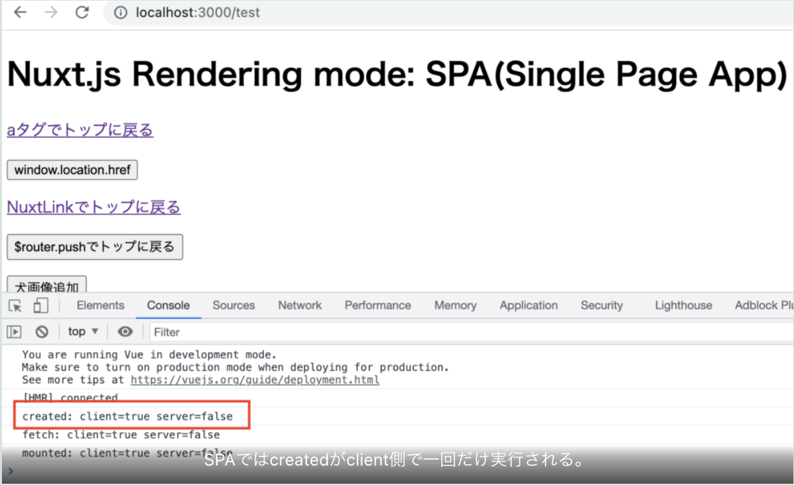
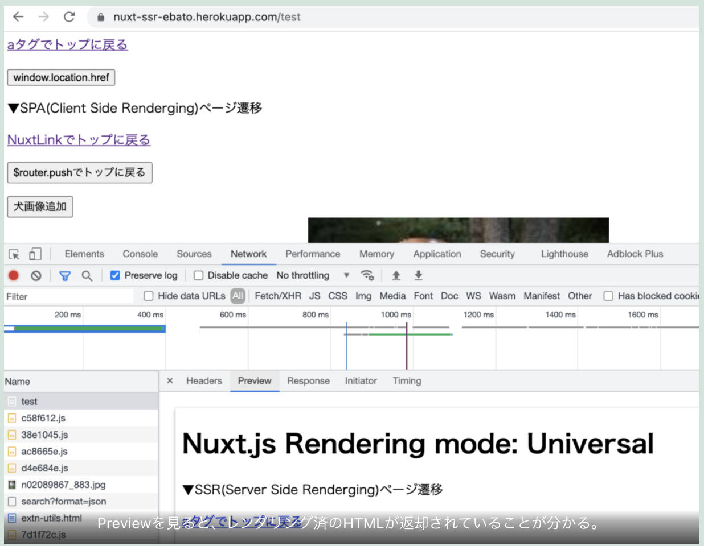
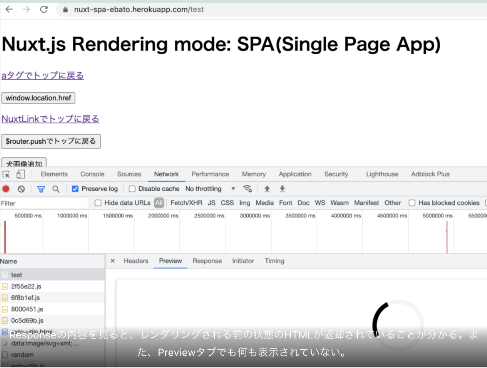

今回はNuxt.jsのUniversal modeとSingle Page Appをそれぞれ実装・動作検証した中で、気付いたことをまとめました。

まず、今回実装したアプリケーションのGithub&公開したデモページを紹介いたします。

### Universal
* github
<a href="https://github.com/chanfuku/docker_nuxt_ssr02" target="_blank">`https://github.com/chanfuku/docker_nuxt_ssr02`</a>

* demo
<a href="https://nuxt-ssr-ebato.herokuapp.com/" target="_blank">`https://nuxt-ssr-ebato.herokuapp.com/`</a>

### SPA
* github
<a href="https://github.com/chanfuku/docker_nuxt_spa" target="_blank">`https://github.com/chanfuku/docker_nuxt_spa`</a>

* demo
<a href="https://nuxt-spa-ebato.herokuapp.com/" target="_blank">`https://nuxt-spa-ebato.herokuapp.com/`</a>


### Universalの場合、ServerとClient 両方のページ表示方法が存在する

今まで勘違いしていました。Universal modeでNuxt.jsのアプリケーションを構築すると、すべてのページ遷移はSSRになるのかと思っていました・・・。正しくは、Universal modeで構築した場合は、ページ表示がSSRになる場合とClient Side Renderingになる場合の2パターンがあります。

### Universalの場合、aタグとNuxtLinkでページ遷移の挙動が異なる

アプリケーション内の別ページ(/test)に遷移する方法を5つに分類し、それぞれの挙動を確認してみました。

1. <a href="/test">`</a>タグを使う
1. javascriptのwindow.location.href = '/test'を使う
1. <Nuxtlink to='/test'>ボタン</Nuxtlink>を使う
1. $router.push('/test')を使う
1. ブラウザにurl(/test)を直接入力して表示する

上記1,2はSSRで/testが表示されます。ページリロードした場合と同じ挙動です。3,4はClient Side Renderingで/testが表示されます。3はHTML上は`<a href`に置き換わっているのにページ遷移はClient Side Renderingの動きになりました。不可解なことに、これは、1の`<a href="/test">`タグを使う方法と挙動が異なります（謎です）。5はSSRです。SPAで構築すると1 ~5全てにおいて、Client Side Renderingでページを表示することになります。

### fetchはSSRではserverで実行されるが、SPAではclientで実行される

server or client、どちらで実行されているのかを調査するためにログを仕込みました。

```javascript
// createdでログ出力を実行する
  async created(): Promise<void> {
    log('created')
  }

// ログ出力メソッド
const log = (funcName: string): void => {
  const str = `${funcName}: client=${process.client} server=${process.server}`
  console.log(str)
}
```





### SSRでページを表示するとcreatedは2回実行される





### SSRとSPAでサーバーから返却されるHTMLが異なる（当たり前だけど）

* SSRの場合



* SPAの場合



以上です、

今回はHerokuに公開しました。HerokuはGUIだけでとても簡単にNuxt.jsのアプリケーションを公開できるので、いつかやり方載せたいと思います。
