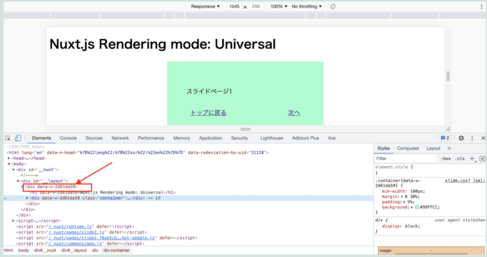
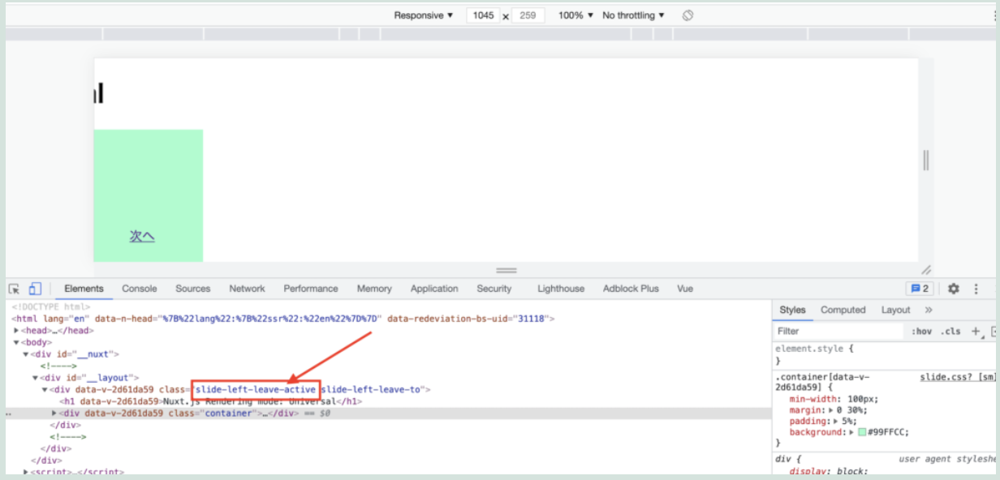
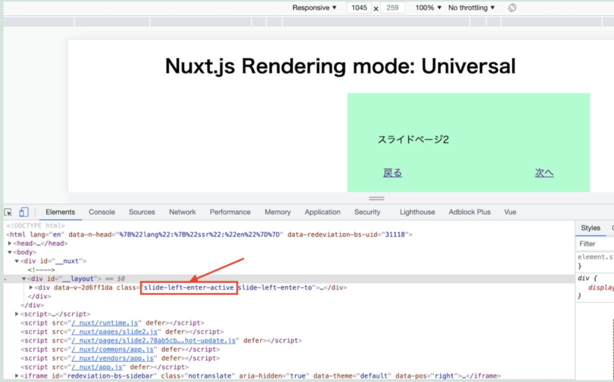

仕事で対応したことの備忘録です。

### ソースコード

<a href="https://github.com/chanfuku/docker_nuxt_ssr02/blob/main/pages/slide1.vue" target="_blank">`https://github.com/chanfuku/docker_nuxt_ssr02/blob/main/pages/slide1.vue`</a>

### demo

<a href="https://nuxt-ssr-ebato.herokuapp.com/slide1" target="_blank">`https://nuxt-ssr-ebato.herokuapp.com/slide1`</a>

ポイントは、下記のtransitionプロパティでfromとtoを取得出来るので、どこのページから遷移してきたのか、どこのページに遷移にするのか、を判定しtransition用のクラス名を返しているところです。

```javascript
export default Vue.extend({
  transition: (to, from): string => {
    if (to?.name === 'slide2' || from?.name === 'index') {
      return 'slide-left'
    }
    if (from?.name === 'slide2' || to?.name === 'index') {
        return 'slide-right'
    }
    return ''
  },
})
```

transition用のcssクラスはこんな感じです。

```css
.slide-left-enter-active {
  animation: slide-in 0.4s forwards;
}
.slide-left-leave-active {
  animation: slide-out 0.4s forwards;
}
.slide-right-enter-active {
  animation: slide-onemoretime 0.4s forwards;
}
.slide-right-leave-active {
  animation: slide-return 0.4s forwards;
}

@keyframes slide-in {
  0% {
    transform: translateX(100%);
  }
  100% {
    transform: translateX(0%);
  }
}
@keyframes slide-out {
   0% {
    transform: translateX(0%);
  }
  100% {
    transform: translateX(-100%);
  }
}
@keyframes slide-onemoretime {
  0% {
    transform: translateX(-100%);
  }
  100% {
    transform: translateX(0);
  }
}
@keyframes slide-return {
  0% {
    transform: translateX(0%);
  }
  100% {
    transform: translateX(100%);
  }
}
```

アニメーションを0.4秒に設定していますが、5秒とかで設定して、「次へ」をクリックした時にどのクラスが実際にHTMLに入ってきているのかをdeveloper toolから確認してみました。



↑次へをクリックする前の状態は、まだtransition用のクラスが赤枠の箇所に入ってきていないです。



↑次へをクリックすると「slide-left-leave-active」クラスが入ってきます。表示していたページを左にスライドさせるアニメーションが発生しますが、アニメーション終了と同時に「slide-left-leave-active」も消えます。



↑その後、「slide-left-enter-active」クラスが入ってきます。次のページが右から左にスライドしてくるアニメーションが発生しますが、アニメーション終了と同時に「slide-left-enter-active」も消えます。

以上です。slide-left-enter-toやleave-toも設定するとより滑らかなアニメーションが作れるのかもしれません。

参考にしたページを以下に記載ます。

* Nuxt.jsのtransitionプロパティについて

<a href="https://develop365.gitlab.io/nuxtjs-2.8.X-doc/ja/api/pages-transition/" target="_blank">`https://develop365.gitlab.io/nuxtjs-2.8.X-doc/ja/api/pages-transition/`</a>

* Vue.jsのEnter/Leaveトランジションについて

<a href="https://jp.vuejs.org/v2/guide/transitions.html" target="_blank">`https://jp.vuejs.org/v2/guide/transitions.html`</a>

