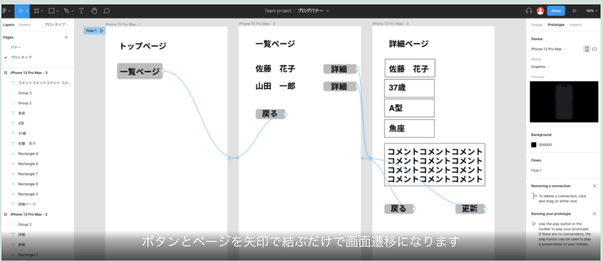
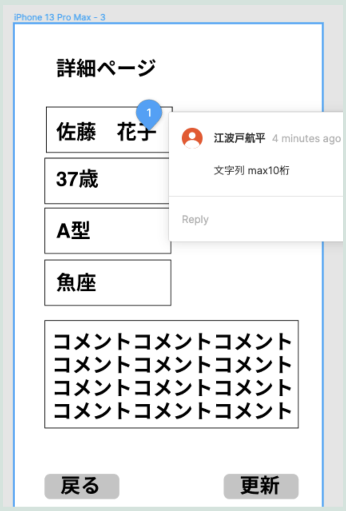

まずは成果物載せます。

### プロトタイプ
<a href="https://www.figma.com/proto/PhylVYjozLhoO62fqqsY8g/%E3%83%96%E3%83%AD%E3%82%B0%E3%83%90%E3%83%8A%E3%83%BC?node-id=47%3A16&scaling=scale-down&page-id=2%3A2&starting-point-node-id=47%3A16" target="_blank">demo</a>

表示されたページで、ボタンをクリックすると一覧画面や詳細画面に遷移したりという動きを確認することが出来ます。

### figmaでプロトタイプの作り方

仕事でよくエクセルやパワポで作られた画面仕様書を読むことがあるのですが、うーん・・・何がしたいのかさっぱり分からん、ということがよくあります。エクセルやパワポの画面仕様書って正直完成形のイメージがしづらすぎて、認識の齟齬が発生しやすいと思うわけです。開発する側としては、どういう機能を実装すれば良いのかをイメージ出来ないと実装できないので、Figmaのようなツールで作られたプロトタイプがあると完成形のイメージがしやすくなって大変助かります。また、疑問点の解消などのコミュニケーションコストもかなり削減できて、開発を依頼する側・される側お互いにメリットがあると思います。

ローディングアニメーションや、スクロール等の動きも表現出来るようです。また、以下の様に項目の仕様（文字列 max 10桁など）も書き込めるので画面設計書としての役割も果たせそうですね。

私自身はこれから画面設計書を作るときはfigmaでプロトタイプを作ろうと思います。
