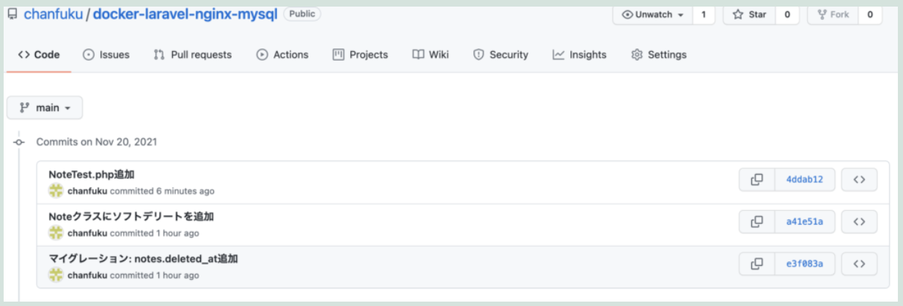

業務で、インメモリSqliteを使ってローカル開発環境のDBが汚れることなくテストコードを実行できるようにしたので、その備忘録です。

先日LaravelのDocker環境を構築した記事を作成しましたが、同じ<a href="https://github.com/chanfuku/docker-laravel-nginx-mysql">リポジトリ</a>にテストコードをpushしました。



上記今回対応したコミット３つです。

### やってみたこと

1. notesテーブルにdeleted_atカラムを追加する。
1. 論理削除フラグとして利用するためにNoteクラスに設定を記述する。
1. 「Noteモデルからデータの詳細や一覧を取得する際に、削除済のデータは自動的に除外してくれることを確認する。」ためのテストコードを書く。

では、詳細を記載していきます。

### 1. notesテーブルにdeleted_atカラムを追加する

コミットは<a href="https://github.com/chanfuku/docker-laravel-nginx-mysql/commit/e3f083a0bf652757cee067477c2baa8b87e476e5" target="_blank">こちら</a>です。ポイントは$table->softDeletes();の部分。これでマイグレーションコマンド実行すると、Timesamp型でdelete_atを追加してくれます。

```php
    public function up()
    {
        Schema::table('notes', function (Blueprint $table) {
          $table->softDeletes(); // deleted_atを追加します
        });
    }
```

マイグレーションコマンドはphp artisan migrateです↓docker環境に入って実行します。

```bash
$ docker-compose exec php bash
$ cd /var/www/laravel && php artisan migrate
```

### 2. Noteクラスにソフトデリート（論理削除）の設定を記述する

コミットは<a href="https://github.com/chanfuku/docker-laravel-nginx-mysql/commit/a41e51a3bbbd9076e434cf754ba05e42ed5ef38a" target="_blank">こちら</a>

### 3. 「Noteモデルからデータの詳細や一覧を取得する際に、削除済のデータは自動的に除外してくれることを確認する。」ためのテストコードを書く。

コミットは<a href="https://github.com/chanfuku/docker-laravel-nginx-mysql/commit/a41e51a3bbbd9076e434cf754ba05e42ed5ef38a" target="_blank">こちら</a>

まず、database.phpに以下追記します。

```php
        'sqlite_testing' => [
          'driver' => 'sqlite',
          'database' => ':memory:',
          'prefix' => '',
        ],
```

次に、phpunit.xmlに以下追記します

```xml
 <server name="DB_CONNECTION" value="sqlite_testing"/>
```

これだけでインメモリSqliteを使ってDB周りのテストコードを各準備が整いました。ローカル開発環境のDBは汚したくない、というニーズをこれで満たせます。

今回書いたテストコードを貼り付けます。

```php
<?php

namespace Tests\Unit;

use Tests\TestCase;
use App\Models\Note;

class NoteTest extends TestCase
{
    public function setUp(): void
    {
      parent::setUp();

      // マイグレーション実行
      $this->artisan('migrate');

      // テストデータ投入 seeder使うのもあり
      Note::factory()->create([
        'id' => 1,
        'title' => '削除したメモです',
        'deleted_at' => '2021-11-20 09:50:00', // 削除済データ
      ]);
      Note::factory()->create([
        'id' => 2,
        'title' => '生きてるメモです',
      ]);
    }

    /**
     * @return void
     */
    public function test_論理削除フラグONのデータがnullであること()
    {
      $result = Note::find(1);
      $this->assertNull($result);
    }

    /**
     * @return void
     */
    public function test_論理削除フラグOFFのデータがnullでないこと()
    {
      $result = Note::find(2);
      $this->assertNotNull($result);
    }

    /**
     * @return void
     */
    public function test_論理削除フラグONのデータが一覧に含まれないこと()
    {
      $result = Note::all()->pluck('id');
      $expected = Note::hydrate([
        [
          'id' => 2,
          'title' => '生きてるメモです',
        ],
      ])->pluck('id');
      $this->assertEquals($result, $expected);
    }
}
```

ポイントとしては、

setUp()の中で、マイグレーション・テストデータを投入ているところです。setUp()は個別のテストメソッドが実行される前に実行されるので事前処理をしておくメソッドです。Seederを使ってテストデータを投入するのも全然ありですが、今回はひと目見てすぐテストデータがどんなデータなのかをイメージしやすいようにsetUp()の中でFactoryを使ってつらつら記載してます。

id = 1のデータはdeleted_atに値を入れて削除済データとして投入し、id = 2のデータは生きているデータとして投入しました。

テストメソッド名は、「test」という文字列がメソッド名に含まれていれば日本語でもOKです。今回は以下３つのテストメソッドを作成しました。

test_論理削除フラグONのデータがnullであること()

test_論理削除フラグOFFのデータがnullでないこと()

test_論理削除フラグONのデータが一覧に含まれないこと()

これでテストコードを実行すると、こんな感じで結果が表示されます↓


テストコードを実行するコマンドは、こちらです↓テスト対象のファイルを書かない場合は全てのテストが実行されます。

```bash
$ docker-compose exec php bash
$ cd /var/www/laravel
$ .vendor/bin/phpunit {テスト対象のファイル}
```

余談ですが、mysqlで動くのにsqliteでは動かないといったトラブルはありそうです。現に、mysql のMODIFYはsqlliteでは使えず、一部のマイグレーションがエラーになる事象に業務で遭遇しました。その場合はマイグレーションは実行せずに、愚直に必要なテーブルだけを作成する作戦でなんとか回避しました・・・（下記）。テストで必要なテーブルが少なかったこと、またテーブル定義が本番DBと揃っていなくてもテストには影響しなかったことが幸いでした。

```php
// 全マイグレーションの中の、必要な部分だけピックアップして実行する
(new CreateNotesTable())->up();
(new AddDeletedAtOnNotes())->up();
```

以上です。
