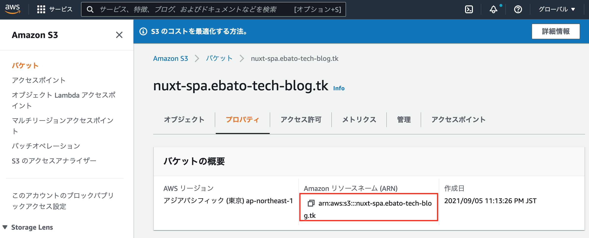
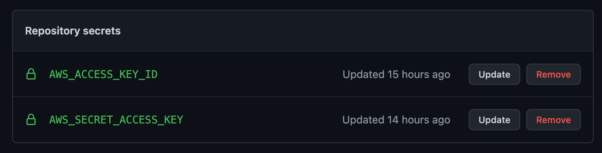
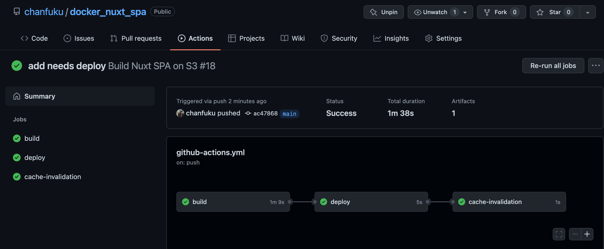

以下の手順で対応していきます。

1. 「S3にデプロイ + CloudFront キャッシュクリア」の権限を持ったIAMユーザーを作成する
2. 1で作成したユーザーのAccess Key Id、Secret Access KeyをGitHubに登録する 
3. GitHub Actionsの設定をする

## 1. 「S3にデプロイ + CloudFront キャッシュクリア」の権限を持ったIAMユーザーを作成する
AWS Management Console > Identity and Access Management (IAM) > アクセス管理 > ユーザー
で「ユーザーを追加」から、以下のポリシーを設定したユーザーを作成する
```json
{
    "Version": "2012-10-17",
    "Statement": [
        {
            "Sid": "VisualEditor0",
            "Effect": "Allow",
            "Action": [
                "s3:PutObject",
                "s3:ListBucket",
                "cloudfront:CreateInvalidation"
            ],
            "Resource": [
                "arn:aws:s3:::<your-s3-bucket-name>",
                "arn:aws:s3:::<your-s3-bucket-name>/*",
                "arn:aws:cloudfront::<ARN account-id>:distribution/<distribution-id>"
            ]
        }
    ]
}
```

ARNの値はヘッダーに記載されている ※以下はS3の例



## 2. 1で作成したユーザーのAccess Key Id、Secret Access KeyをGitHubのSettingに登録する 
1でユーザー作成するとAccess Key Id, Secret Access Keyが発行されるので、
GitHub your repority > Settings > Secrets > Actions で「New repository secret」から以下の環境変数を設定する
```
AWS_ACCESS_KEY_ID: Access Key Idの値
AWS_SECRET_ACCESS_KEY: Secret Access Keyの値
```

登録するとこんな感じ↓



## 3. GitHub Actionsの設定をする
.github/workflows/github-actions.ymlを作成し、jobを定義する

```yaml
name: Build Nuxt SPA on S3 and Cache Invalidation on CloudFront
on:
  push:
      branches:
        - main
jobs:
  build:
    runs-on: ubuntu-latest
    steps:
      - uses: actions/setup-node@v3
        with:
          node-version: '14'

      - name: Checkout
        uses: actions/checkout@main

      - name: Install Dependencies
        run: npm install

      - name: Build
        run: npm run build

      - name: Upload build result
        uses: actions/upload-artifact@v3
        with:
          name: dist
          path: dist/

  deploy:
    needs: build
    runs-on: ubuntu-latest
    steps:
      - name: Download build result
        uses: actions/download-artifact@v3
        with:
          name: dist
          path: dist/
      - name: Deploy  # S3にデプロイ
        env:
          AWS_ACCESS_KEY_ID: ${{ secrets.AWS_ACCESS_KEY_ID }}
          AWS_SECRET_ACCESS_KEY: ${{ secrets.AWS_SECRET_ACCESS_KEY }}
          AWS_REGION: ap-northeast-1
        run: | # S3のnuxt-spa.ebato-tech-blog.tkバケットにデプロイ
          aws s3 sync ./dist s3://nuxt-spa.ebato-tech-blog.tk

  cache-invalidation:
    needs: deploy
    runs-on: ubuntu-latest
    steps:
      - name: CacheInvalidation  # 全キャッシュクリア
        env:
          AWS_ACCESS_KEY_ID: ${{ secrets.AWS_ACCESS_KEY_ID }}
          AWS_SECRET_ACCESS_KEY: ${{ secrets.AWS_SECRET_ACCESS_KEY }}
          AWS_REGION: ap-northeast-1
        run:
          aws cloudfront create-invalidation --distribution-id E149NJU26D1UYW --paths "/*"
```

- build -> deploy -> cache-invalidationの順でjobが実行されるようにした

- GitHub公式が出しているActionsを活用する
    - node-versionを14に固定する
        - <a href="https://github.com/actions/setup-node" target="_blank">`actions/setup-node`</a>
    - ブランチcheckout
        - <a href="https://github.com/actions/checkout" target="_blank">`actions/checkout`</a>
    - ビルドした成果物(dist)を一つのjobから次のjobに受け渡す
        - <a href="https://github.com/actions/upload-artifact" target="_blank">`upload-artifact`</a>
        - <a href="https://github.com/actions/download-artifact" target="_blank">`download-artifact`</a>

これでmainブランチにマージしたり、pushしたりすると自動でS3にデプロイされ、CloudFrontのキャッシュクリアが行われます。



以上です
