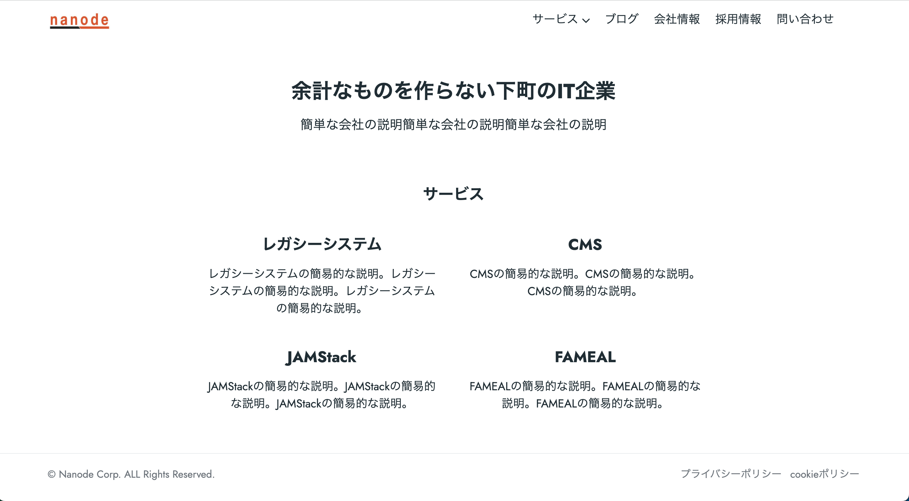

Hugoを使ってコーポーレートサイト実装して欲しいとの依頼を頂いたので、Netlifyで公開するところまでやってみました。

## Hugo
<a href="https://gohugo.io/" target="_blank">https://gohugo.io/</a>

テーマ(テンプレート)は↓を使いました。

https://themes.gohugo.io/themes/doks/

## 完成したサイト(デモ版)
https://serene-gecko-c4716b.netlify.app/

問い合わせページはNetlifyのformを使いました。Netlifyの管理画面で問い合わせ内容を確認したり、CSVダウンロードも出来ます。
https://docs.netlify.com/forms/setup/

ブログページのページネーションは、今回使ったテンプレートにデフォルトで組み込まれていたページネーションの機能を使いました。

## HugoのTutorial動画
https://www.youtube.com/watch?v=qtIqKaDlqXo
2017年とかの動画なので、手順通り進めても所々動かないのが辛いですが、動画のコメント欄に解決方法が載っています。

## Netlify
静的サイトをホスティングしてくれるサービスです。公開するリポジトリを設定すると、そのリポジトリのmainブランチにmergeしたり、pushしたりすると自動でNetlifyがdeployしてくれます。有料プランにすると独自ドメインを使えるみたいです。
https://www.netlify.com/

## Docker
公式のDocker Imageが提供されていないので、Docker環境を構築するなら自前で頑張る必要があります...。
公式サイトの手順通りMacのbrewを使って構築しました。
