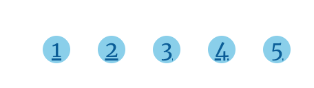

このブログも徐々に記事数が増えてきたので、pagenationを追加しようということで、
<a href="https://github.com/NickyMeuleman/gatsby-paginated-blog" target="_blank">`paginationのライブラリ`</a>が既に世の中にあるのですが、reactとGraphQLの勉強も兼ねてあえて自前で実装してみました。

## repo
<a href="https://github.com/chanfuku/gatsby-blog" target="_blank">
https://github.com/chanfuku/gatsby-blog
</a>

### components/pagination.js
まず、paginationコンポーネントを作成します。
```js
// components/pagination.js
import * as React from "react"
import { Link } from "gatsby"

const Pagination = ({ totalCount }) => {
  const PER_PAGE = 5

  const range = (start, end) => [...Array(end - start + 1)].map((_, i) => start + i)

  return (
    <ul class="pagenation">
      {range(1, Math.ceil(totalCount / PER_PAGE)).map((number, index) => (
        <li key={index}>
          <Link to={`/blog/page/${number}`}>{number}</Link>
        </li>
      ))}
    </ul>
  )
}

export default Pagination
```

### components/posts.js
次に記事一覧コンポーネントを作成します。
```js
// src/components/posts.js
import * as React from "react"
import { Link } from "gatsby"

const Posts = ({ posts }) => {
  return (
      <ol style={{ listStyle: `none` }}>
        {posts.map(post => {
          const title = post.frontmatter.title || post.fields.slug

          return (
            <li key={post.fields.slug}>
              <article
                className="post-list-item"
                itemScope
                itemType="http://schema.org/Article"
              >
                <header>
                  <h2>
                    <Link to={post.fields.slug} itemProp="url">
                      <span itemProp="headline">{title}</span>
                    </Link>
                  </h2>
                  <small>{post.frontmatter.date}</small>
                </header>
                <section>
                  <p
                    dangerouslySetInnerHTML={{
                      __html: post.frontmatter.description || post.excerpt,
                    }}
                    itemProp="description"
                  />
                </section>
              </article>
            </li>
          )
        })}
      </ol>
  )
}

export default Posts
```

### templates/blog-page.js
次にtemplates/blog-page.jsを作成します。
```js
import * as React from "react"
import { graphql } from "gatsby"
import Bio from "../components/bio"
import Layout from "../components/layout"
import Seo from "../components/seo"
import Pagination from "../components/pagination"
import Posts from "../components/posts"

const BlogPage = ({ data, location }) => {
  const siteTitle = data.site.siteMetadata?.title || `Title`
  const posts = data.allMarkdownRemark.nodes

  return (
    <Layout location={location} title={siteTitle}>
      <Seo title={siteTitle} />
      <Bio />
      <Posts posts={posts} />
      <Pagination totalCount={data.allMarkdownRemark.totalCount} />
    </Layout>
  )
}

export default BlogPage

export const query = graphql`
  query ($limit: Int!, $skip: Int!) {
    site {
      siteMetadata {
        title
        description
      }
    }
    allMarkdownRemark(
      sort: { fields: [frontmatter___date], order: DESC }
      skip: $skip
      limit: $limit
      ) {
      totalCount
      nodes {
        excerpt
        fields {
          slug
        }
        frontmatter {
          date(formatString: "MMMM DD, YYYY")
          title
          description
        }
      }
    }
  }
`
```

## pages/index.js
次にpages/index.jsに上で作成したPaginationとPostsを追加します。
```js
import Pagination from "../components/pagination"
import Posts from "../components/posts"
.
. // 省略
.
  return (
    <Layout location={location} title={siteTitle}>
      <Seo title={siteTitle} />
      <Bio />
      <Posts posts={posts} />
      <Pagination totalCount={data.allMarkdownRemark.totalCount} />
    </Layout>
  )
```

graphQLに関しては、skip, limitを引数に追加し、totalCountを返すように修正します。
skipはMysqlで言うところのoffset、つまりn件目から取得するという意味です。limitは取得したい件数で、totalCountは全件数です。
```js
    allMarkdownRemark(
      sort: { fields: [frontmatter___date], order: DESC }
      skip: 0
      limit: 5
    ) {
      totalCount
```

上記のコードはrepositoryの
<a href="https://github.com/chanfuku/gatsby-blog/blob/main/app/src/pages/index.js" target="_blank">
index.js
</a>
にあります。

## gatsby-node.js
次にgatsby-node.jsを修正します。
まず、createPagesの中に、以下のようにgraphqlにtotalCount(全件数)を返すように定義を追加します。

```js
  const result = await graphql(
    `
      {
        allMarkdownRemark(
          sort: { fields: [frontmatter___date], order: ASC }
          limit: 1000
        ) {
          totalCount
          nodes {
            id
            fields {
              slug
            }
          }
        }
      }
    `
  )
```

そして、1ページ目の記事一覧ページ、2ページ目の記事一覧ページ...を作成する処理を実装します。
```js
  const posts = result.data.allMarkdownRemark.nodes
  const PerPage = 5
  const pageCount = Math.ceil(result.data.allMarkdownRemark.totalCount / PerPage)

  for (let i = 0; i < pageCount; i++) {
    createPage({
      path: `/blog/page/${i + 1}`,
      component: path.resolve("./src/templates/blog-page.js"),
      context: {
        limit: PerPage,
        skip: i * PerPage,
      },
    })
  }
```


上記のコードはrepositoryの
<a href="https://github.com/chanfuku/gatsby-blog/blob/main/app/gatsby-node.js" target="_blank">
gatsby-node.js
</a>
にあります。

## src/pagenation.css
pagenationのcssを作成します。
```css
.pagenation {
 display: flex;
}

.pagenation li {
  list-style: none;
  margin-left: 20px;
  border-radius: 50%;
  background-color: skyblue;
  height: 20px;
  width: 20px;
  text-align:center;
  line-height: 20px;
}
```

## gatsby-browser.js
最後にpagenation.cssをimportします。
```js
import "./src/pagenation.css"
```

## 完成

まだ記事数がそこまでないので、最初のページに戻る、最後のページに進むの機能は保留で。

次はMaterial UIを入れてページネーションをもう少しカッコよくしたいと思います。
