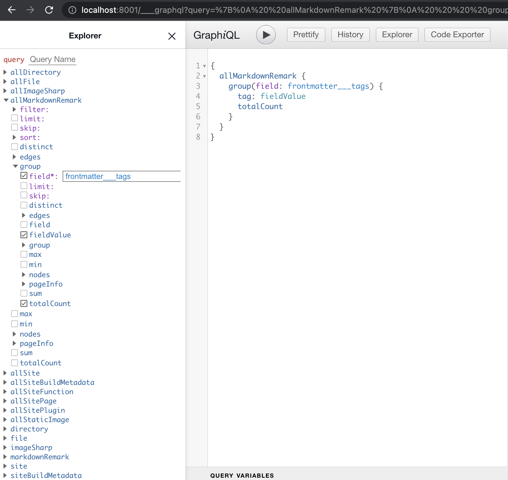
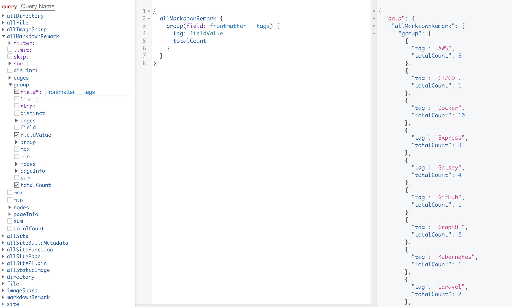
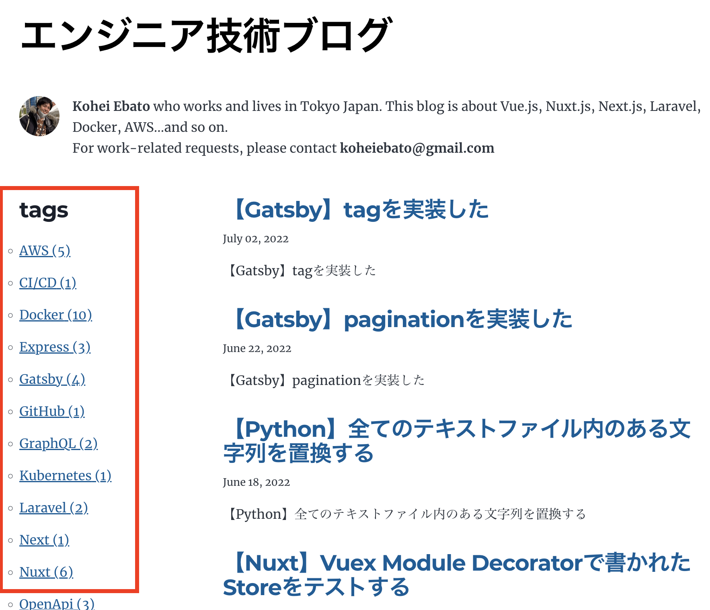
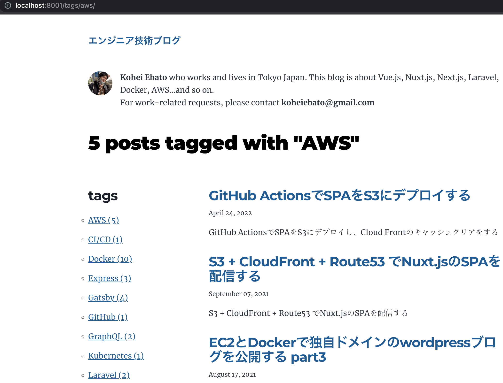

記事が多くなってきたので、タグを付けてタグ別のページを作りたい、ということで実装してみました。

## Gatsby公式
<a href="https://www.gatsbyjs.com/docs/adding-tags-and-categories-to-blog-posts/" target="_blank">
https://www.gatsbyjs.com/docs/adding-tags-and-categories-to-blog-posts/
</a>

## 記事のmarkdownに`tags`を追加します。

```
---
title: 【Gatsby】tagを実装した
date: "2022-07-02T11:12:03.284Z"
description: "【Gatsby】tagを実装した"
tags: ["Gatsby", "React", "GraphQL"]
---
```

<strong>gatsby起動中の場合は`gatsby develop`で再起動が必要です。</strong>

## GraphiQLで動作確認する
`http://localhost:8001/___graphql`



tagがGraphQLで使えるようになっているのかを確認するために、下記のqueryを入力します。
```graphql
{
  allMarkdownRemark {
    group(field: frontmatter___tags) {
      tag: fieldValue
      totalCount
    }
  }
}
```

再生ボタンのような▶のボタンを押すと、右側のエリアに結果が出力されます。タグ一覧が取得出来ていることを確認します。




## タグ一覧コンポーネントを作成します。
ここは公式サイトにはないので少し工夫をした部分です。
タグ一覧コンポーネントは画面で言うと、下記の赤枠の部分です。


`src/component/tags.js`を追加します。

<details>
<summary><strong>src/component/tags.jsの全体はこちら</strong></summary>

```jsx
// src/component/tags.js 
import * as React from 'react'
import { Link } from "gatsby"
import { Helmet } from "react-helmet"
import kebabCase from "lodash/kebabCase"
import IsMobileSize from "../lib/mediaQuery"

const Tags = ({
  data: {
    allMarkdownRemark: { totalCount },
    site: {
      siteMetadata: { title },
    },
    tagsGroup: { group }
  },
}) => {

  const showTaglist = !IsMobileSize()

  return (
    <>
      {showTaglist &&
        <div className="taglist">
          <Helmet title={title} />
          <div>
            <h3>tags</h3>
            <ul>
              {group.map(tag => (
                <li key={tag.fieldValue}>
                  <Link to={`/tags/${kebabCase(tag.fieldValue)}/`}>
                    {tag.fieldValue} ({tag.totalCount})
                  </Link>
                </li>
              ))}
            </ul>
          </div>
        </div>
      }
    </>
  )
}

export default Tags
```
</details>


スマホだとタグ一覧を表示するスペーズがないので、IsMobiliSize()という関数でスマホ判定をしてタグ一覧を非表示にしています。

詳細は割愛しますが、<a href="https://mui.com/material-ui/react-use-media-query/" target="_blank">material-uiのuseMediaQuery</a>というモジュールを使いました。

理想はスマホの場合は、ボタンを表示して、押したらタグ一覧が表示される、みたいなUIが良いのかもですが今回はスキップで。


## タグのリンクを踏んで表示される、タグ別の記事一覧ページを作成します。
`src/templates/tags.js`を追加します。urlで言うと`/tags/{tag}`で表示されるページです。

上で作成したタグ一覧コンポーネントを使うようにしました。



<details>
<summary><strong>src/templates/tags.jsの全体はこちら</strong></summary>


```jsx
// src/templates/tags.js 
import React from "react"
import { graphql } from "gatsby"
import PropTypes from "prop-types"
import Bio from "../components/bio"
import Layout from "../components/layout"
import Seo from "../components/seo"
import Posts from "../components/posts"
import TagsComponent from "../components/tags"

const Tags = ({ pageContext, data, location }) => {
  const { tag } = pageContext
  const { nodes: posts, totalCount } = data.allMarkdownRemark
  const tagHeader = `${totalCount} post${
    totalCount === 1 ? "" : "s"
  } tagged with "${tag}"`

  const siteTitle = data.site.siteMetadata?.title || `Title`
  // const currentPage = location.pathname.replace('/page/', '')

  return (
    <Layout location={location} title={siteTitle}>
      <Seo title={siteTitle} />
      <Bio />
      <h1>{tagHeader}</h1>
      <section className="main-content">
        <TagsComponent data={data} />
        <Posts posts={posts} />
      </section>
    </Layout>
  )
}

export default Tags

export const pageQuery = graphql`
  query($tag: String) {
    site {
      siteMetadata {
        title
        description
      }
    }
    allMarkdownRemark(
      limit: 2000
      sort: { fields: [frontmatter___date], order: DESC }
      filter: { frontmatter: { tags: { in: [$tag] } } }
    ) {
      totalCount
      nodes {
        excerpt
        fields {
          slug
        }
        frontmatter {
          date(formatString: "MMMM DD, YYYY")
          title
          description
        }
      }
    }
    tagsGroup: allMarkdownRemark(limit: 2000) {
      group(field: frontmatter___tags) {
        fieldValue
        totalCount
      }
    }
  }
`
```
</details>


ポイントはqueryの中でタグでfilterしている部分と

```javascript
    allMarkdownRemark(
      limit: 2000
      sort: { fields: [frontmatter___date], order: DESC }
      filter: { frontmatter: { tags: { in: [$tag] } } }
```

タグ一覧コンポーネントに渡すタグ一覧を取得している部分です。

```javascript
    tagsGroup: allMarkdownRemark(limit: 2000) {
      group(field: frontmatter___tags) {
        fieldValue
        totalCount
      }
    }
```

## gatsby-node.jsを修正する
gatsby-node.js、タグ別の記事一覧ページをcreatePageする処理を追加します。

<details>
<summary><strong>gatsby-node.jsの全体はこちら</strong></summary>

```javascript
const path = require(`path`)
const { createFilePath } = require(`gatsby-source-filesystem`)
const _ = require("lodash")

exports.createPages = async ({ graphql, actions, reporter }) => {
  const { createPage } = actions

  // Define a template for blog post
  const blogPostTemplate = path.resolve(`./src/templates/blog-post.js`)
  const tagTemplate = path.resolve("src/templates/tags.js")

  // Get all markdown blog posts sorted by date
  const result = await graphql(
    `
      {
        allMarkdownRemark(
          sort: { fields: [frontmatter___date], order: ASC }
          limit: 1000
        ) {
          totalCount
          nodes {
            id
            fields {
              slug
            }
            frontmatter {
              tags
            }
          }
        }
        tagsGroup: allMarkdownRemark(limit: 2000) {
          group(field: frontmatter___tags) {
            fieldValue
          }
        }
      }
    `
  )

  if (result.errors) {
    reporter.panicOnBuild(
      `There was an error loading your blog posts`,
      result.errors
    )
    return
  }

  const posts = result.data.allMarkdownRemark.nodes
  const PerPage = 8
  const pageCount = Math.ceil(result.data.allMarkdownRemark.totalCount / PerPage)

  for (let i = 0; i < pageCount; i++) {
    createPage({
      path: `/page/${i + 1}`,
      component: path.resolve("./src/templates/blog-page.js"),
      context: {
        limit: PerPage,
        skip: i * PerPage,
      },
    })
  }

  // Create blog posts pages
  // But only if there's at least one markdown file found at "content/blog" (defined in gatsby-config.js)
  // `context` is available in the template as a prop and as a variable in GraphQL

  if (posts.length > 0) {
    posts.forEach((post, index) => {
      const previousPostId = index === 0 ? null : posts[index - 1].id
      const nextPostId = index === posts.length - 1 ? null : posts[index + 1].id

      createPage({
        path: post.fields.slug,
        component: blogPostTemplate,
        context: {
          id: post.id,
          previousPostId,
          nextPostId,
        },
      })
    })
  }

  // Extract tag data from query
  const tags = result.data.tagsGroup.group
  // Make tag pages
  tags.forEach(tag => {
    createPage({
      path: `/tags/${_.kebabCase(tag.fieldValue)}/`,
      component: tagTemplate,
      context: {
        tag: tag.fieldValue,
      },
    })
  })
}

exports.onCreateNode = ({ node, actions, getNode }) => {
  const { createNodeField } = actions

  if (node.internal.type === `MarkdownRemark`) {
    const value = createFilePath({ node, getNode })

    createNodeField({
      name: `slug`,
      node,
      value,
    })
  }
}

exports.createSchemaCustomization = ({ actions }) => {
  const { createTypes } = actions

  // Explicitly define the siteMetadata {} object
  // This way those will always be defined even if removed from gatsby-config.js

  // Also explicitly define the Markdown frontmatter
  // This way the "MarkdownRemark" queries will return `null` even when no
  // blog posts are stored inside "content/blog" instead of returning an error
  createTypes(`
    type SiteSiteMetadata {
      author: Author
      siteUrl: String
      social: Social
    }

    type Author {
      name: String
      summary: String
    }

    type Social {
      twitter: String
    }

    type MarkdownRemark implements Node {
      frontmatter: Frontmatter
      fields: Fields
    }

    type Frontmatter {
      title: String
      description: String
      date: Date @dateformat
    }

    type Fields {
      slug: String
    }
  `)
}


```
</details>

ポイントは、タグ一覧からタグ別記事一覧ページをcreatePageしている部分です。

```javascript
  // Extract tag data from query
  const tags = result.data.tagsGroup.group
  // Make tag pages
  tags.forEach(tag => {
    createPage({
      path: `/tags/${_.kebabCase(tag.fieldValue)}/`,
      component: tagTemplate,
      context: {
        tag: tag.fieldValue,
      },
    })
  })
```

## ページネーションの2ページ目、3ページ目...にもタグ一覧コンポーネントを埋め込みます
これをやらないと、ページネーションで2ページ目を表示した時にタグ一覧が表示されないのでタグ一覧コンポーネントを追加します。

<details>
<summary>src/template/blog-page.jsの全体はこちら</summary>

```javascript
import * as React from "react"
import { graphql } from "gatsby"
import Bio from "../components/bio"
import Layout from "../components/layout"
import Seo from "../components/seo"
import Pagination from "../components/pagination"
import Posts from "../components/posts"
import Tags from "../components/tags"

const BlogPage = ({ data, location }) => {
  const siteTitle = data.site.siteMetadata?.title || `Title`
  const posts = data.allMarkdownRemark.nodes
  const currentPage = location.pathname.replace('/page/', '')

  return (
    <Layout location={location} title={siteTitle}>
      <Seo title={siteTitle} />
      <Bio />
      <section className="main-content">
        <Tags data={data} />
        <Posts posts={posts} />
      </section>
      <Pagination totalCount={data.allMarkdownRemark.totalCount} currentPage={currentPage} />
    </Layout>
  )
}

export default BlogPage

export const query = graphql`
  query ($limit: Int!, $skip: Int!) {
    site {
      siteMetadata {
        title
        description
      }
    }
    allMarkdownRemark(
      sort: { fields: [frontmatter___date], order: DESC }
      skip: $skip
      limit: $limit
      ) {
      totalCount
      nodes {
        excerpt
        fields {
          slug
        }
        frontmatter {
          date(formatString: "MMMM DD, YYYY")
          title
          description
        }
      }
    }
    tagsGroup: allMarkdownRemark(limit: 2000) {
      group(field: frontmatter___tags) {
        fieldValue
        totalCount
      }
    }
  }
`
```
</details>


ここでもタグ一覧を取得するようにqueryに下記追加しました。

```javascript
    tagsGroup: allMarkdownRemark(limit: 2000) {
      group(field: frontmatter___tags) {
        fieldValue
        totalCount
      }
    }
```

取得したタグ一覧を以下のように渡しています。

```javascript
        <Tags data={data} />
```

以上で、タグ一覧コンポーネントの作成と、タグ別記事一覧ページの作成は完了です。

基本的には、<a href="https://www.gatsbyjs.com/docs/adding-tags-and-categories-to-blog-posts/" target="_blank">
Gatsby公式サイト
</a>通りなのですが、

<strong>公式サイトではタグ一覧を一つのページとして完全に独立させているところを、今回は各ページの左に埋め込みたかったのでコンポーネント化をした</strong>、というお話でした。

## repo
<a href="https://github.com/chanfuku/gatsby-blog" target="_blank">
https://github.com/chanfuku/gatsby-blog
</a>


