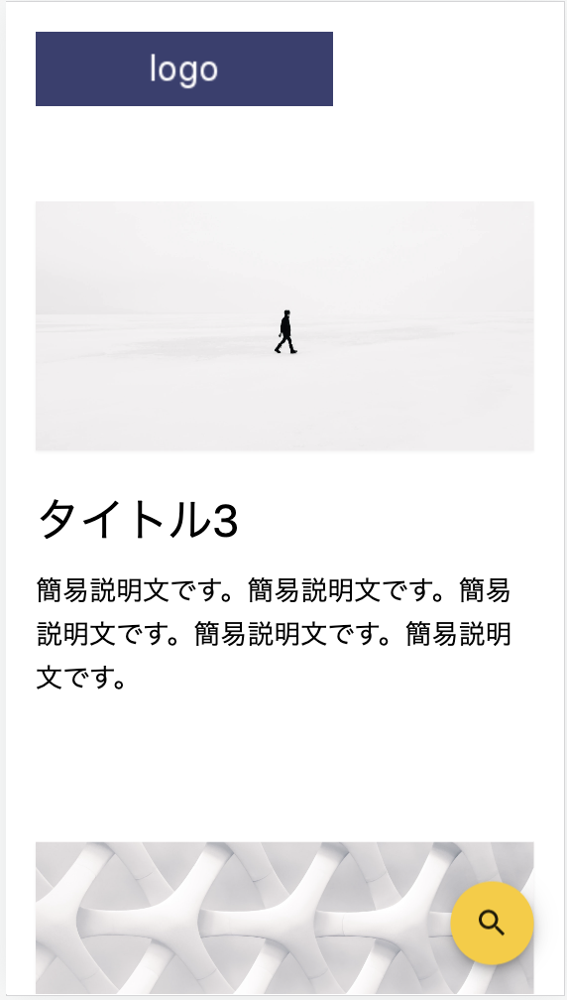
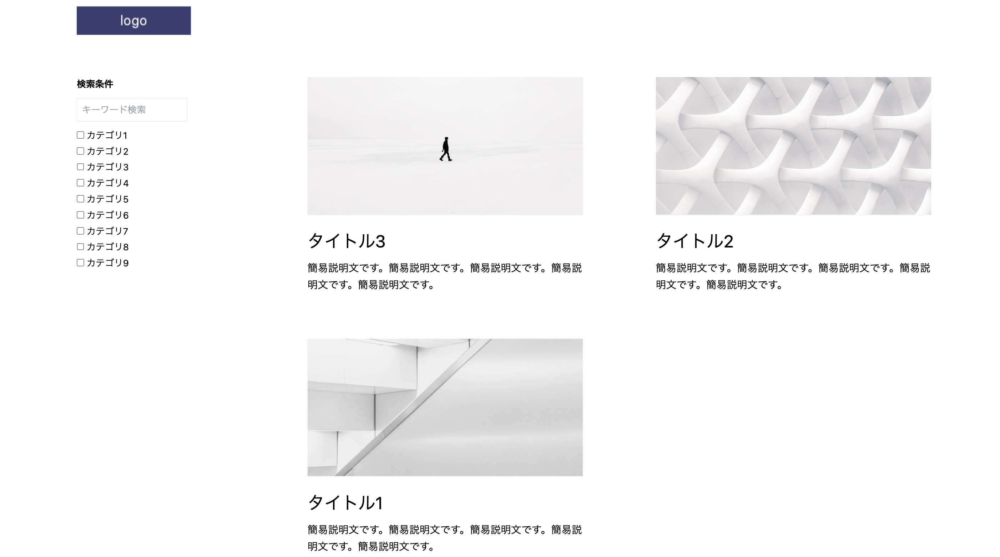

検索機能付きのブログを作って欲しい、とのご依頼をいただいたので作ってみました。

## おおまかな要望としては
* React(Next.js)で作る
* Backend(APIやDB)は作らない
* ブログ記事はmarkdownで書く
* 検索機能 (フリーワード検索とカテゴリ検索）
* ブックマーク対応 (記事の検索結果をブックマークし再度同じ検索結果が開けるようにしたい)
* レスポンシブ対応（PCでは2カラム、SPだと1カラム)
* PCの場合は検索ボックスは画面左に固定表示される。SPの場合は画面右下に虫眼鏡アイコンを固定表示し、クリックすると検索ダイアログが表示される。

## 完成(demo)
<a href="https://next-typescript-blog-with-search-c5167lryt-chanfuku.vercel.app/" target="_blank">
https://next-typescript-blog-with-search-c5167lryt-chanfuku.vercel.app/
</a>

### SP

### PC

## repo
<a href="https://github.com/chanfuku/next-typescript-blog-with-search" target="_blank">
https://github.com/chanfuku/next-typescript-blog-with-search
</a>

## deploy
mainブランチにpushすると自動的にvercelでdeployされます。
