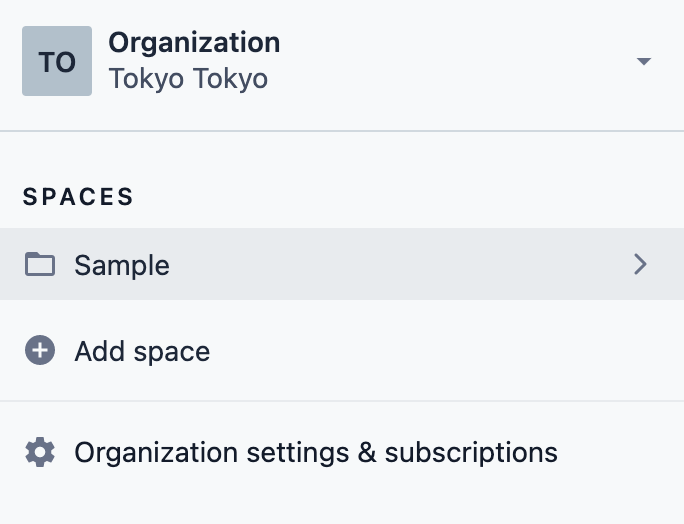
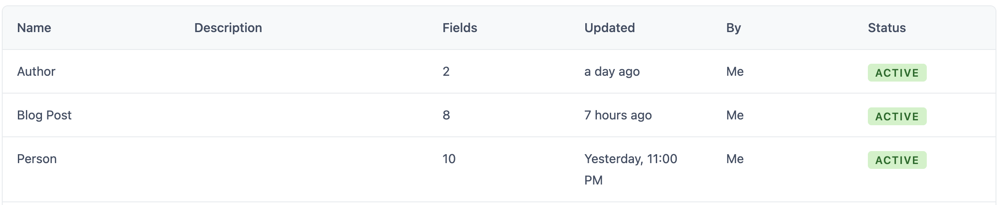
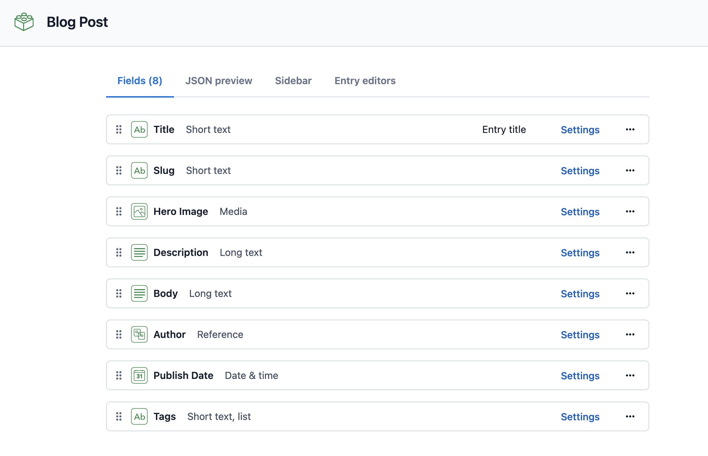
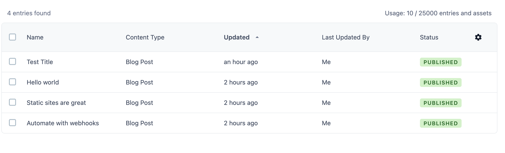
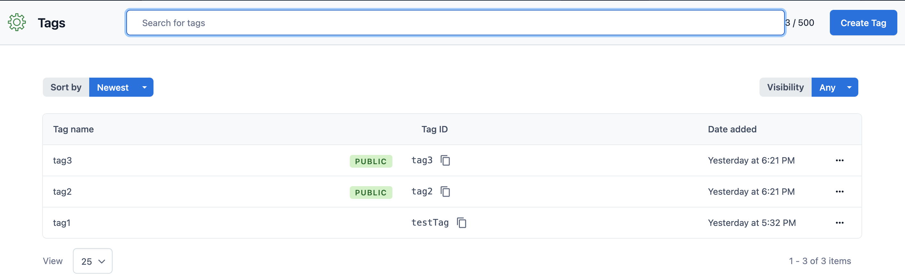
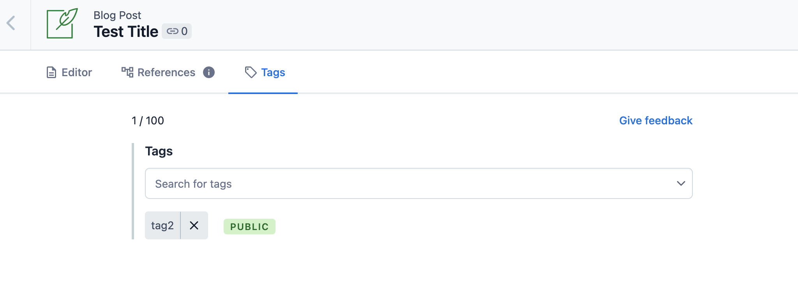

前回作ったブログの記事をCMSで更新出来るように<a href="https://www.contentful.com/" target="_blank">`Contentful`</a>を導入してみました。

## 完成(demo)
<a href="https://next-typescript-blog-with-search.vercel.app/" target="_blank">
https://next-typescript-blog-with-search.vercel.app/
</a>

## repo
<a href="https://github.com/chanfuku/next-contentful-typescript-blog" target="_blank">
https://github.com/chanfuku/next-contentful-typescript-blog
</a>

## Contentfulに登録しSpaceを作成する
<a href="https://www.contentful.com/" target="_blank">`Contentful`</a>に登録完了後、spaceを作成します。
私はSampleという名前でSpaceを作成しました。※freeプランだと一つしかspaceが作れないようです。



## Content Modelを作成する

quick startの中でテンプレート選択のようなメニューが出てくるので、「Blog」を選択します。すると、下記の様なContent Modelが自動的に作成されます。



Blog Postはこんな感じ↓



## 記事を作成してみる
Content > Add Blog Postで記事を作成してみます。既に3つの記事が自動的に作成されてました。「Test Tile」というタイトルの記事を追加で作成しました。



## Tagを追加する
Settings > Tags > Create TagsでTagを追加します。

tag1,tag2,tag3を追加しました。tag2, tag3のみpublicにしたので、postに設定できます。

publicは公開用のtagなのでdelivery apiで使う、private は管理用なのでmanagement apiで使う、という仕様みたいです。



## Post(記事)にTagを設定する
Content > Post > Tags と進むとtag設定画面が表示されます。




## Client Codeを自動生成する
<a href="https://github.com/intercom/contentful-typescript-codegen" target="_blank">
contentful-typescript-codegen
</a>
を使って、clientのコードを自動生成したいと思います。
他にも必要なライブラリがいくつかあるのでまとめてinstallします。

```
npm install contentful contentful-management dotenv contentful-typescript-codegen
```

## <rootディレクトリ>/getContentfulEnvironment.jsを作成する

```js
require('dotenv').config()
const contentfulManagement = require("contentful-management")

module.exports = function() {
  const contentfulClient = contentfulManagement.createClient({
    accessToken: process.env.CONTENTFUL_MANAGEMENT_API_ACCESS_TOKEN,
  })

  return contentfulClient
    .getSpace(process.env.CONTENTFUL_SPACE_ID)
    .then(space => space.getEnvironment(process.env.CONTENTFUL_ENVIRONMENT))
}
```

## .envを作成する
.env.localに記載した環境変数が上記のgetContentfulEnvironment.jsでは読み込めなかったので, ファイル名を.envに変更します。

```bash
mv .env.local .env
```

.envの中身↓ ...の部分はContentfulのsetting > API Keysに記載されている値を貼り付けてください

```bash
CONTENTFUL_SPACE_ID=...
CONTENTFUL_ACCESS_TOKEN=...
CONTENTFUL_PREVIEW_ACCESS_TOKEN=...
CONTENTFUL_MANAGEMENT_API_ACCESS_TOKEN=...
CONTENTFUL_ENVIRONMENT=master
```

## package.jsonにコード自動生成コマンド追加

```js
  "scripts": {
    "contentful-typescript-codegen": "contentful-typescript-codegen --output @types/generated/contentful.d.ts"
```

これで、コード自動生成の準備は整ったので、下記のコマンドを実行するとclientコードが自動生成されます

```bash
npm run contentful-typescript-codegen
```

## utils/client.tsを作成する

```js
// utils/client.ts
import { createClient } from 'contentful'

const config = {
  space: process.env.CONTENTFUL_SPACE_ID || '',
  accessToken: process.env.CONTENTFUL_ACCESS_TOKEN || '',
  environment: 'master'
}

export const client = createClient(config)
```

## lib/api.tsを作成する
今回は<a href="https://www.contentful.com/developers/docs/references/content-delivery-api/" target="_blank">Conetent Delivery API</a>しか使いませんでしたが、他にもContent Management API, Content Preview API, Images API, GraphQL Content API, User Management API等あるようです。

記事(Post)を取得する`getAllPosts`とタグ(Tag)を取得する`getAllTags`を定義しました。

```js
// lib/api.ts
import { client } from '../utils/client'
import { IBlogPostFields } from '../@types/generated/contentful'
import { Entry, Tag } from 'contentful'

export async function getAllPosts(params: {}): Promise<Entry<IBlogPostFields>[]> {
  const { items } = await client.getEntries<IBlogPostFields>(params)
  return items
}

export async function getAllTags(): Promise<Tag[]> {
  const { items } = await client.getTags()
  return items
}
```

## pages/index.tsのgetStaticProps修正
getStaticPropsで記事一覧とタグ一覧を取得するようにします。

```js
// pages/index.ts
export const getStaticProps = async () => {
  const [allPosts, allTags] = await Promise.all([
    getAllPosts({ content_type: 'blogPost' }),
    getAllTags(),
  ])

  return {
    props: { allPosts, allTags },
  }
}
```

## pages/posts/[slug].tsxのgetStaticPaths・getStaticProps修正

```js
// pages/posts/[slug].tsx
export async function getStaticProps({ params }: Params) {
  const allPosts = await getAllPosts({
    content_type: 'blogPost',
    'fields.slug': params.slug
  })
  const post = allPosts.length ? allPosts[0] : undefined
  
  const content = post
    ? await markdownToHtml(post.fields.body || '')
    : undefined

  return {
    props: {
      post,
      content,
    },
  }
}

export async function getStaticPaths() {
  const allPosts = await getAllPosts({ content_type: 'blogPost' })

  return {
    paths: allPosts.map((post: Entry<IBlogPostFields>) => {
      return {
        params: {
          slug: post.fields.slug,
        },
      }
    }),
    fallback: false,
  }
}
```

## pages/index.tsxに検索機能を追加
記事一覧はbuild時にContentful APIで取得済、また、ただのブログなので頻繁に検索結果が変わるものでもないため、
再度APIをcallするのではなく、シンプルにjavascriptでfilterするようにしました。

```js
// pages/index.tsx
  const search = ({ keyword, selectedTags }: SearchType) => {
    if (!keyword && !selectedTags.length) {
      setPosts(allPosts)
      return
    }
    const filtered = allPosts.filter((post: Entry<IBlogPostFields>) => {
      const keywordFound = keyword.length && (post.fields.title.includes(keyword) || post.fields.slug.includes(keyword) || post.fields.body.includes(keyword))
      if (keywordFound) return true
      return selectedTags.some((tag: string) => post.metadata.tags.map(v => v.sys.id).includes(tag))
    })
    setPosts(filtered)
  }
```

以上です

