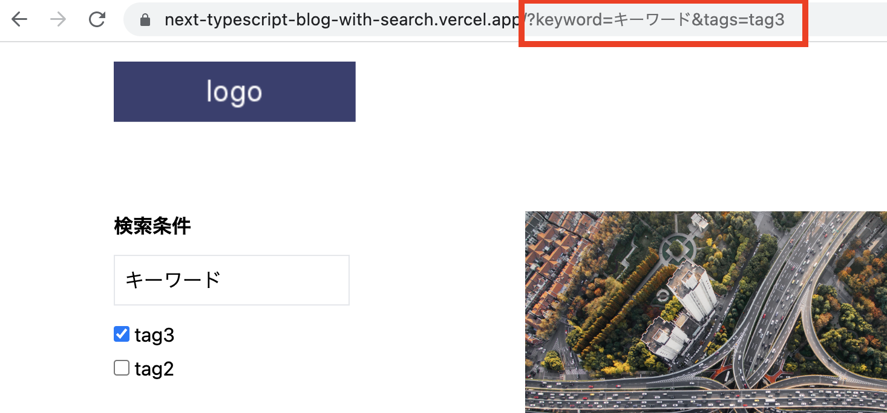

これまでVueではそこそこUnit Testを書いてきたのですが、Reactではどうやって書くのだろうか、ということでjestを導入するところからやってみました。
## 成果物Repo
<a href="https://github.com/chanfuku/next-contentful-typescript-blog" target="_blank">
https://github.com/chanfuku/next-contentful-typescript-blog
</a>


まずは環境構築ということで、

Next.js公式examplesにある「<a href="https://github.com/vercel/next.js/tree/canary/examples/with-jest" target="_blank">`next.js/examples/with-jest`</a>」を参考にしました。

## [環境構築] 各種libraryをinstallします
```bash
npm install --save-dev jest @testing-library/react @testing-library/jest-dom @types/jest jest-environment-jsdom
```

## [環境構築] package.jsonにtestコマンドを追加します
```js
  "scripts": {
    "test": "jest",
```

## [環境構築] jest.config.jsを作成します
```js
const nextJest = require('next/jest')

const createJestConfig = nextJest({
  // Provide the path to your Next.js app to load next.config.js and .env files in your test environment
  dir: './',
})

// Add any custom config to be passed to Jest
const customJestConfig = {
  setupFilesAfterEnv: ['<rootDir>/jest.setup.js'],
  moduleNameMapper: {
    // Handle module aliases (this will be automatically configured for you soon)
    '^@/components/(.*)$': '<rootDir>/components/$1',

    '^@/pages/(.*)$': '<rootDir>/pages/$1',
  },
  testEnvironment: 'jest-environment-jsdom',
}

// createJestConfig is exported this way to ensure that next/jest can load the Next.js config which is async
module.exports = createJestConfig(customJestConfig)
```

## [環境構築] jest.setup.jsを作成します
```js
// Optional: configure or set up a testing framework before each test.
// If you delete this file, remove `setupFilesAfterEnv` from `jest.config.js`

// Used for __tests__/testing-library.js
// Learn more: https://github.com/testing-library/jest-dom
import '@testing-library/jest-dom/extend-expect'
```

これでjestの環境構築は完了したので、テストコードを書いてきます。

## `__tests__/components/search-box.spec.tsx`を作成します

<details>
<summary><strong>__tests__/components/search-box.spec.tsxの全体はこちら</strong></summary>

```js
import React from "react";
import { render, screen } from '@testing-library/react';
import { Tag } from 'contentful'
import SearchBox from '../../components/search-box'

const allTags: Tag[] = [
  {
    name: 'tag1名',
    sys: {
      id: 'tag1',
      type: 'Tag',
      version: 1,
      visibility: 'public'
    }
  },
  {
    name: 'tag2名',
    sys: {
      id: 'tag2',
      type: 'Tag',
      version: 1,
      visibility: 'public'
    }
  },
  {
    name: 'tag3名',
    sys: {
      id: 'tag3',
      type: 'Tag',
      version: 1,
      visibility: 'public'
    }
  }
]

test('検索ワードが入力された状態で表示されること', () => {
  render(
    <SearchBox
      keyword="キーワード"
      selectedTags={[]}
      allTags={allTags}
      addOrRemove={jest.fn()}
      onKeywordChange={jest.fn()}
    />
  )

  const textbox = screen.getByRole('textbox')
  expect(textbox).toHaveValue('キーワード')
});

test('いくつかのcheckboxがcheckedの状態で表示されること', () => {
  render(
    <SearchBox
      keyword=""
      selectedTags={["tag1", "tag2"]}
      allTags={allTags}
      addOrRemove={jest.fn()}
      onKeywordChange={jest.fn()}
    />
  )

  const checkbox1 = screen.getByRole('checkbox', { name: 'tag1名' });
  expect(checkbox1).toBeChecked()

  const checkbox2 = screen.getByRole('checkbox', { name: 'tag2名' });
  expect(checkbox2).toBeChecked()

  const checkbox3 = screen.getByRole('checkbox', { name: 'tag3名' });
  expect(checkbox3).not.toBeChecked()
});
```
</details>

* 何をテストしているのか？
URLのリクエストパラメーターに検索ワードとタグIDが入っていて、

その検索ワードとタグIDが検索フォームのテキスト入力とcheckboxにセットされた状態で表示される、という仕様になっているので

検索フォームコンポーネントのpropsに渡された検索ワード/タグIDが、テキスト入力とcheckboxにセットされるかをテストしています。



* [ポイントその1] テスト対象のコンポーネントをrenderする

`react-testing-library`を使ってrenderします。

<a href="https://testing-library.com/docs/react-testing-library/intro" target="_blank">
https://testing-library.com/docs/react-testing-library/intro
</a>


```js
  render(
    <SearchBox
      keyword="キーワード"
      selectedTags={[]}
      allTags={allTags}
      addOrRemove={jest.fn()}
      onKeywordChange={jest.fn()}
    />
  )
```

* [ポイントその2] テスト対象のdomを取得する
```js
const textbox = screen.getByRole('textbox')
```

要素を取得するための`queries`というものがあります。

queriesを使って`screen.getByXXX`の様に書くと、要素を取得できます。

getByRole以外にも、findByXXXやgetAllByXXX等沢山ありますが、今回はgetByRoleのみを使いました。

詳細は下記公式サイトに記載されています。

<a href="https://testing-library.com/docs/queries/about#types-of-queries" target="_blank">
https://testing-library.com/docs/queries/about#types-of-queries
</a>

* [ポイントその3] jest-domを使ってテストする

↑で取得した要素をjest-domのexpectの引数にセットし、matherを使ってテストします。

```js
expect(textbox).toHaveValue('キーワード')
```

matcher一覧は下記jest-dom公式repoに記載されています。
<a href="https://github.com/testing-library/jest-dom" target="_blank">
https://github.com/testing-library/jest-dom
</a>

今回は`toHaveValue`と`toBeChecked`を使いました。
簡単に言うと、

`toHaveValue`はinputのvalueをtestしたい時に使うmatcherで、

`toBeChecked`はcheckoxにcheckが入っているかをtestしたい時に使うmatcherです。

## unit testを実行してみる
`npm run test`を叩きます。

```bash
npm run test

> test
> jest

info  - Loaded env from /Users/k-ebato/Documents/workspace/chanfuku/next-typescript-blog-with-search/.env
 PASS  __tests__/components/search-box.spec.tsx
  ✓ 検索ワードが入力された状態で表示されること (115 ms)
  ✓ いくつかのcheckboxがcheckedの状態で表示されること (139 ms)

Test Suites: 1 passed, 1 total
Tests:       2 passed, 2 total
Snapshots:   0 total
Time:        4.628 s
Ran all test suites.
```

今回はreactのunit test初体験、ということで環境構築とテストコードの基礎にフォーカスしましたが、

次回はモジュールのモック化（一部のモジュールをmock化してダミーに置き換えることで、テストコードが書きやすくなる）をやってみたいと思います。

