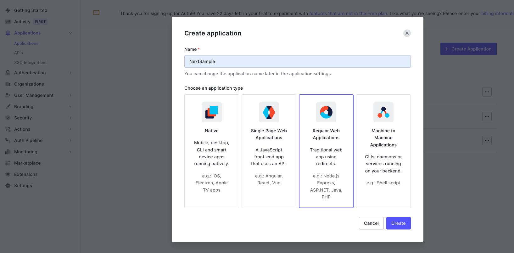
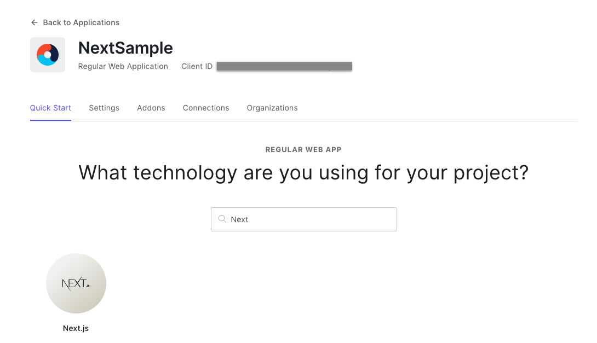
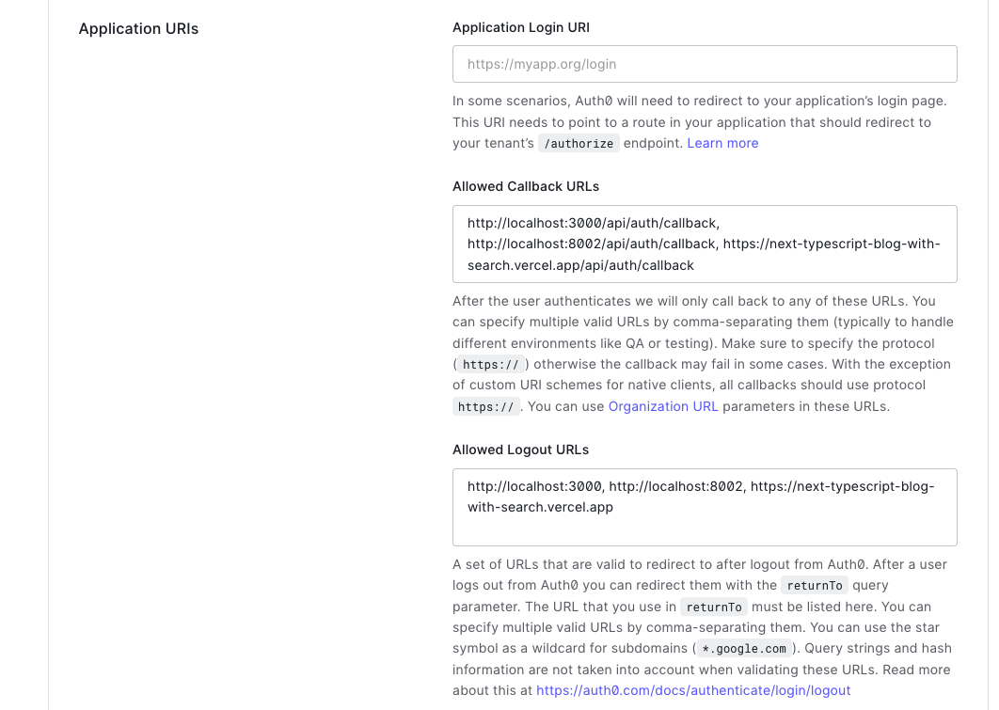
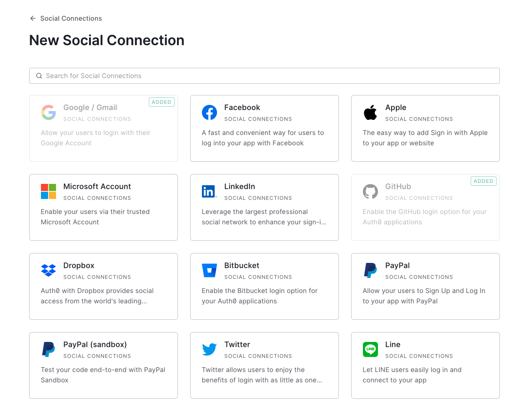
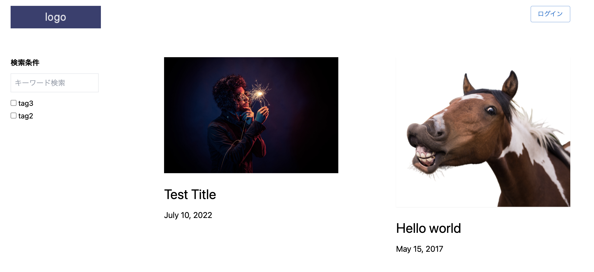
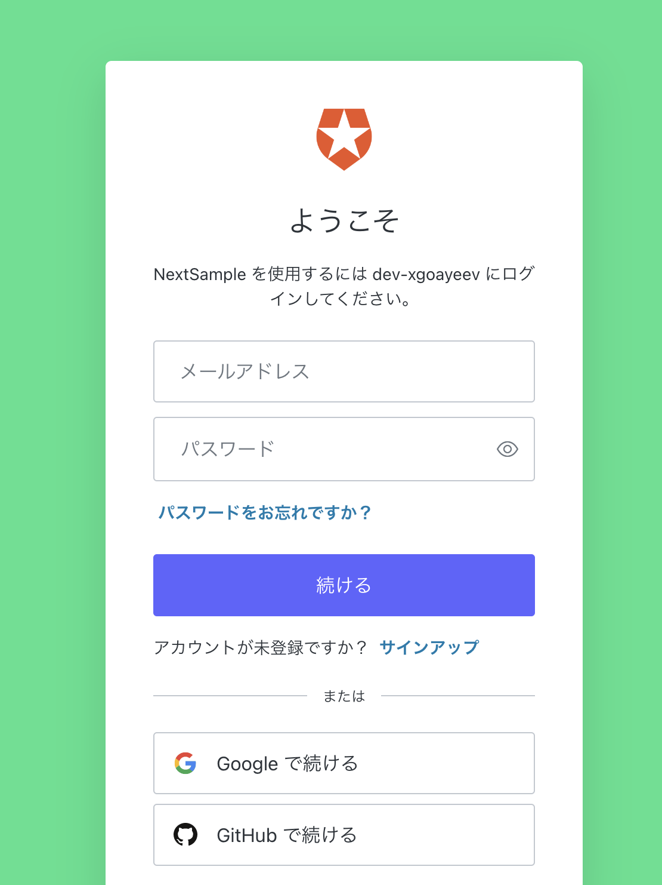
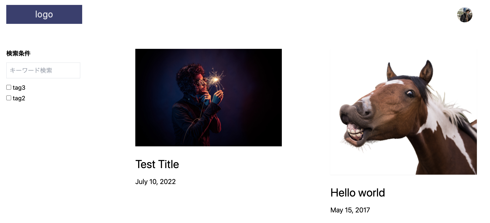
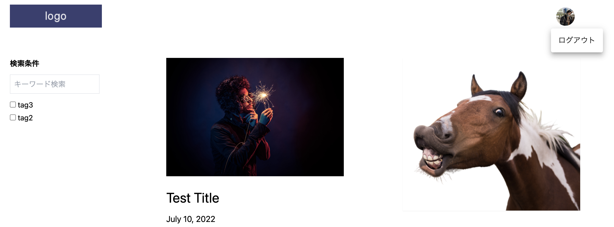

Auth0とは、「誰でも簡単に導入できる認証・認可プラットフォーム」です。

[前回のjest](../20220718-next-jest)、
[前々回のcontetful](../20220710-next-contentful)
と同じく、Next.jsのサイトにAuth0を導入してみました。

## Auth0

<a href="https://auth0.com/jp" target="_blank">
https://auth0.com/jp
</a>

## Demo

<a href="https://next-typescript-blog-with-search.vercel.app/">
https://next-typescript-blog-with-search.vercel.app/
</a>

## Repo

<a href="https://github.com/chanfuku/next-contentful-typescript-blog" target="_blank">
https://github.com/chanfuku/next-contentful-typescript-blog
</a>

## Auth0登録後、ダッシュボードからApplicationを作成します

ダッシュボード > Appliations > Create Applicationで`Regular Web Appliations`を選択します。
`SPA`を選択すると次のステップでNext.jsが選択できないので要注意です。



## Next.jsを選択します



## 作成したApplicationのSettingsにURLを設定します

ダッシュボード > Applications > 上記で作成したApplication名 > settingsを選択し、

以下のように、Allowed Callback URLsとAllowed Loguout URLsを登録します。

カンマ区切りで複数登録出来るので、ローカル開発環境のURLと本番のURL(vercelで公開している<a href="https://next-typescript-blog-with-search.vercel.app/" target="_blank">`このサイト`</a>のurl)も登録しました。



## Social Loginも追加します

Social Loginも簡単に実装出来るそうなので、試しにGithubを追加してみたいと思います。因みに、googleログインはdefaultで入っていました。

ダッシュボード > Authentication > social > Create Connectionを選択すると、以下のように選択できるので、Githubを選択します。

他にも`Twitter`や`Line`等もありました。



これで、Auth0側の設定は終わりです。確かに簡単です。

## Next.jsのアプリケーションに`@auth0/nextjs-auth0`をinstallします

Auth0の<a href="https://auth0.com/docs/quickstart/webapp/nextjs/interactive" target="_blank">`nextjs/quickstart`</a>を参考にしながら進めていきます。

```
npm install @auth0/nextjs-auth0
```

## .env修正
.envに以下の値を追加します。

```
AUTH0_SECRET=
AUTH0_BASE_URL=
AUTH0_ISSUER_BASE_URL=
AUTH0_CLIENT_ID=
AUTH0_CLIENT_SECRET=
AUTH0_SCOPE=
```

値はAuth0のsettingsからコピって来るのもよし、一覧簡単なのは

ダッシュボード > Appliations > アプリケーション名 > Quick Start > DOWNLOAD SAMPLE　と選択すると、

.envが作成済のNext.jsのサンプルアプリケーションがダウンロード出来るので、その中から.envを持ってくるのが早いかもしれません。

## pages/_app.tsxを修正します

以下のように、`<UserProvider></UserProvider>`で囲むと、その中でユーザー情報が参照出来るようになる、らしいです。

```js
import { AppProps } from 'next/app'
import { UserProvider } from '@auth0/nextjs-auth0';
import '../styles/index.css'

export default function MyApp({ Component, pageProps }: AppProps) {
  return (
    <UserProvider>
      {/*
       // @ts-ignore */}
      <Component {...pageProps} />
    </UserProvider>
  )
}
```

## pagesにapi/auth/[...auth0].tsを追加します

これで、ログインは/api/auth/loginで、

ログアウトは/api/auth/logoutで、処理が行われるようになります。

```js
import { handleAuth } from '@auth0/nextjs-auth0'

export default handleAuth()
```

## Headerにログインボタン・アバター・ログアウトボタンを追加します

<details>
<summary><strong>components/header.tstの全体はこちら</strong></summary>

```js
import { useState } from 'react'
import { useRouter } from 'next/router'
import { useUser } from '@auth0/nextjs-auth0'
import Avatar from '@mui/material/Avatar'
import Button from '@mui/material/Button'
import Menu from '@mui/material/Menu'
import MenuItem from '@mui/material/MenuItem'
import { getItemsFromStorage, makeQuerySearchParams } from '../lib/search'

const Header = () => {
  const router = useRouter()
  const { user, isLoading } = useUser()
  const [anchorEl, setAnchorEl] = useState<null | HTMLElement>(null)
  const open = Boolean(anchorEl)

  const toTopPage = () => {
    const { keyword, selectedTags } = getItemsFromStorage()
    router.push({
      pathname: '/',
      query: makeQuerySearchParams({ keyword, selectedTags })
    })
  }

  const handleClick = (event: React.MouseEvent<HTMLButtonElement>) => {
    setAnchorEl(event.currentTarget)
  };
  const handleClose = () => {
    setAnchorEl(null)
    router.push('/api/auth/logout')
  };

  return (
    <section className='mt-5 mb-16 flex justify-between'>
      <h2>
        <a onClick={toTopPage}></a>
      </h2>
      {!isLoading && !user && (
        <a href="/api/auth/login">
          <Button variant="outlined">ログイン</Button>
        </a>
      )}
      {user && (
        <>
          <Button
            id="basic-button"
            aria-controls={open ? 'basic-menu' : undefined}
            aria-haspopup="true"
            aria-expanded={open ? 'true' : undefined}
            onClick={handleClick}
          >
          <Avatar
            alt="avatar"
            src={user.picture || ''}
          />
          </Button>
          <Menu
            id="basic-menu"
            anchorEl={anchorEl}
            open={open}
            onClose={handleClose}
            MenuListProps={{
              'aria-labelledby': 'basic-button',
            }}
          >
            <MenuItem onClick={handleClose}>ログアウト</MenuItem>
          </Menu>
        </>
      )}
    </section>
  )
}

export default Header
```

</details>

## ログイン前

右上にログインボタンが表示されます。



## ログイン画面

ログイン画面の色を少しカスタマイズしたので、背景が緑になっていますがデフォルトだと黒背景です。

「GitHubで続ける」も表示されているので、クリックしてGitHubアカウントへのアクセスを許可すると、GitHubでログインが出来るようになります。

Googleでログインも出来ますし、「サインアップ」から新規にアカウントを登録することも可能です。



## ログイン後

ログインボタンの位置にGitHubのアバターが表示されます。



アバターをクリックすると、ログアウトメニューが表示されます。



## テストアカウント

もしログインの動作確認をしたい場合は以下のアカウントをお使いください。

メールアドレス: ebato+20220725@20220725.com

パスワード: Test@1234

デモサイトはこちらです↓

<a href="https://next-typescript-blog-with-search.vercel.app/">
https://next-typescript-blog-with-search.vercel.app/
</a>

## Vercelで公開する場合は環境変数を設定します

Vercelで公開する場合は、Vercelのダッシュボード > Settings > Environment Variablesで

Auth0の環境変数を適宜設定する必要があります。

ローカル環境の.envは値をシングルクォートで囲っても問題なく動きますが、VercelのSettingsではシングルクォートは除く必要があるので要注意です。
