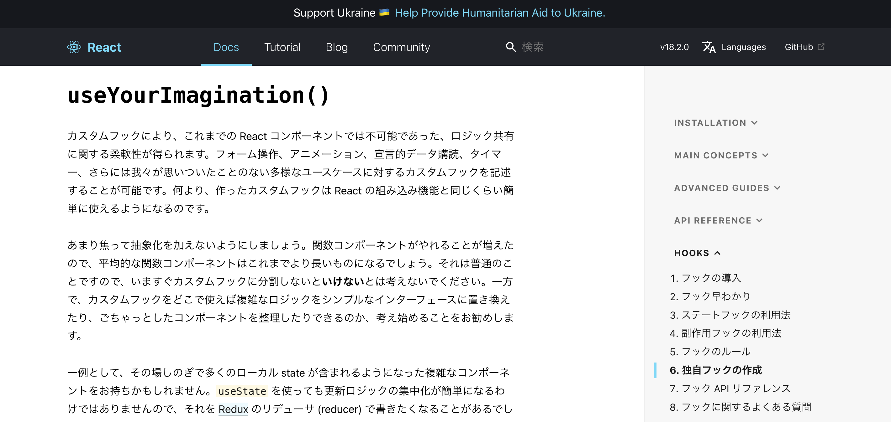

最近作った<a href="https://github.com/chanfuku/next-contentful-typescript-blog" target="_blank">
React(Next.js)のアプリケーション
</a>
の検索機能を独自フックに切り出して、テストコードを書いてみました。

独自のフックを作成すると何のメリットがあるのかと言うと、コンポーネントからロジックを抽出して再利用可能な関数を作ることが可能になり、コードの見通しが良くなる & テストコードが書きやすくなります。

## Repo
<a href="https://github.com/chanfuku/next-contentful-typescript-blog" target="_blank">
https://github.com/chanfuku/next-contentful-typescript-blog
</a>

## 参考にしたサイト
<a href="https://ja.reactjs.org/docs/hooks-custom.html" target="_blank">
【React公式】https://ja.reactjs.org/docs/hooks-custom.html
</a>

<a href="https://github.com/testing-library/react-hooks-testing-library" target="_blank">
@testing-library/react-hooks
</a>

## 作成した独自フック
#### components/user-search.tsx
```js
import { useState } from 'react'
import { Entry } from 'contentful'
import { IBlogPostFields } from '../@types/generated/contentful'
import { SearchType } from '../types/search'
import { getSearchResultByKeyword, getSearchResultBySelectedTags, getSelectedTags } from '../lib/search'

export const useSearch = (allPosts: Entry<IBlogPostFields>[]) => {
  const [posts, setPosts] = useState<Entry<IBlogPostFields>[]>(allPosts);
  const [selectedTags, setSelectedTags] = useState<string[]>([]);
  const [keyword, setKeyword] = useState<string>('');

  const handleSearch = ({ keyword, selectedTags }: SearchType) => {
    const keywordSearchResult = getSearchResultByKeyword({ keyword, posts: allPosts })
    const finalResult = getSearchResultBySelectedTags({ selectedTags, posts: keywordSearchResult })
    setKeyword(keyword)
    setSelectedTags(selectedTags)
    setPosts(finalResult)
  }

  return {
    posts,
    keyword,
    selectedTags,
    handleSearch,
  }
}
```

## 独自フックを利用する側
#### pages/index.tsx
```js
import { useState, useEffect } from 'react'
import Head from 'next/head'
import { useRouter } from 'next/router'
import Fab from '@mui/material/Fab'
import { Entry, Tag } from 'contentful'
import SearchIcon from '@mui/icons-material/Search'
import Container from '../components/container'
import SearchBox from '../components/search-box'
import SearchDialog from '../components/search-dialog'
import MoreStories from '../components/more-stories'
import Layout from '../components/layout'
import Header from '../components/header'
import { useSearch } from '../components/use-search'
import { getAllPosts, getAllTags } from '../lib/api'
import isMobileSize from '../lib/mediaQuery'
import { setItemsToStorage, getSearchParamsFromQuery, makeQuerySearchParams, getSelectedTags } from '../lib/search'
import { SearchType } from '../types/search'
import { IBlogPostFields } from '../@types/generated/contentful'

type Props = {
  allPosts: Entry<IBlogPostFields>[]
  allTags: Tag[]
}

const Index = ({ allPosts, allTags }: Props) => {
  const [open, setOpen] = useState<boolean>(false);
  const { posts, keyword, selectedTags, handleSearch } = useSearch(allPosts);
  .
  .
  // 省略
```

#### 独自フックをimportしている箇所
```js
import { useSearch } from '../components/use-search'
```

#### 上記でimportした独自フックを利用している箇所
```js
  const { posts, keyword, selectedTags, handleSearch } = useSearch(allPosts);
```

ポイントとしては、独自フックを利用する側は、特に特別なことは意識せず、独自フックをimportしてシンプルに使うだけ、ということです。

検索に関するコードを独自フックに抽出したので、コード全体の見通しが良くなりました。


# 独自フックのテストコード

`@testing-library/react-hooks`を`npm install`します。

どうやらreact18では使えない様で、reactとreact-domを17系に変更する必要があったので要注意です。

#### __tests__/components/user-search.spec.tsx
```js
import { renderHook, act } from '@testing-library/react-hooks'
import { useSearch } from '../../components/use-search'
import { post1, allPosts } from '../lib/search.spec'

describe('useSearch', () => {
  test('keyword=test1, tag=tag1が検索ヒットする', () => {
    const { result } = renderHook(() => useSearch(allPosts))
    act(() => {
      result.current.handleSearch({ keyword: 'test1', selectedTags: ['tag1'] })
    })

    expect(result.current.posts).toStrictEqual([post1])
    expect(result.current.keyword).toBe('test1')
    expect(result.current.selectedTags).toStrictEqual(['tag1'])
  })
  test('keyword=test1, tag=tag1,tag2が検索ヒットする', () => {
    const { result } = renderHook(() => useSearch(allPosts))
    act(() => {
      result.current.handleSearch({ keyword: 'test1', selectedTags: ['tag1', 'tag2'] })
    })

    expect(result.current.posts).toStrictEqual([post1])
    expect(result.current.keyword).toBe('test1')
    expect(result.current.selectedTags).toStrictEqual(['tag1', 'tag2'])
  })
  test('keyword=test1, tag=tag2で検索ヒットしない', () => {
    const { result } = renderHook(() => useSearch(allPosts))
    act(() => {
      result.current.handleSearch({ keyword: 'test1', selectedTags: ['tag2'] })
    })

    expect(result.current.posts).toStrictEqual([])
    expect(result.current.keyword).toBe('test1')
    expect(result.current.selectedTags).toStrictEqual(['tag2'])
  })
})
```

ポイントしては、以下の3つです。

* まず、下記の様にrenderHooksで独自フック(今回はuseSearch)を作成する

```js
const { result } = renderHook(() => useSearch(allPosts))
```

* そして、下記の様にuserSearchが保持するhandleSearchという関数を実行する

```js
    act(() => {
      result.current.handleSearch({ keyword: 'test1', selectedTags: ['tag1'] })
    })
```

* その結果をテストする
```js
    expect(result.current.posts).toStrictEqual([post1])
```


## 想像力を使いなさい



React公式の独自フックについて記載されているページの最後の方に、大きく`useYourImagination()`と記載されています。

直訳すると、「想像力を使いなさい」。

想像力が必要ということは、それだけ自由度が高いのだと思います。

今回は独自フックの中ではuseStateしか使っていないですが、他にもuseContextやuseCallbackやuseMemo等があり、使い方はエンジニアの想像力次第といったところでしょうか。
