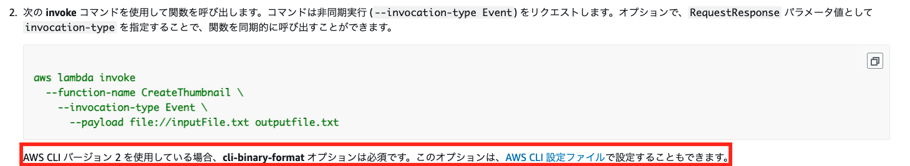
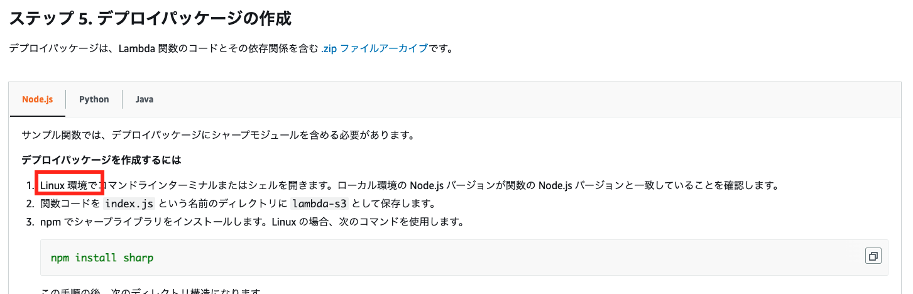

最近フロント周り（特にReact)ばかり触っていたので、たまにはバックエンドにも触れたいと思い、

AWS Lambdaのチュートリアルをやってみました。

## チュートリアル
<a href="https://docs.aws.amazon.com/ja_jp/lambda/latest/dg/with-s3-tutorial.html" target="_blank">
https://docs.aws.amazon.com/ja_jp/lambda/latest/dg/with-s3-tutorial.html
</a>

## ハマりポイント
基本的にはstep1から順に進めていけば出来るのですが、Lambda初心者の私にとっては、<a href="https://docs.aws.amazon.com/ja_jp/lambda/latest/dg/with-s3-tutorial.html#s3-tutorial-events-adminuser-create-test-function-upload-zip-test-manual-invoke" target="_blank">「ステップ 7. Lambda 関数をテストする」</a>で2つハマりポイントがありました。

1. 「Invalid base64」エラー

2. 「something went wrong installing the \"sharp\" module\n」エラー

では、詳細と解決方法を記載していきます。

## 「Invalid base64」エラー

<a href="https://docs.aws.amazon.com/ja_jp/lambda/latest/dg/with-s3-tutorial.html#s3-tutorial-events-adminuser-create-test-function-upload-zip-test-manual-invoke" target="_blank">「ステップ 7. Lambda 関数をテストする」</a>で関数呼び出しコマンドを実行すると、コンソールに↓が表示されます。

```bash
Invalid base64: "{
  "Records":[
    {
      "eventVersion":"2.0",
      "eventSource":"aws:s3",
      "awsRegion":"us-west-2",
      "eventTime":"1970-01-01T00:00:00.000Z",
      "eventName":"ObjectCreated:Put",
      "userIdentity":{
        "principalId":"AIDAJDPLRKLG7UEXAMPLE"
      },
      "requestParameters":{
        "sourceIPAddress":"127.0.0.1"
      },
      "responseElements":{
        "x-amz-request-id":"C3D13FE58DE4C810",
        "x-amz-id-2":"FMyUVURIY8/IgAtTv8xRjskZQpcIZ9KG4V5Wp6S7S/JRWeUWerMUE5JgHvANOjpD"
      },
      "s3":{
        "s3SchemaVersion":"1.0",
        "configurationId":"testConfigRule",
        "bucket":{
          "name":"lambda-s3-20220811",
          "ownerIdentity":{
            "principalId":"A3NL1KOZZKExample"
          },
          "arn":"arn:aws:s3:::lambda-s3-20220811"
        },
        "object":{
          "key":"HappyFace.jpg",
          "size":1024,
          "eTag":"d41d8cd98f00b204e9800998ecf8427e",
          "versionId":"096fKKXTRTtl3on89fVO.nfljtsv6qko"
        }
      }
    }
  ]
}
"
```

Invalid base64と記載されいるのでどうやらエラーの様子。

ちゃんとドキュメントを読み返します。



「AWS CLI バージョン 2 を使用している場合、cli-binary-format オプションは必須です。」

しっかり書いてあります。スルーしてしまっていた私がアホなだけでした。

#### AWS CLIのバージョンを確認するコマンド
```bash
$ aws --version
aws-cli/2.6.2 Python/3.9.11 Darwin/20.6.0 exe/x86_64 prompt/off
```

2系なので、`cli-binary-format` オプションが必須です。CLI バージョン2では--payloadはbase64に変換されるため、エラーになっていたようです。

オプションを付けたコマンドはこうなります↓

```bash
aws lambda invoke --function-name CreateThumbnail \
--invocation-type Event \
--cli-binary-format raw-in-base64-out \
--payload file://inputFile.txt outputfile.txt
```

すると、↓と表示されたので成功したと思いきや、次のハマりポイントに入っていきます。

```
{
    "StatusCode": 202
}
```

## 「something went wrong installing the \"sharp\" module\n」

上記で`StatusCode: 202`が表示されたから成功したと思ったのですが、S3のバケットを確認しても、resizeされたサムネイル画像が生成されていませんでした。

`CloudWatch`でログを確認すると、こんなエラーが吐かれていました。

```
{
    "errorType": "Error",
    "errorMessage": "\nSomething went wrong installing the \"sharp\" module\n\nCannot find module '../build/Release/sharp-linux-x64.node'\nRequire stack:\n- /var/task/node_modules/sharp/lib/sharp.js\n- /var/task/node_modules/sharp/lib/constructor.js\n- /var/task/node_modules/sharp/lib/index.js\n- /var/task/index.js\n- /var/runtime/UserFunction.js\n- /var/runtime/index.js\n\nPossible solutions:\n- Install with verbose logging and look for errors: \"npm install --ignore-scripts=false --foreground-scripts --verbose sharp\"\n- Install for the current linux-x64 runtime: \"npm install --platform=linux --arch=x64 sharp\"\n- Consult the installation documentation: https://sharp.pixelplumbing.com/install"
```

どうやら`sharp`が見つからない様子。

<a href="https://docs.aws.amazon.com/ja_jp/lambda/latest/dg/with-s3-tutorial.html#with-s3-tutorial-create-function-package" target="_blank">「ステップ 5. デプロイパッケージの作成」</a>に原因となりそうなことが書いてありました。



Linux環境でパッケージを作成してくださいと。Macでも大丈夫なはず、と思い込んで進めてしまいましたが駄目だったようです。

調べていくうちにLambdaの公式Docker Image等も提供されていることが分かったので、Linux環境を立ち上げようかと思ったのですが、

エラーメッセージに習って、下記コマンドでlinux用のsharpをMacにinstallする方法を試しました。

```bash
npm install --platform=linux --arch=x64 sharp
```

#### zip化する
```bash
zip -r function.zip .
```

#### 作成済のLambda関数を削除する
```bash
aws lambda delete-function --function-name CreateThumbnail \
```

#### Lamda関数を作成する 
```bash
aws lambda create-function --function-name CreateThumbnail \
--zip-file fileb://function.zip --handler index.handler --runtime nodejs12.x \
--timeout 30 --memory-size 1024 \
--role arn:aws:iam::031484419454:role/lambda-s3-role
```
※iam::xxxxのxxxxの部分はuserIdに書き換えてください。

こんな表示がされればLambda関数の作成が成功している
```
{
    "FunctionName": "CreateThumbnail",
    "FunctionArn": "arn:aws:lambda:ap-northeast-1:031484419454:function:CreateThumbnail",
    "Runtime": "nodejs12.x",
    "Role": "arn:aws:iam::031484419454:role/lambda-s3-role",
    "Handler": "index.handler",
    "CodeSize": 8538635,
    "Description": "",
    "Timeout": 30,
    "MemorySize": 1024,
    "LastModified": "2022-08-11T15:54:11.658+0000",
    "CodeSha256": "mTkZqIDpIpSiUHdqpYTysxmNNJQWDsXNppkLODEIHzY=",
    "Version": "$LATEST",
    "TracingConfig": {
        "Mode": "PassThrough"
    },
    "RevisionId": "422163ea-b634-416a-990b-f7e5683e5742",
    "State": "Pending",
    "StateReason": "The function is being created.",
    "StateReasonCode": "Creating",
    "PackageType": "Zip",
    "Architectures": [
        "x86_64"
    ],
    "EphemeralStorage": {
        "Size": 512
    }
}
```

#### Lambda関数を実行する
```bash
aws lambda invoke --function-name CreateThumbnail \
--invocation-type Event \
--cli-binary-format raw-in-base64-out \
--payload file://inputFile.txt outputfile.txt
```

成功したっぽい。

```
{
    "StatusCode": 202
}
```

ようやくresizeされたサムネ画像がS3バケットに保存されました。

CloudWatchを確認すると、無事成功した様子。

```
2022-08-11T15:55:49.712Z	02b60c6b-03e4-4b99-86c7-858a8fafff57	INFO	Successfully resized lambda-s3-20220811/HappyFace.jpg and uploaded to lambda-s3-20220811-resized/resized-HappyFace.jpg
```

あとは、

<a href="https://docs.aws.amazon.com/ja_jp/lambda/latest/dg/with-s3-tutorial.html#with-s3-tutorial-configure-event-source" target="_blank">「ステップ 8. Amazon S3 を設定してイベントを発行する」</a>をやれば、S3のresouce用のバケットに画像をアップロードすると、Lambda関数が実行され、resized用のバケットにサムネイル画像が作成されます。

Lambdaはまだまだ知らないことが沢山あるので、これから深堀りしていきたいと思います。
