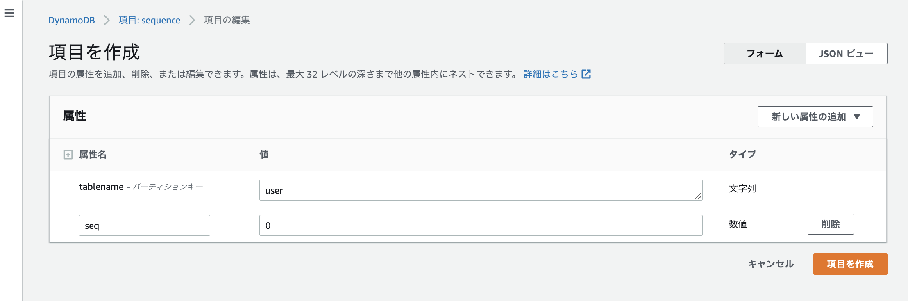
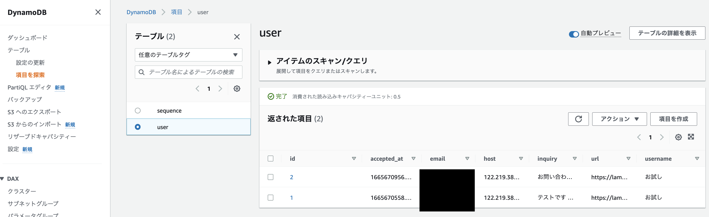

こんな感じで、お問い合わせフォームを送信すると、Lambda + APIGatewayで作成したコードが実行され、

送信者名/メアド/お問い合わせ内容をDynamodbに保存しつつ、

何かしらの資料的なPDFがダウンロード出来るURLが記載されたメールがSESで送信される、

という、一般的なお問い合わせです。

何番煎じか分からない位の内容ですが、自分のAWSスキルを少しでも上げるためにやってみました。

## 全体構成


それでは、順を追って解説していきます。

## S3に資料を保存する

任意のbucketを作成し、PDFでもPPTなんでも良いのですが資料っぽい素材を置きます。

お問い合わせサンクスメール内にダウンロード先のURLが記載されているので、そこからダウロードしてもらう仕様です。

バケット名は世界で一意である必要があります。今回は「lambda-web-example-static-20221010」とし、ファイルは「sample.pdf」としました。


## Lambdaを作成する

以下のように、関数の新規作成画面で「設計図の使用」を選択 > プループリントに`microsevice-http-endpoint-python`と入力し、

`Create a microsevice that interacts with a DDB table`を選択し、`設定`を押下します。


次に、以下の「基本的な情報」で関数名に任意の名前を入力します。ここでは、`userInquiryFunction`としました。

実行ロールは`既存のロールを使用する`を選択しました。既存のロールは以前[この記事](../20220811-lambda-s3-tutorial)でLambda + S3のチュートリアルをやった時に作成した実行ロール(lambda-s3-role)を使いました。

AWS Lambdaのチュートリアルで言うところの<a href="https://docs.aws.amazon.com/ja_jp/lambda/latest/dg/with-s3-tutorial.html#with-s3-tutorial-create-execution-role" target="_blank">ステップ3. 実行ロールを作成する</a>で作成した実行ロールです。

ちなみに、後ほど詳しく説明しますが、この実行ロールをそのまま使うと権限不足でエラーになります。


## APIGatewayトリガーを作成する

上記のLambda作成画面と同じ画面で、APIGateway トリガーを設定します。

`Create a new API`を選択し、API Typeに`REST API`よりもコスパが良い`HTTP API`を選択します。

Securityは誰でも呼び出せるという意味の`Open`にし、名前は任意の名前を入力します。

Deployment stageは初期表示のまま`default`とし、CORSにチェックを入れます。

CORSにチェックを入れないと、AjaxでAPIをcallする際にエラーになります。

Enabled detailed metricsは有料オプションらしいので要注意です。


APIGatewayトリガーの下に表示されるLambda 関数コードはこの時点では編集不可なので

一旦このまま`関数の作成`ボタンをクリックします。

## お問い合わせフォームHTMLを作成する
Github Pagesで作成しました。シンプル is the bestということでjQueryを使ってます。入力した内容を$ajaxで送信するだけなので特別なことはしてないです。

<a href="https://chanfuku.github.io/lambda-playground/lambda-apigateway-dynamodb-ses/index.html" target="_blank">
https://chanfuku.github.io/lambda-playground/lambda-apigateway-dynamodb-ses/index.html
</a>

APIGatewayの設定画面からエンドポイントのURLをコピーし(赤で囲ってるところです)、上記index.htmlの$ajaxでpostするurl部分に貼り付けます。

```js
        $.ajax({
          'type': 'POST',
          'url': 'APIGatewayのエンドポイントをここに',
```


## APIGatewayでCORSの設定をする

これをやらないとCORSのエラーでPOSTできないです。


## DynamoDBにユーザー情報/お問い合わせ内容を保存するテーブルを作成する

DynamoDBには連番を振る機能がないらしいので、AWS公式でも紹介されている<a href="https://docs.aws.amazon.com/ja_jp/amazondynamodb/latest/developerguide/WorkingWithItems.html#WorkingWithItems.AtomicCounters" target="_blank">アトミックカウンタ方式</a>で、sequenceテーブルを作成します。


sequenceテーブルのseqの値を更新時に+1して保存し、その値をuserテーブルのidに保存する仕組みです。

上記の処理中に別の処理が割り込むことはないため、一意の値が保証されます。

しかしながら、userテーブルに書き込む処理中にエラーが発生すると、sequenceテーブルのseqだけ更新されるので、連番の連続性は保証されません。

テーブル設計はこんな感じ。

#### user テーブル
|  属性名  |  型  | 説明 |
| ---- | ---- | ---- |
|  id  |  Number  | 連番。プライマリーキー |
|  username  |  String  | ユーザーの氏名 |
|  email |  String  | ユーザーのメールアドレス |
|  inquiry |  String  | ユーザーのお問い合わせ内容 |
|  accepted_at |  Number  | 受付日時のUnix タイムスタンプ |
|  host |  String  | クライアントのホスト名(IPアドレス) |
|  url |  String  | 資料ダウロードURL |

#### sequence テーブル
|  属性名  |  型  | 説明 |
| ---- | ---- | ---- |
|  tablename  |  String  | テーブル名 |
|  seq  |  Number  | 連番 |


テーブル名に`user`、パーティションキーに`id`、そして値は`数値`に設定します。

テーブル設定はデフォルト設定で、`テーブルの作成`ボタンをクリックするとuserテーブルが作成されます。


次にsequenceテーブルを作成します。テーブル名に`sequence`、パーティションキーに`tablename`、値は`文字列`に設定します。


そして、sequenceテーブルに、tablename=user、seq=0という初期値を登録したいので、アクションから`項目を作成`を選択します。


属性名がRelationa DBで言うところのカラム名です。tablenameというプライマリキー(パーティションキー)に`user`と入力し、

`新しい属性の追加`から`数値`を選択すると、新しい行が追加されるので、属性名にseq、値に0を入力し「項目を作成」を選択します。



## SESを設定する

詳細は割愛しますが、「Create identity」から検証用のメールアドレスを設定します。

最初はサンドボックス環境ということで、ここで設定したメールアドレス宛にのみメール送信が可能になります。

## Lambda実行ロールにポリシー追加する

IAM Policyのロール設定画面から対象のロール(今回はlambda-s3-role)に「AWSLambdaS3Policy」「AmazonS3FullAccess」「AmazonDynamoDBFullAccess」「AmazonSESFullAccess」を追加します。


## Lambdaの関数を編集する

一番左の「コード」タブから編集していきます。


<details>
<summary>コードの詳細を見る</summary>

```python
import json
import boto3
import base64
import time
import decimal
import os

# DynamoDBオブジェクト
dynamodb = boto3.resource('dynamodb')
# S3オブジェクト
s3  = boto3.client('s3')
# SESオブジェクト
ses = boto3.client('ses')

# メール送信関数
def sendmail(to, subject, body):
  mailFrom = os.environ['MAILFROM']
  response = ses.send_email(
    Source = mailFrom,
    ReplyToAddresses = [mailFrom],
    Destination = {
      'ToAddresses' : [to]
    },
    Message = {
      'Subject' : {
        'Data': subject,
        'Charset': 'UTF-8'
      },
      'Body' : {
        'Text' : {
          'Data': body,
          'Charset': 'UTF-8'
        }
      }
    }
  )

# 連番を更新して返す関数
def next_seq(table, tablename):
  response = table.update_item(
    Key={
      'tablename' : tablename
    },
    UpdateExpression="set seq = seq + :val",
    ExpressionAttributeValues={
      ':val': 1
    },
    ReturnValues='UPDATED_NEW'
  )
  return response['Attributes']['seq']

def lambda_handler(event, context):
  # OPTIONメソッドの時は何もしない
  operation = event['httpMethod']
  if operation == 'OPTIONS':
    return {
      'statusCode' : 204,
      'headers': {
        'content-type': 'application/json'
      },
      'body' : json.dumps({
        'message': ''
      })
    }

  try:
    # シーケンスデータを得る
    seqtable = dynamodb.Table('sequence')
    nextseq = next_seq(seqtable, 'user')
    # フォームに入力されたデータを得る
    body = event['body']
    if event['isBase64Encoded']:
      body = base64.b64decode(body)

    decoded = json.loads(body)
    username = decoded['username']
    email = decoded['email']
    inquiry = decoded['inquiry']
    # クライアントのIPアドレスを得る
    host = event['requestContext']['identity']['sourceIp']

    # 署名付きURLを作る
    url = s3.generate_presigned_url(
      ClientMethod = 'get_object',
      Params = {
        'Bucket' : os.environ['SAVED_BUCKET'],
        'Key' : os.environ['FILE_NAME']
      },
      # 一週間
      ExpiresIn = 24 * 60 * 60 * 7,
      HttpMethod = 'GET')

    # 現在のUNIXタイムスタンプを得る
    now = time.time()
    # userテーブルに登録する
    usertable = dynamodb.Table('user')
    usertable.put_item(
      Item={
        'id' : nextseq,
        'username' : username,
        'email' : email,
        'inquiry': inquiry,
        'accepted_at' : decimal.Decimal(str(now)),
        'host' : host,
        'url' : url
      }
    )

    # メールを送信する
    mailbody = """
{0}様
お問い合わせいただきありがとうございます。
近日中に担当者よりご連絡させていただきます。
資料は下記のURLからダウンロードできます。※1週間で有効期限が切れますのでご注意ください。
{1}
""".format(username, url)
    sendmail(email, "お問い合わせいただきありがとうございます", mailbody)

    # 結果を返す
    return {
      'statusCode' : 200,
      'headers': {
        'content-type': 'application/json'
      },
      'body' : json.dumps({
        'message': '成功'
      })
    }

  except:
    # エラーメッセージを返す
    import traceback
    err = traceback.format_exc()
    print(err)
    return {
      'statusCode' : 500,
      'headers': {
        'content-type': 'application/json'
      },
      'body' : json.dumps({
        'error': '内部エラーが発生しました'
      })
    }
```
</details>

コードは<a href="https://github.com/chanfuku/lambda-playground/blob/main/lambda-apigateway-dynamodb-ses/user_regist.py" target="_blank">ここ</a>にあります。

処理の流れとしては、こんな感じです。

1. lambda_handlerでeventを受け取る
1. CORSの際に飛んでくるPreflight Request (Option)の時は何もせずに204を返す
1. sequenceテーブルのseqを更新し次の連番を取得する
1. フォームに入力された値やclientのIPアドレスを取得する ※UrlEncodeされているのでdecodeが必要
1. S3に保存されている資料(PDF)の署名付きURLを作る。※期限は一週間にした
1. ユーザーお問い合わせ情報や署名付きURLをuserテーブルに登録する
1. ここまで正常に実行されたら200を返す。例外が発生したらログに吐き出して500を返す。

## 環境変数を設定する

設定 > 環境変数 > 編集 から

`MAILFROM`(送信元メールアドレス)と`SAVED_BUCKET`(資料のPDFが保存されているS3のバケット名)と`FILE_NAME`(ファイル名)を登録します。


## お問い合わせを送信してみる


DynamoDBにもお問い合わせ内容が保存されてました。
連番も問題さそうです。



また、メールも届き、メール内のリンクをクリックするとPDFが見れたのでちゃんと動いてそうです。
