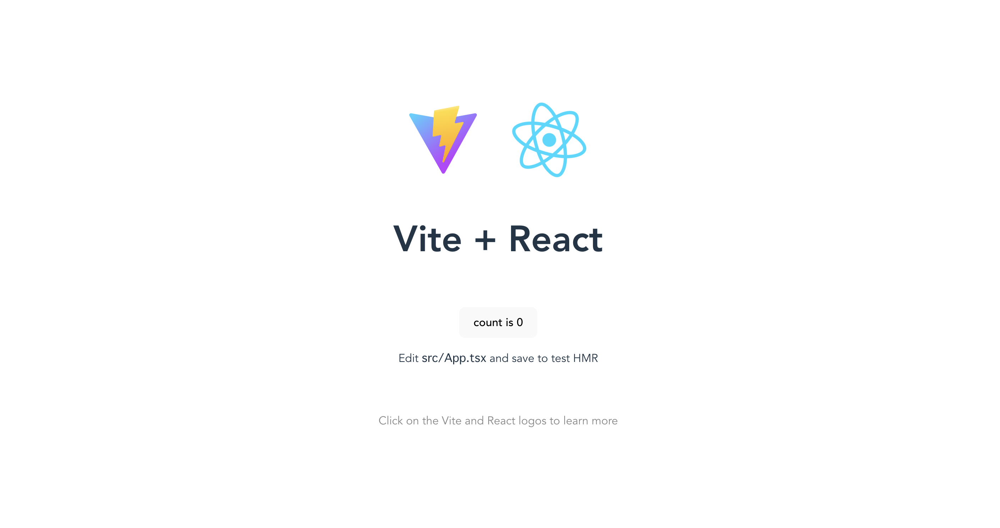
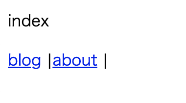

Viteとはフランス語で「素早い」という意味で、より速く無駄のない開発体験を提供することを目的とした次世代のビルドツール、らしいです。※公式サイトより抜粋

どんなものか感触を掴むために、Vite + React + vite-plugin-pagesのサイトをdockerで構築してみました。

## Vite
https://ja.vitejs.dev/

こんな感じで作ったので手順をメモしておきます。
## vite用のディレクトリ作成
```bash
$mkdir vite-playground
```

vite用のディレクトリの下に今回作るsample用のディレクトリ(react-plugin-pages)を作成しておきます。
```bash
$cd vite-playground
$mkdir react-plugin-pages
$cd react-plugin-pages
$touch docker-compose.yml && mkdir sample-app
```

フォルダ構成はこんな感じ↓
他にも色々とviteで試したくなった時に新たにディレクトリを増やしていくことを想定しています。
```
vite-playground
└── react-plugin-pages
    ├── docker-compose.yml
    └── sample-app
```

## docker-compose.ymlを編集する

```yml
version: '3.8'
services:
  vite:
    image: node:16.13.2-alpine3.14
    volumes:
      - ./:/vite
    working_dir: /vite/sample-app
    tty: true
```

## container起動 & loginする

```bash
$docker-compose -d
$docker-compose exec vite /bin/sh
```

## Viteプロジェクトを作成する

containerの中でviteのapplicationを作成していきます。
npm create vite@latestを実行すると、色々と質問されるので下記のように選択していきます。
```
/vite/sample-app # cd ..
/vite # npm create vite@latest
Need to install the following packages:
  create-vite@latest
Ok to proceed? (y) y
✔ Project name: … sample-app
✔ Select a framework: › React
✔ Select a variant: › TypeScript
```

## npm install & npm run devで起動してみる
※ docker containerの中で実行します。

```bash
# cd /vite/sample-app/
# /vite/sample-app # npm install
# /vite/sample-app # npm run dev
  VITE v3.2.1  ready in 2897 ms

  ➜  Local:   http://localhost:5173/
  ➜  Network: use --host to expose
```

すると、`http://localhost:5173/`で起動しました、と表示されますが、
`http://localhost:5173/` にアクセスすると、以下のようにエラーになります。


## vite.config.tsの修正

5173はデフォルトのportで、他のアプリケーションに割当済の場合は次のport(5174)で起動しますが、開発中はportを固定したいはず、かつWebページのデフォルトポートである8080に変更したいことが多いかと思います。
ただ、それだけではサーバーがリッスンすべきIPアドレスが指定されていないので、ブラウザでページを表示できません。

hostやportについてドキュメントに記載されてました。

<a href="https://ja.vitejs.dev/config/server-options.html#server-host" target="_blank">server.hostについて</a>

<a href="https://ja.vitejs.dev/config/server-options.html#server-port" target="_blank">server.portについて</a>

上記に習って、以下の様にserver.hostとserver.portを指定します。

```ts
import { defineConfig } from 'vite'
import react from '@vitejs/plugin-react'

// https://vitejs.dev/config/
export default defineConfig({
  plugins: [react()],
  // hostとportを指定する
  server: {
    host: '0.0.0.0' // trueでもOK
    port: 8080
  }
})
```

## portを8080に変更し、npm run devを実行するようにdocker-compose.ymlを修正する

docker-compose.ymlにもport:8080を定義し、container起動時に`npm run dev`を実行するようにします。

#### docker-compose.yml
```yml
version: '3.8'
services:
  vite:
    image: node:16.13.2-alpine3.14
    volumes:
      - ./:/vite
    working_dir: /vite/sample-app
    tty: true
    # portを設定
    ports:
      - 8080:8080
    command: npm run dev
```

以下の様に、npm run devにoptionを指定する方法でもOKです。

```bash
npm run dev -- --host 0.0.0.0 --port 8080
```

docker-compose.ymlを修正したのでcontainerを再起動します。

```
docker-compose up -d 
```

これで、viteの画面が表示されました。



## vite-plugin-pagesをinstallする

vite + Reactの初期状態はreact-router等の機能が入っていないため、画面遷移が出来ません。
そこで、react-routerをwrapしたrouterライブラリ(vite-plugin-page)を試してみたいと思います。

<a href="https://github.com/hannoeru/vite-plugin-pages" target="_blank">vite-plugin-pageはこちら</a>

```bash
$docker-compose exec vite /bin/sh
/vite/sample-app # npm install -D vite-plugin-pages
/vite/sample-app # npm install react-router react-router-dom 
```

## vite.config.tsにvite-plugin-pagesの定義をpluginに追加する

#### vite.config.ts 
```js
import { defineConfig } from 'vite'
import react from '@vitejs/plugin-react'
import Pages from 'vite-plugin-pages'

// https://vitejs.dev/config/
export default defineConfig({
  plugins: [
    react(),
    // vite-plugin-pagesの設定
    Pages(),
  ],
  server: {
    host: '0.0.0.0', // trueでもOK
    port: 8080,
  },
})
```

## src/main.tsxを修正する

```js
import { StrictMode, Suspense } from 'react'
import { createRoot } from 'react-dom/client'
import {
  BrowserRouter as Router,
  useRoutes,
} from 'react-router-dom'

import './index.css'

import routes from '~react-pages'

// eslint-disable-next-line no-console
console.log(routes)

function App() {
  return (
    <Suspense fallback={<p>Loading...</p>}>
      {useRoutes(routes)}
    </Suspense>
  )
}

const app = createRoot(document.getElementById('root')!)

app.render(
  <StrictMode>
    <Router>
      <App />
    </Router>
  </StrictMode>,
)
```

## トップページを作成する

vite-plugin-pagesはNuxt.jsやNext.jsと同様にファイルシステム ルーティングを採用しています。

まずはトップページを作成します。

#### pages/index.tsx
```js
import { Link } from 'react-router-dom'
import type { FC } from 'react'

const index: FC = () => {
  return (
    <div>
      <p>index</p>
      <Link to="/blog">
        blog
      </Link> |
      <Link to="/about">
        about
      </Link> |
    </div>
  )
}

export default index
```

## 遷移先の/blogや/aboutページを作成する

/blog/indexページや/about/indexページを作成します。
また、/blog/{id}ページやnot foundページも作成します。
最終的にこんな感じのフォルダ構成になります↓

```bash
pages
├── about
│   └── index.tsx
├── blog
│   ├── [...all].tsx
│   ├── [id].tsx
│   ├── index.tsx
│   └── today
│       └── index.tsx
└── index.tsx
```

## 6. 動作確認

トップページを表示するとこんな感じです。



## github repo
https://github.com/chanfuku/vite-playground/tree/main/react-plugin-pages

blogやaboutのリンクをクリックすると画面遷移が確認できるかと思います。
