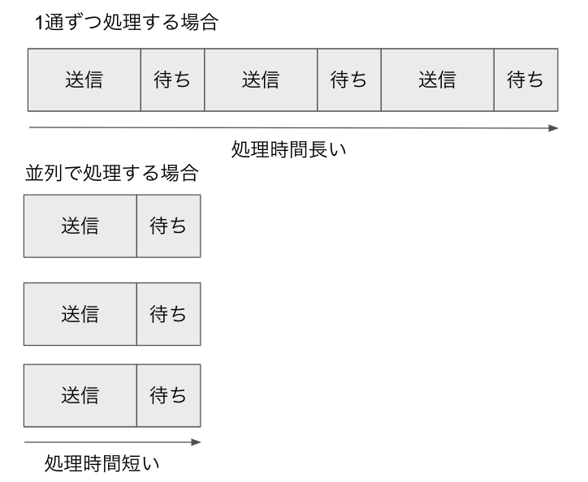
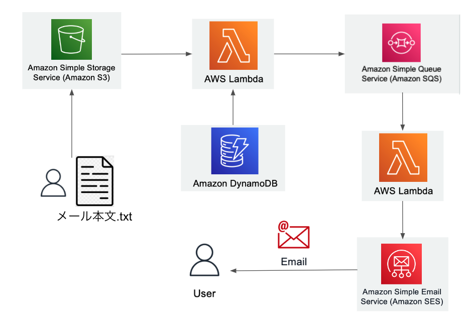
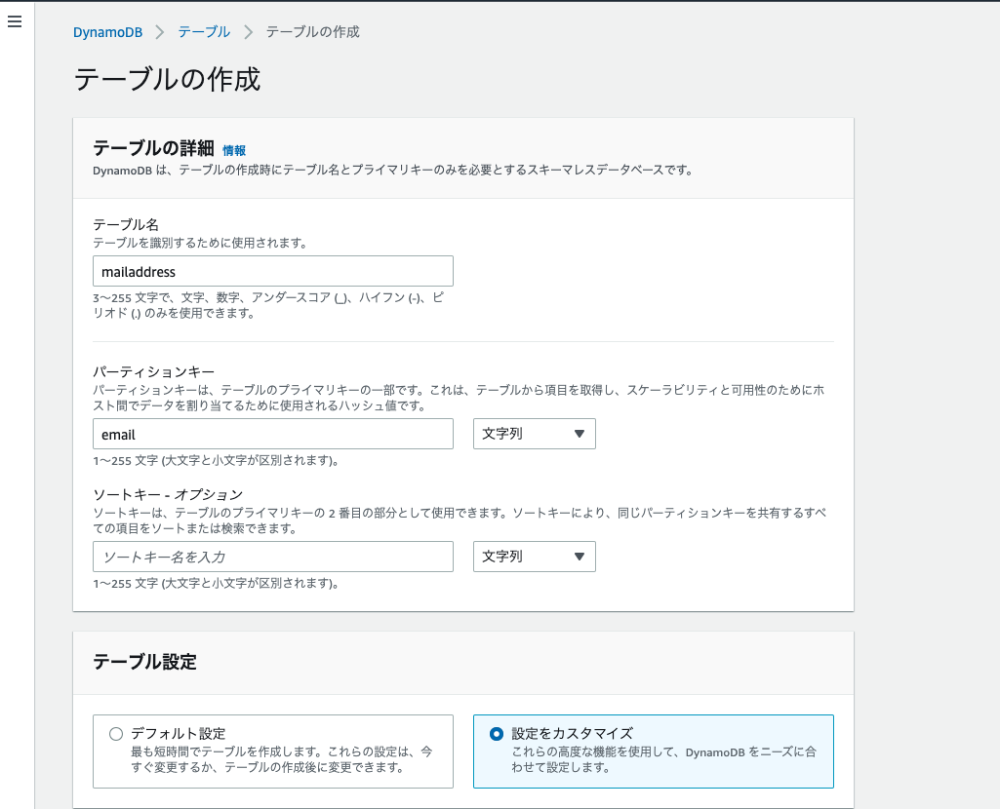
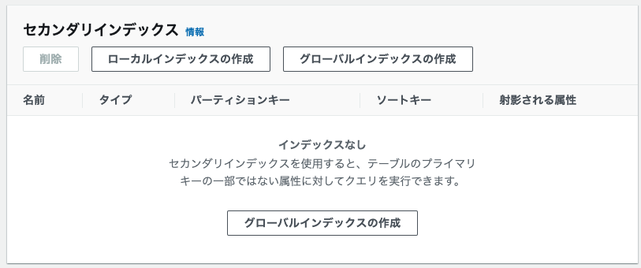
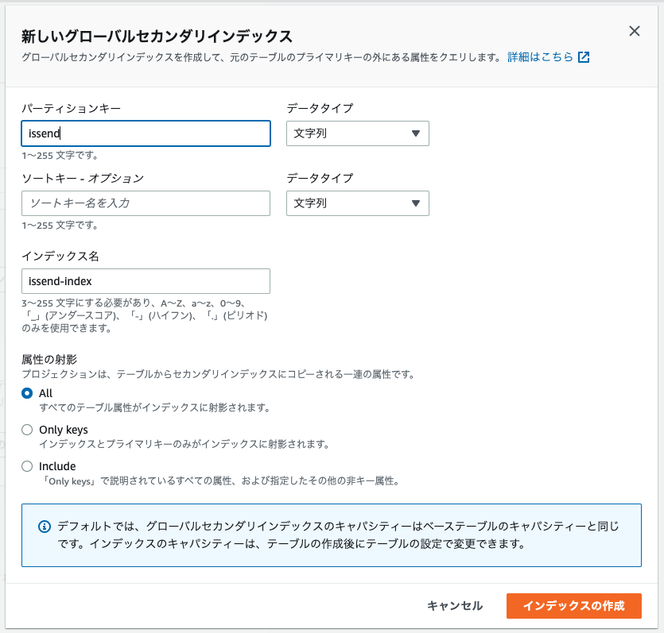
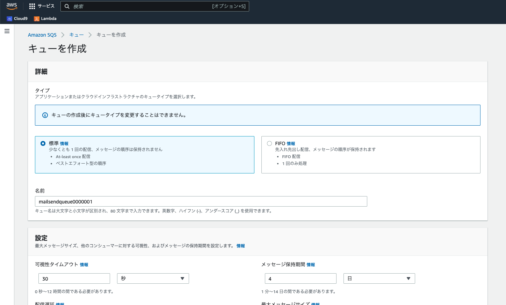
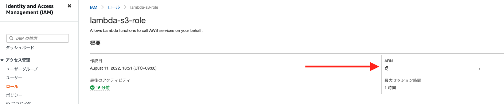
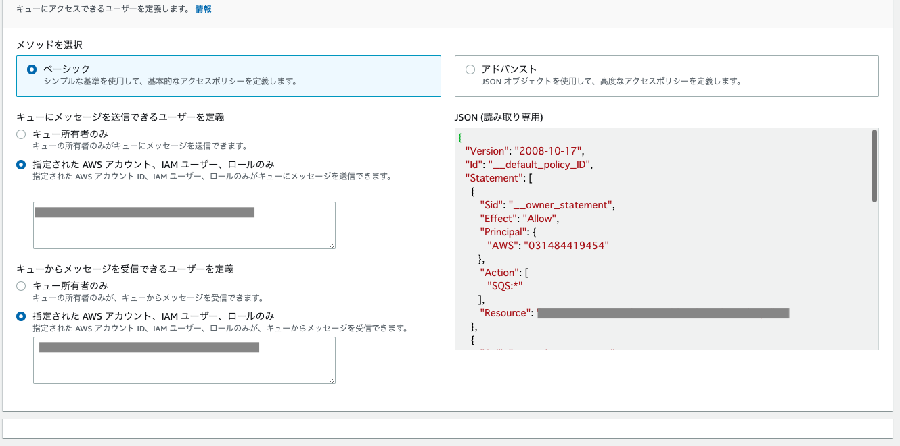
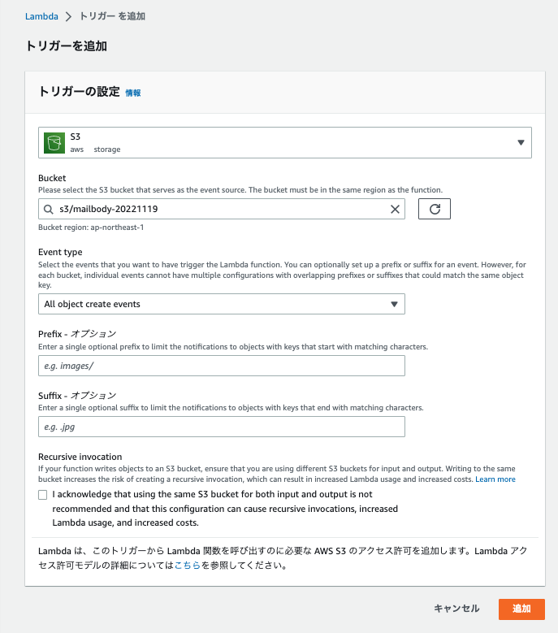
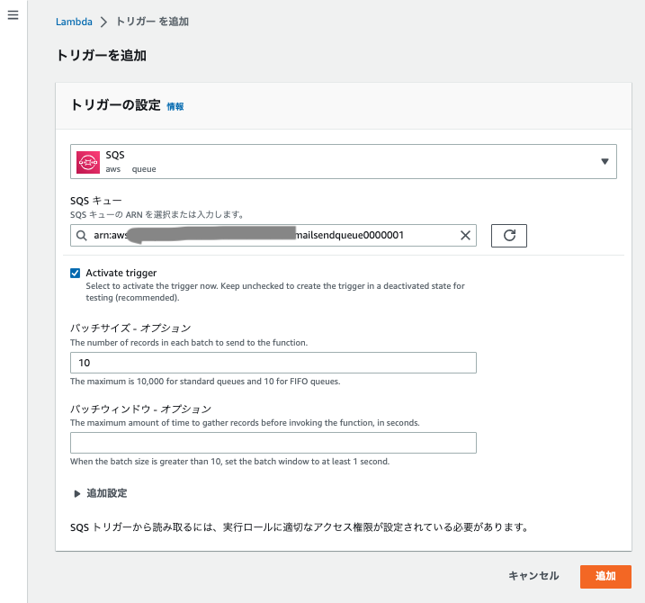

SQSはメッセージをキューイングする機能です。一度キューに溜めることで、順次、好きな時に取り出して処理できるようになります。

ソフトウェア間を直接データを渡すのではなく、第三者経由でデータを渡すことで、送信側と受信側が好きなときに処理を行うことができます。

### 【SQSの処理の流れ】
1. 通信内容をSQS側に送信し、キューとして保存
1. 受信側がSQS側に通信内容を問合せ
1. キューにデータがあれば受信

### 並列処理も簡単に実現出来る
また、複数のプロセスでキューを処理すれば、並列処理も簡単に実現出来るので処理効率が向上します。



今回は初のSQSということで、シンプルにSQSのキューにメッセージを溜めて、メッセージから値を取り出してメールを送信するアプリケーションを作りました。

### 全体構成


### DynamoDBにメールアドレス管理テーブルを作成する

|  属性名  |  型  |  意味  |
| ---- | ---- | ---- |
|  email  |  String  | メールアドレス |
|  username  |  String  | ユーザー名 |
|  haserror  |  Number  | 配信の際にエラーがあったかどうかのフラグ |
|  issend  |  Number  | 送信済かどうかのフラグ |

↑のようなテーブルをDynamoDBで作ります。



テーブル名に「mailaddress」、パーティションキー(プライマリーキー)に「email」と入力し、emailを文字列に設定します。

テーブル設定に「設定をカスタマイズ」を選択し、更に画面を下にスクロールします。



DynamoDBではプライマリーキー以外のキーで検索しようとすると、全件検索になってしまうので、

検索対象になりそうな項目は「セカンダリインデックス」に設定します。

今回で言うと、同一メールアドレスに対して2回以上送信しないように、未送信(issend=0)に絞ってメールアドレスを取得する必要があるので、

「issend」をセカンダリインデックスに設定したいです。

ローカルインデックス or グローバルインデックスの選択を迫られますが、パーティションキーを超えて取得したい場合に使用するグローバルインデックスを選択します。



上記の様に、issendをセカンダリインデックスに設定します。

他はデフォルトの状態で「テーブルの作成」ボタンをクリック。

### 初期データを登録する

mailaddressテーブルに初期データを投入します。メールボックスシミュレーターというSESのテスト用メールアドレスが何個かあるのでそれらを使うのも良さそうですが、今回はスキップで。

```bash
aws dynamodb put-item --table-name mailaddress --item '{"email": {"S": "yamada@example.com"}, "username": {"S": "山田太郎"}, "haserror": {"N": "0"}, "issend": {"N": "0"}}'
aws dynamodb put-item --table-name mailaddress --item '{"email": {"S": "tanaka@example.com"}, "username": {"S": "田中一郎"}, "haserror": {"N": "0"}, "issend": {"N": "0"}}'
aws dynamodb put-item --table-name mailaddress --item '{"email": {"S": "sato@example.com"}, "username": {"S": "佐藤二郎"}, "haserror": {"N": "0"}, "issend": {"N": "0"}}'
```

### S3バケットを作成します

S3にメール本文が置かれた時に、それをSQSのメッセージとして登録する処理を作ります。

バケット名は「mailbody-20221119」にしました。「example.txt」をアップロードします。

#### example.txt
```
メール配信テスト

このメールはテストです。
```

### SQS周りのアクセス権設定
1. AWSコンソールにログインしているアカウントに`AmazonSQS FullAccess`を追加
1. SQS実行ロールに`AmazonSQS FullAccess`を追加。私は「lambda-s3-role」というロールを作って、それに付与しました。

### SQSのキューを作成する
AWSコンソール > SQS > キュー > 「キューを作成」から

「mailsendqueue0000001」という名前のキューを作成しました。



下の方にスクロールしていくと、「アクセスポリシー」という項目があるので、

「指定された AWS アカウント、IAM ユーザー、ロールのみ」を選択して、SQS実行ロール(本稿ではlambda-s3-role)のARNの値をコピペします。





### SQSにメッセージを登録するLambdaを作成する

AWSコンソール > Lambda > 関数 > 関数の作成から

「一から作成」を選択肢、「sendQueue」という名の関数を作成します。ランタイムは「Python 3.9」、アクセス権限は「既存のロールを使用する」を選択し、「lambda-s3-role」を選択します。

作成ボタンをクリックし、Lambda > 関数 > sendQueue　で「トリガーを追加」ボタンをクリックします。トリガーの設定でS3を選択肢、バケットに先程作成した「mailbody-20221119」を指定します。



lambda_function.pyを以下のように修正します。これでS3にファイルが置かれたら、メールアドレス、バケット名、ファイル名がSQSのキューにメッセージとして登録されます。

### lambda_function.py

<details>
<summary>コードの詳細を見る</summary>

```python
import json
import urllib.parse
import boto3
from boto3.dynamodb.conditions import Key, Attr

def lambda_handler (event, context):
    # 1. DynamoDBのmailaddressテーブルを操作するオブジェクト
    dynamodb = boto3.resource('dynamodb')
    table = dynamodb.Table('mailaddress')
    # 2. SQSのキューを操作するオブジェクト
    sqs = boto3.resource('sqs')
    queue= sqs.get_queue_by_name (QueueName='mailsendqueue0000001')
    for rec in event['Records']:
        # 3. S3に置かれたファイルパスを取得
        bucketname= rec['s3']['bucket']['name']
        filename= rec['s3']['object']['key']
        # 4. haserrorが0のものをmailaddressテーブルから取得
        response = table.query(
            IndexName='haserror-index',
            KeyConditionExpression=Key('haserror').eq(0)
        )
        # 5. 上記の1件1件についてループ処理
        for item in response['Items']:
            # 6. 送信済みを示すissendを0にする
            table.update_item(
                Key={'email': item['email']},
                UpdateExpression="set issend=:val",
                ExpressionAttributeValues= {
                    ':val': 0
                }
            )
            # 7. SQS にメッセージとして登録する
            sqsresponse = queue.send_message(
                MessageBody=item['email'],
                MessageAttributes={
                    'username': {
                        'DataType': 'String',
                        'StringValue': item['username']
                    },
                    'bucketname': {
                        'DataType': 'String',
                        'StringValue': bucketname
                    },
                    'filename': {
                        'DataType': 'String',
                        'StringValue': filename
                    }
                }
            )
            # 結果をログに出力しておく
            print(json.dumps(sqsresponse))
```
</details>

### SQSからメッセージを取り出してメールを送信する

最後にSQSにメッセージが登録された、メッセージを取り出してメールを送信する処理をLambdaを作成します。

先程↑で作成したLambdaと同様に、AWSコンソール > Lambda > 関数 > 関数の作成から

「一から作成」を選択肢、「readMessageAndSendMail」という名の関数を作成します。ランタイムは「Python 3.9」、アクセス権限は「既存のロールを使用する」を選択し、「lambda-s3-role」を選択します。

作成ボタンをクリックし、Lambda > 関数 > sendQueue　で「トリガーを追加」ボタンをクリックします。トリガーの設定でSQSを選択し、先程作成した「mailsendqueue0000001」を指定します。



lambda_function.pyを以下のように修正します。これでSQSのキューにメッセージが登録されたら、メッセージからメールアドレス、バケット、本文が記載されたファイル名を取得し、SESでメール送信します。

### lambda_function.py

<details>
<summary>コードの詳細を見る</summary>

```python
import json
import boto3

sqs = boto3.resource('sqs')
s3 = boto3.resource('s3')
dynamodb = boto3.resource('dynamodb')
table = dynamodb.Table('mailaddress')
client = boto3.client('ses')
MAILFROM = 'SESでverified済のメールアドレス' # メールアドレスの変更

def lambda_handler (event, context):
    print(event)
    for rec in event['Records']:
        email = rec['body']
        bucketname = rec['messageAttributes']['bucketname']['stringValue']
        filename = rec ['messageAttributes']['filename']['stringValue']
        username = rec['messageAttributes']['username']['stringValue']

        #S3バケットから本文を取得する
        obj = s3.Object(bucketname, filename)
        response = obj.get()
        maildata = response['Body'].read().decode('utf-8')
        data = maildata.split("\n", 3)
        subject = data[0]
        body= data[2]
        # 送信済みでないことを確認し、また、送信済みに設定する
        response = table.update_item(
            Key = {
                'email': email
            },
            UpdateExpression = "set issend=:val",
            ExpressionAttributeValues = {
                ':val': 1
            },
            ReturnValues = 'UPDATED_OLD'
        )
        #未送信なら送信
        if response['Attributes']['issend'] == 0:
            #メール送信
            response = client.send_email(
                Source=MAILFROM,
                ReplyToAddresses=[MAILFROM],
                Destination= {
                    'ToAddresses': [
                        email
                    ]
                },
                Message={
                    'Subject': {
                        'Data': subject,
                        'Charset': 'UTF-8'
                    },
                    'Body': {
                        'Text': {
                            'Data': body,
                            'Charset': 'UTF-8'
                        }
                    }
                }
            )

        else:
            print("Resend Skip")
```
</details>

これで完了です。S3にメール本文か記載されたテキストファイルを置くと、こんなメールが届きました。


更にメール送信がエラー(バウンスメール)の場合にhaserrorを1に更新したり、何らかの通知を出したりする処理もあった方が良かったりしますが、ここで一区切りとします。

他にもAWSコンソールからポチポチ設定するのではなく、SAMを使って開発したいところですが、盛り沢山過ぎるのでにここで一区切りとします。

## github repo
今回の成果物。

https://github.com/chanfuku/lambda-playground/tree/main/lambda-dynamodb-sqs

