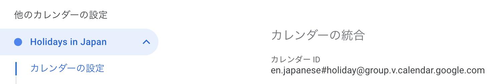

- 月末に勤怠表・請求書のスプレッドシートを更新し、PDFに変換し google driveに保存する
- PDFをメールに添付しgmailで送信する

上記の事務作業をGASで自動化しました。

いくつかポイントに絞って記載します。

## 祝日判定

勤怠表を更新する上で、xx月xx日は祝日なのかどうかを判定する必要がありました。

### 祝日一覧を取得するサンプルコード

```js

// 2023/2/12が祝日かどうかを判定しログに吐き出す
const targetDateObj = new Date('2023/2/12')
console.log(isHoliday(targetDateObj))

function isHoliday (targetDateObj) {
  const calendarId = 'ja.japanese#holiday@group.v.calendar.google.com'
  const holidayCalendar = CalendarApp.getCalendarById(calendarId)
  const events = holidayCalendar.getEventsForDay(targetDateObj)
  return events.length > 0
}
```

祝日カレンダーからeventを取得し、event数が1以上であれば祝日、と判定します。

`ja.japanese#holiday@group.v.calendar.google.com`は公開されている祝日カレンダーのIDです。

私の場合はなぜかgoogle calendarが祝日カレンダーが英語版だったため取得出来ませんでした。



以下の様に`ja`ではなく、`en`にしたところ無事取得することが出来ました。

`en.japanese#holiday@group.v.calendar.google.com`

### PDFを出力する

```js
function downloadPdf () {
  const sheet = SpreadsheetApp.getActiveSpreadsheet()
  const pdf = sheet.getAs('application/pdf')
  pdf.setName('PDFファイル名')
  const file = DriveApp.getFolderById('出力先のフォルダID').createFile(pdf)
}
```

sheet.getAs('application/pdf')でPDFに変換出来ます。

また、sheet.setName('PDFファイル名')でファイル名を設定出来ます。

DriveApp.getFolderById('出力先のフォルダID')でフォルダを取得し、createFile(file)でPDFを出力します。

### メールに添付して下書き保存

```js
function attachPdfToEmail () {
  const pdfFolderId = 'PDFフォルダID'
  const workSchedulePdfFileName = '勤怠表PDF名'
  const invoicePdfFileName = '請求書PDF名'
  const recipient = '送信先メールアドレス'
  const mailSubject = 'メール件名'
  const mailBody = 'メール本文'
  const bcc = 'bccメールアドレス'

  const workSchedulePdfFiles = DriveApp.getFolderById(pdfFolderId).getFilesByName(workSchedulePdfFileName)
  const invoicePdfFiles = DriveApp.getFolderById(pdfFolderId).getFilesByName(invoicePdfFileName)
  const options = {
    attachments: [
      workSchedulePdfFiles.next().getBlob(),
      invoicePdfFiles.next().getBlob(),
    ],
    bcc
  }
  GmailApp.sendEmail(recipient, mailSubject, mailBody, options)
}
```

Folder.getFilesByName('ファイル名')でフォルダ内の対象ファイルを複数取得出来ます。

ファイルが一つしかない場合は、Files.next()で一つ目を取得できます。

Files.next().getBlob()で取得したblob形式のファイルをを添付します。

GmailApp.sendEmail()で送信出来ますが、下書き保存だけにしたおきたい場合はGmailApp.createDraft()で下書き保存出来ます。

### 月末に実行する

今日が月末なのかを判定する処理を毎日実行します。

今日 + 1日、つまり明日がxx月1日だったら今日は月末なのでmain()を実行する、という方法です。

```js
function trigger(){
  const date = new Date()
  date.setDate(date.getDate() + 1)
  if (date.getDate() === 1){
    main()
  }
}

function main(){
  // メインの処理
}
```

毎日定期実行するには、左メニュー > トリガー > トリガーを追加 を選択し、

実行する関数を選択から対象の関数を選択 > イベントのソースを選択で「時間主導型」を選択 >

時間ベースのトリガーのタイプを選択で「日付ベースのタイマー」 を選択 >

時刻は、適宜選択します。

理想は今日が月末最終営業日かどうかを判定したかったのですが、若干大変そうだったのでここまででOKとしました。
