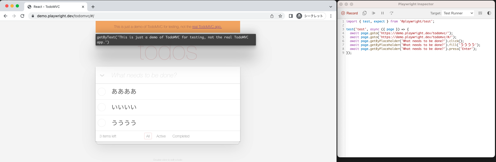

日々仕事を進めていく中で、どうしようもなく面倒な事務作業が2つありました。

1. 勤怠システムに業務開始、業務終了、休憩開始、休憩終了時刻を打刻する

2. 月末に勤怠表や請求書のPDFにしてメールで送信する

何をやったのかというと、上記1番2番の作業に対して、

1. `playwright`を使って自動で勤怠システムに打刻するようにした

2. `google apps script(GAS)`を使って月末になったら自動で勤怠表や請求書をメールで送信するようにした

をやりました。

1に関しては、私の場合残業はなく、稼働時間は一日8時間で固定という方針なので、作業開始時に`打刻コマンド`を実行したら

その3時間後に休憩開始、その1時間後に休憩終了、その5時間後に業務終了、が自動で打刻されればOKという仕様です。

## playwrightとは

E2Eのテスティングフレームワークですが、ブラウザ操作の自動化にも使えます。

<a href="https://github.com/microsoft/playwright" target="_blank">
https://github.com/microsoft/playwright
</a>

## ブラウザ操作からシナリオコードを生成する

`シナリオコード`という言葉は勝手に作りましたが、テストコードがテストを実行するためのコードなら、

`シナリオコード`は何かをテストするわけではなく、何かしらのユーザー操作(シナリオ)が表現されたコードを実行するためだけのコードという意味です。

<a href="https://playwright.dev/docs/intro" target="_blank">ここ</a>を参考にしながらplaywrightをinstallした後、

以下のコマンドを実行すると、ChromiumというGoogle製のブラウザが起動し、シナリオコードを生成したいサイトが表示されます。

詳しくは<a href="https://playwright.dev/docs/codegen#running-codegen" target="_blank">公式docのここ</a>に記載されています。

```bash
npx playwright codegen {シナリオコードを生成したいサイト}
```

下記は、playwrightのdemo用のサイトにアクセスしてみた時のスクショです。

左側にChromium、右側にシナリオコードが表示されています。Chromiumで操作（例: あああと入力する)すると、右側にシナリオコードが生成されていきます。



操作が終わったら、生成されたシナリオコードを自分のプロジェクトのテスト用scriptにコピペするだけなのでとても簡単です。

## 待ち時間を入れたい

Aという操作をした後、1時間待ってからBという操作をしたい。そんな時はこれ。

```js
  // playwrightのサイトに訪問する
  await page.goto('https://playwright.dev/')
  // 1時間経過させる
  await page.waitForTimeout(1000 * 60 * 60 * 1)
```

## playwright.config.tsでtimeout等を調整

シナリオコードを実行する際に、長時間放置すると強制的に終了してしまうので適宜timeoutを設定します。

```js
const config: PlaywrightTestConfig = {
  testDir: './tests',
  /* Maximum time one test can run for. */
  // 念の為10時間(ms)
  timeout: 36000000,
```

また、このままだとシナリオコード実行時にchromium, firefox, chromeなどの複数のブラウザで実行されてしまいます。

今回はブラウザの操作を自動化したいだけなので、chromium以外はコメントアウトします。

```js
  projects: [
    {
      name: 'chromium',
      use: {
        ...devices['Desktop Chrome'],
      },
    },

    /*
    {
      name: 'firefox',
      use: {
        ...devices['Desktop Firefox'],
      },
    },
```

## シナリオの実行

```bash
npx playwright test --headed
```

すると、chromiumが起動し、自動で操作する様子が見えるかと思います。

--headed を外すと画面上にchromiumは表示されず、バックグランドで実行されます。

業務開始と同時にこのコマンドを実行すればあとは自動で休憩開始・休憩終了・業務終了まで打刻してくれます。

## GASを使って月末に自動で勤怠表・請求書等をPDF化して送信する

こちらは次回。
