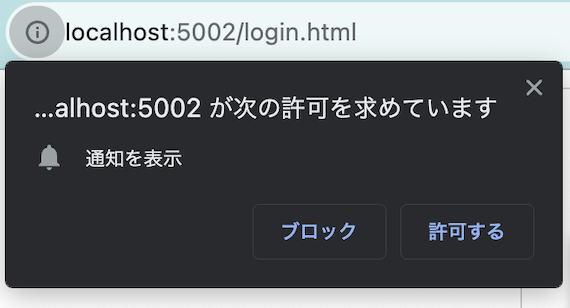
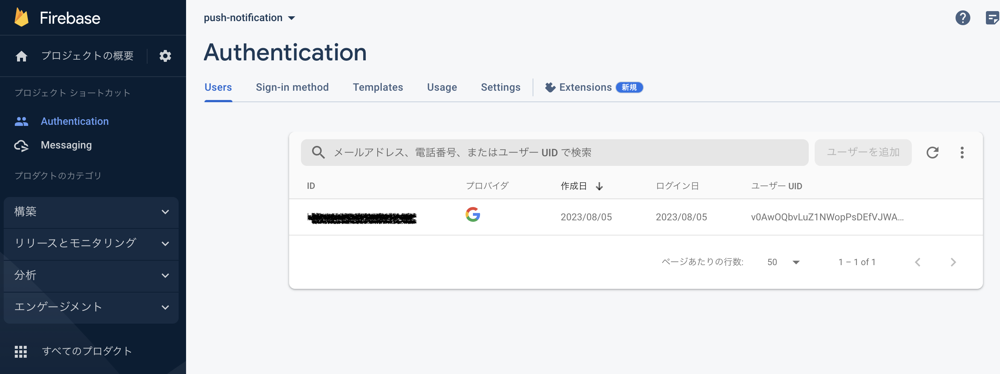
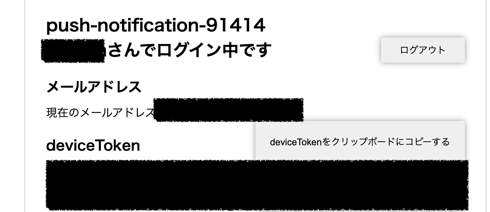
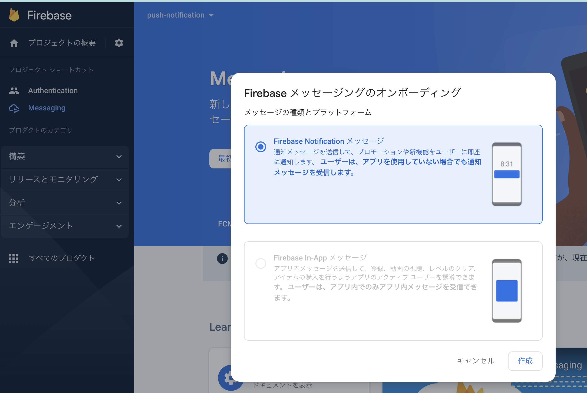
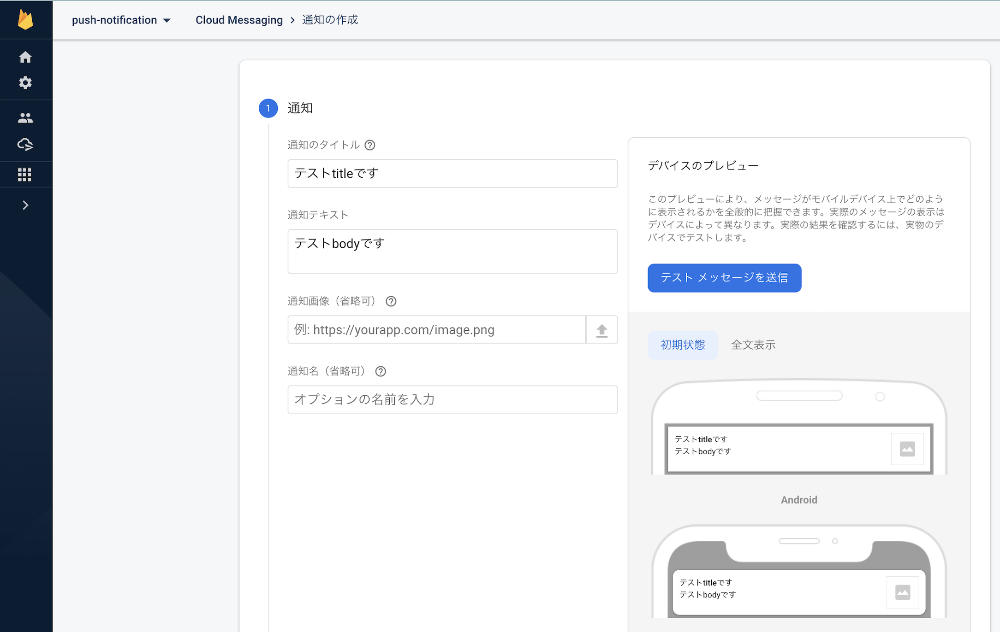
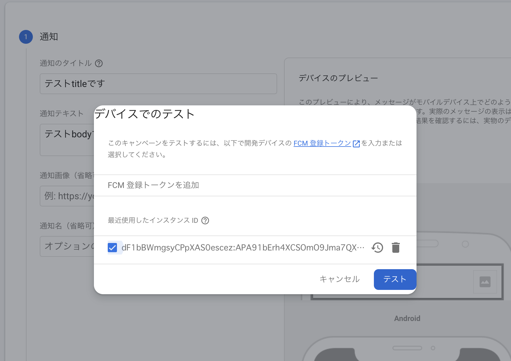
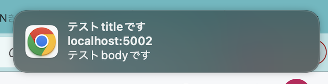

FirebaseのAuthenticationとCloud Messagingを使ってソーシャルログインとWebのPush通知を作ってみたのでメモ。

### Firebase  Authentication

<a href="https://firebase.google.com/docs/auth?hl=ja" target="_blank">
https://firebase.google.com/docs/auth?hl=ja
</a>

### Firebase Cloud Messaging

<a href="https://firebase.google.com/docs/cloud-messaging/js/client?hl=ja" target="_blank">
https://firebase.google.com/docs/cloud-messaging/js/client?hl=ja
</a>

### 結論から

成果物は以下にあります。

<a href="https://github.com/chanfuku/firebase-playground/tree/main/social-signin-with-messaging" tareget="_blank">
firebase-playground/social-signin-with-messaging</a>

Firebase SDKを使いました。

* auth
<a href="https://firebase.google.com/docs/auth/web/google-signin?hl=ja" tareget="_blank">
https://firebase.google.com/docs/auth/web/google-signin?hl=ja
</a>

* cloud-messaging
<a href="https://firebase.google.com/docs/cloud-messaging/js/client?hl=ja" tareget="_blank">
https://firebase.google.com/docs/cloud-messaging/js/client?hl=ja
</a>

### ローカル環境で起動するところまで

上記リポジトリの<a href="https://github.com/chanfuku/firebase-playground/tree/main/social-signin-with-messaging#readme" target="_blank">README</a>を参考にしてみてください。

### ソーシャルログインとPUSH通知をやってみる

下記コマンドで起動した後、

```bash
npm run local
```

1. localhost:5002/login.htmlにアクセスすると、通知を許可するよう求められるので「許可する」を選択します。



2. ログインボタンからログインします。ブラウザの別タブを開き、Firebaseのコンソール画面のAuthencation > Usersからログインしたユーザーの情報を確認出来ます。



3. localhost:5002/mypage.htmlにアクセスすると、deviceTokenが表示されているので、「deviceTokenをコピーする」ボタンでコピーします。この後このサイトにpush通知を飛ばすので閉じないようにします。



4. Firebaseのコンソール画面に戻り、Messaging > 最初のキャンペーンを作成 > Firebase Notification メッセージ > 作成を選択します。



5. テスト通知のタイトルとテキストを入力し、「テストメッセージを送信」を選択します。



6. 3でコピーしたデバイストークンを登録し「テスト」を選択します。



7. 画面の右上にPUSH通知が表示されます。※システム設定 > 通知　> Google Chromeから通知を許可しておく必要があります(Mac)。


