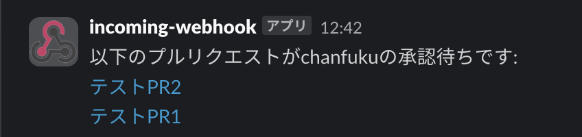
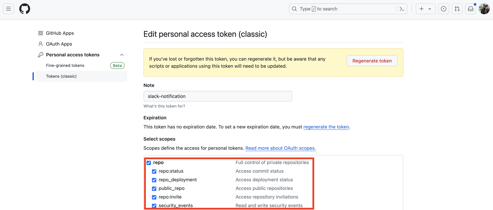

チームで開発しているとプルリクエストのレビューをしたり、されたりすることがあると思います。

プルリクエストのレビューって後回しにすると忘れてしまって、後日レビュー依頼者からslackでリマインドが来て、「すみません！遅れてしまいましたがLGTMです！」

というやりとりが発生してしまうのがチーム開発あるあるだと思っています。

そこで、タイトルの通り、**自分がレビューし忘れているプルリクエストを定期的にslackに通知するようにする仕組み**を作りました。

早速成果物を載せます↓

### github repo

<a href="https://github.com/chanfuku/notify-pending-pull-requests" target="_blank">
https://github.com/chanfuku/notify-pending-pull-requests
</a>

### 何をしているのか？

上記repoのindex.jsを実行すると、指定されたgithubのrepositoryの中から、

自分がレビューアに指定されている & approveしていないプルリクエストのリストがslackに通知されます。

その通知処理が毎朝9時に実行されるように、GitHub Actionsの定義ファイル(.github/workflows/notify-pending-pull-requests.yml)で設定しました。



こんな感じでslackに通知が来ます。テキストリンクになっているのでクリックしたらプルリクエスト画面に飛ぶことが出来ます。

### コードの解説

`index.js`

```js
import fetch from 'node-fetch';
import dotenv from 'dotenv';
dotenv.config();

const REPOSITORIES_GITHUB = JSON.parse(process.env.REPOSITORIES_GITHUB);
const TOKEN_GITHUB = process.env.TOKEN_GITHUB; // GitHub Personal Access Token
const SLACK_WEBHOOK_URL = process.env.SLACK_WEBHOOK_URL; // Slack Webhook URL
const REVIEWER_USERNAME = process.env.REVIEWER_USERNAME; // GitHub Username

async function notifyPendingPullRequests() {
  let allPendingReviews = [];

  for (const repo of REPOSITORIES_GITHUB) {
    const pullRequests = await getOpenPullRequests(repo.owner, repo.repo);
    const pendingReviews = pullRequests.filter(pr => isReviewerAndNotApproved(pr));
    allPendingReviews = allPendingReviews.concat(pendingReviews);
  }

  if (allPendingReviews.length > 0) {
    const message = formatSlackMessage(allPendingReviews);
    sendSlackNotification(message);
  } else {
    console.log('No pending pull requests found');
  }
}

async function getOpenPullRequests(owner, repo) {
  const url = `https://api.github.com/repos/${owner}/${repo}/pulls`;
  const options = {
    method: 'GET',
    headers: {
      'Authorization': `token ${TOKEN_GITHUB}`,
      'Accept': 'application/vnd.github.v3+json'
    }
  };

  const response = await fetch(url, options);
  const pullRequests = await response.json();

  return pullRequests;
}

function isReviewerAndNotApproved(pullRequest) {
  return pullRequest.requested_reviewers.some(reviewer => reviewer.login === REVIEWER_USERNAME);
}

function formatSlackMessage(pullRequests) {
  let message = `以下のプルリクエストが${REVIEWER_USERNAME}の承認待ちです:\n`;

  pullRequests.forEach(pr => {
    message += `<${pr.html_url}|${pr.title}>\n`;
  });

  return message;
}

function sendSlackNotification(message) {
  const payload = {
    text: message
  };

  const options = {
    method: 'POST',
    headers: {
      'Content-Type': 'application/json'
    },
    body: JSON.stringify(payload)
  };

  fetch(SLACK_WEBHOOK_URL, options)
    .then(response => {
      if (!response.ok) {
        throw new Error(`Error sending message to Slack: ${response.statusText}`);
      }
      return response.text();
    })
    .then(text => console.log('Slack notification sent:', text))
    .catch(error => console.error('Error:', error));
}

// 実行
notifyPendingPullRequests();
```

処理の大まかな流れとしては、下記になります。

1. GitHub APIを使って、プルリクエストを取得する
2. 自分がレビューアになっている & approveしていないプルリクエストだけを抽出する
3. slackに通知する

ローカルで実行するには、

まず、`.env.example`をコピーして`.env`を作成し、下記項目を適宜定義します。

`REPOSITORIES_GITHUB`はJSONなので複数のrepositoryを設定できます。

```js
# JSON format
REPOSITORIES_GITHUB=[{"owner": "sample-owner", "repo": "sample-repo"}]
TOKEN_GITHUB=
SLACK_WEBHOOK_URL=
REVIEWER_USERNAME=
```

`TOKEN_GITHUB`はGitHubのsettingsから取得できます。

注意点としては、対象のrepositoryがprivateの場合、GitHub Personal Access Tokenのscopeに`repo`を指定する必要があります。



これをやらないと権限が足らずにエラーになってしまいます。

`SLACK_WEBHOOK_URL`は通知先のチェンネルのwebhook urlです。

`REVIEWER_USERNAME`はgithubのユーザー名です。

設定後は、`npm install` と `node index.js`を実行すればslackに通知が届くはずです。

### GitHub Actionsの設定

`.github/workflows/notify-pending-pull-requests.yml`

```yaml
name: Notify Pending Pull Requests

on:
  schedule:
    - cron: '0 0 * * *' # JSTで毎日午前9時に実行

jobs:
  notify:
    runs-on: ubuntu-latest

    steps:
      - name: Checkout repository
        uses: actions/checkout@v3

      - name: Setup Node.js
        uses: actions/setup-node@v3
        with:
          node-version: '20'

      - name: Install dependencies
        run: npm install

      - name: Run notification script
        env:
          REPOSITORIES_GITHUB: ${{ secrets.REPOSITORIES_GITHUB }}
          TOKEN_GITHUB: ${{ secrets.TOKEN_GITHUB }}
          SLACK_WEBHOOK_URL: ${{ secrets.SLACK_WEBHOOK_URL }}
          REVIEWER_USERNAME: ${{ secrets.REVIEWER_USERNAME }}
        run: node index.js
```

下記が毎朝9時AM(日本時間)で実行されるように定義している箇所です。

```yaml
on:
  schedule:
    - cron: '0 0 * * *' # JSTで毎日午前9時に実行
```

envの値はGitHub ActionsのSecretsに設定する必要があります。

secretsのキーに`GITHUB_`というprefixをつけて保存しようとするとエラーになるので、`XXX_GITHUB`の形式にしました。

### 感想

他にもっと簡単で効果的な問題解決方法があるかもしれません。

今回9割はChatGPTに作ってもらいました。1割は自分で手直しする必要がありましたが、それでも相当助かりました。

ChatGPTありがとー。
