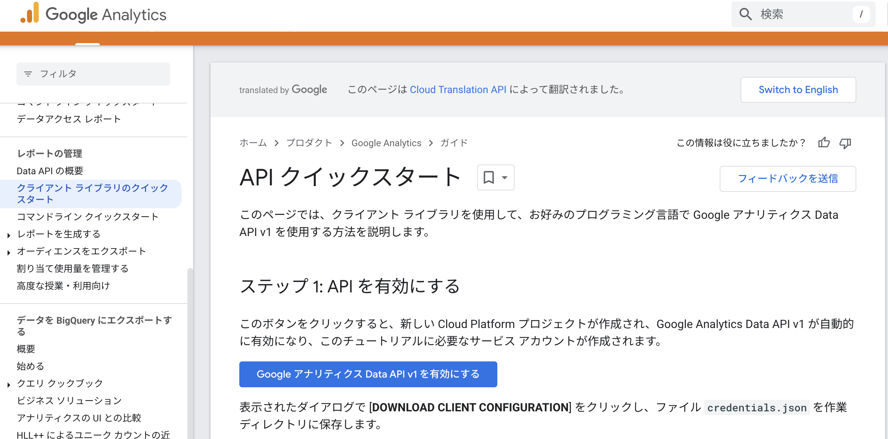
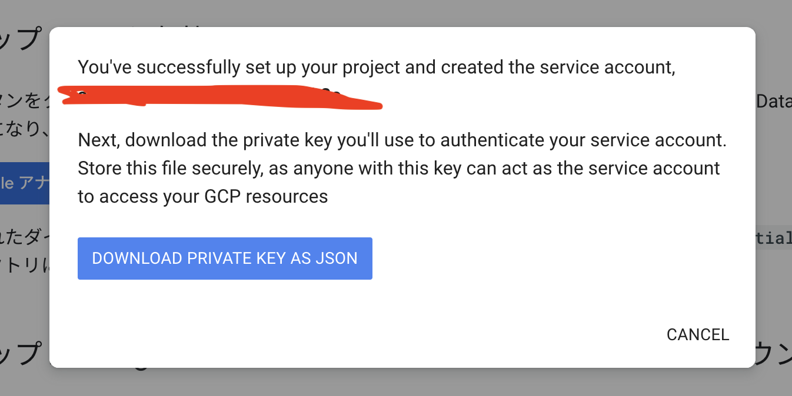
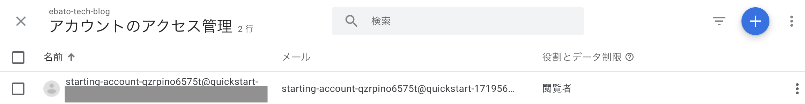

最近業務で学んだことのアウトプット。

Google Analyticsのデータを取得してスプレッドシートに書き込む、という要望の実現方法を調査しました。

大きく2つの機能を実装します。

1. Google Analyticsからデータを取得する

2. 1で取得したデータをGoogle Spread Sheetに書き込む

### github repo

<a href="https://github.com/chanfuku/ga4-api-nodejs-sample" target="_blank">
https://github.com/chanfuku/ga4-api-nodejs-sample
</a>

### Google Analyticsからデータを取得する

* Node.jsのClientを使います。

<a href="https://googleapis.dev/nodejs/analytics-data/latest/index.html" target="_blank">
https://googleapis.dev/nodejs/analytics-data/latest/index.html
</a>

* Google Analytics Data APIの公式Doc

<a href="https://developers.google.com/analytics/devguides/reporting/data/v1/rest?hl=ja" target="_blank">
https://developers.google.com/analytics/devguides/reporting/data/v1/rest?hl=ja
</a>

* Google Analytics Data API クイックスタート

<a href="https://developers.google.com/analytics/devguides/reporting/data/v1/quickstart-client-libraries?hl=ja" target="_blank">
https://developers.google.com/analytics/devguides/reporting/data/v1/quickstart-client-libraries?hl=ja
</a>

上記のGoogle Analytics Data API クイックスタートを参考に進めていきます。

### ステップ 1: APIを有効にする

「Google アナリティクス Data API v1を有効にする」ボタンがあるので、クリックします。



すると、private keyが発行されるので「DOWNLOAD PRIVATE KEY AS JSON」をクリックしてダウンロードします。



### ステップ 2: Google Analytics 4 プロパティにサービス アカウントを追加する

テキスト エディタを使用して、前の手順でダウンロードした credentials.json ファイルを開き、client_email フィールドを検索して、次のようなサービス アカウントのメールアドレスを取得します。

```bash
quickstart@PROJECT-ID.iam.gserviceaccount.com
```

Google Analyticsにログインし、左メニューから `管理 > アカウント > アカウントのアクセス管理 > 右上の+ボタン`からメールアドレスを追加します。

権限は`閲覧者`に設定します。

設定できたらこんな感じの画面になってるはずです。



### ステップ 3: Node.jsのプロジェクトを作成する

いよいよ、Node.jsのプロジェクトを作成し、クライアントライブラリをインストールします。

```bash
mkdir nodejs-ga4-sample
cd nodejs-ga4-sample
npm init
npm install @google-analytics/data dotenv
```

### ステップ 4: .envに`GOOGLE_APPLICATION_CREDENTIALS`を定義する

ステップ1でダウンロードした`credentials.json`をプロジェクトルートに配置し、

同じくプロジェクトルートに.envを作成します。.envの中身は下記のように、credentials.jsonのパスを指定します。

```js
GOOGLE_APPLICATION_CREDENTIALS='./credentials.json'
```

### ステップ 5: Google Alayticsからデータを取得するプログラムを書く

下記サンプルコードです。

```js
// Imports the Google Analytics Data API client library.
import {BetaAnalyticsDataClient} from '@google-analytics/data';
import dotenv from 'dotenv';
dotenv.config();

// Using a default constructor instructs the client to use the credentials
// specified in GOOGLE_APPLICATION_CREDENTIALS environment variable.
const analyticsDataClient = new BetaAnalyticsDataClient();

/**
 * TODO(developer): Uncomment this variable and replace with your
 *   Google Analytics 4 property ID before running the sample.
 */
const propertyId = 'your ga4 property id';

// Runs a simple report.
async function runReport() {
  const [response] = await analyticsDataClient.runReport({
    property: `properties/${propertyId}`,
    dateRanges: [
      {
        startDate: '2024-06-01',
        endDate: 'today',
      },
    ],
    dimensions: [
      {
        name: 'city',
      },
    ],
    metrics: [
      {
          "name": "activeUsers"
      },
    ],
  });

  console.log('Report result:');
  response.rows.forEach((row) => {
    console.log(row.dimensionValues[0], row.metricValues[0]);
  });
}

runReport();
```

#### 解説

`propertyId`は`Google Analyticsログインし左メニュー > 管理 > プロパティ > プロパティの詳細`に表示されています。

dataRangesにstartDate(開始日)、endDate(終了日)を指定します。

`dimensions`と`metrics`で、取得したいデータの分析軸や属性を指定します。

`dimensions`とは、データ解析結果の縦軸を意味し、`metrics`が横軸を意味します。

例えば、`dimensions`に`city`、`metrics`に`activeUsers`を指定した場合、都市毎のactiveUser数という意味になります。

APIのディメンションと指標については下記にドキュメントがあります。

<a href="https://developers.google.com/analytics/devguides/reporting/data/v1/api-schema?hl=ja" target="_blank">
https://developers.google.com/analytics/devguides/reporting/data/v1/api-schema?hl=ja
</a>

### ステップ 6: 実行する

以下の様に、都市毎のアクティブユーザー数が取得出来ました。

```bash
node ga-report.js
Report result:
{ value: '(not set)', oneValue: 'value' } { value: '23', oneValue: 'value' }
{ value: 'Shinjuku City', oneValue: 'value' } { value: '21', oneValue: 'value' }
{ value: 'Minato City', oneValue: 'value' } { value: '16', oneValue: 'value' }
{ value: 'Osaka', oneValue: 'value' } { value: '16', oneValue: 'value' }
{ value: 'Shibuya City', oneValue: 'value' } { value: '13', oneValue: 'value' }
{ value: 'Chiyoda City', oneValue: 'value' } { value: '11', oneValue: 'value' }
{ value: 'Chuo City', oneValue: 'value' } { value: '9', oneValue: 'value' }
{ value: 'Ota City', oneValue: 'value' } { value: '7', oneValue: 'value' }
{ value: 'Yokohama', oneValue: 'value' } { value: '7', oneValue: 'value' }
{ value: 'Setagaya City', oneValue: 'value' } { value: '6', oneValue: 'value' }
{ value: 'Shinagawa City', oneValue: 'value' } { value: '6', oneValue: 'value' }
```

Google Spread Sheetに書き込む機能の実装方法については次回以降に。
