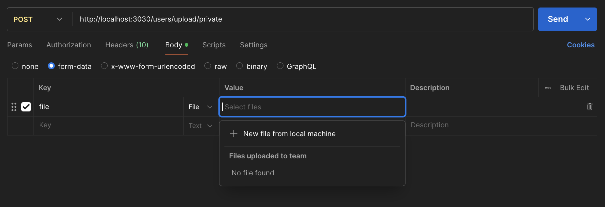

NestJSについて学んだことを少しずつアウトプットしていきたい。

まずは、APIキーのリクエストによるCSVアップロード機能の実装方法を記載します。

## 1. ApiKeyGuardを作る

以下のように、Headerの`x-api-key`にセットされている値とenvに定義されているAPI_KEYの値を比較して認証を行うクラスを作成します。

```ts
import {
  CanActivate,
  ExecutionContext,
  Injectable,
  NotImplementedException,
  UnauthorizedException,
} from '@nestjs/common';
import { Reflector } from '@nestjs/core';

@Injectable()
export class ApiKeyGuard implements CanActivate {
  constructor(private readonly reflector: Reflector) {}

  canActivate(context: ExecutionContext): boolean {
    // eslint-disable-next-line @typescript-eslint/no-unsafe-assignment
    const request = context.switchToHttp().getRequest();
    // eslint-disable-next-line @typescript-eslint/no-unsafe-assignment
    const apiKey = request.headers['x-api-key']; // APIキーをヘッダーから取得

    // 環境変数から有効なAPIキーを取得
    const validApiKey = process.env.API_KEY;

    if (!validApiKey) {
      throw new NotImplementedException('api key is not implemented');
    }

    if (!apiKey || apiKey !== validApiKey) {
      throw new UnauthorizedException('invalid api key');
    }

    return true; // 認証成功
  }
}
```

### 2. CSVファイルをParseする関数をUtilクラスに作る

```ts
import { Options, parse } from 'csv-parse/sync';

export class CsvUtil {
  static parseCsvFile(file: Express.Multer.File, options?: Options): unknown[] {
    options = options || {
      bom: true,
      columns: true,
      delimiter: ',',
      trim: true,
    };

    let csvRows: unknown[] = [];
    csvRows = parse(file.buffer, options) as unknown[];
    return csvRows;
  }
}
```

### 3. Controllerを作る

```ts
import {
  BadRequestException,
  Controller,
  HttpStatus,
  Logger,
  Post,
  UploadedFile,
  UseGuards,
  UseInterceptors,
} from '@nestjs/common';
import { FileInterceptor } from '@nestjs/platform-express';
import { ApiOperation, ApiResponse, ApiTags } from '@nestjs/swagger';
import { ApiKeyGuard } from 'src/common/utility/api-key.guard';
import { CsvUtil } from 'src/common/utility/csv-util';
import { userService } from './user.service';
import {
  UserCsvUploadResult,
  UserDepartmentCsvRow,
} from './dto/user.dto';

@Controller('users')
@ApiTags('ユーザー操作')
export class UserController {
  private logger = new Logger(UserController.name);
  constructor(private readonly userService: UserService) {}

  @Post('/upload/private')
  @UseGuards(ApiKeyGuard)
  @ApiOperation({
    summary: 'CSVアップロードによるユーザー一括登録(Api-Key認証方式)',
  })
  @ApiResponse({ status: HttpStatus.OK, type: UserCsvUploadResult })
  @UseInterceptors(FileInterceptor('file'))
  async uploadCsv(
    @UploadedFile() file: Express.Multer.File,
  ): Promise<UserCsvUploadResult> {
    if (!file) {
      throw new BadRequestException('no file');
    }

    // CSVの内容を検証し不正な場合はBadRequestExceptionを投げる
    const csvRows = this.validateCsvRowsOrThrowError(file);

    const result = await this.userService.createNewUsers(
      userRows,
    );
    return { result };
  }

  validateCsvRowsOrThrowError(
    file: Express.Multer.File,
  ): UserDepartmentCsvRow[] {
    let csvRows: UserDepartmentCsvRow[];

    try {
      csvRows = CsvUtil.parseCsvFile(file) as UserDepartmentCsvRow[];
    } catch (e) {
      // parseに失敗した場合
      this.logger.warn(e);
      throw new BadRequestException(e.message);
    }

    if (!csvRows.length) {
      throw new BadRequestException('empty file');
    }

    for (const [i, row] of Object.entries(csvRows)) {
      if (
        !row.hasOwnProperty('code') ||
        !row.hasOwnProperty('name') ||
        !row.hasOwnProperty('department_name') ||
        !row.code.length ||
        !row.name.length ||
        !row.department_name.length
      ) {
        throw new BadRequestException(`invalid data at line ${Number(i) + 1}`);
      }
    }

    return csvRows;
  }
}
```

ポイントしては、以下のようになります。

1. @UseGuards(ApiKeyGuard)でApiKeyを使ったガードを定義します
2. @UseInterceptors(FileInterceptor('file'))でファイルアップロードを処理するためのデコレーターを定義します
3. @UploadedFile() file: Express.Multer.File,でファイルを受け取ります
4. CsvUtil.parseCsvFile(file)でparseします
5. 適宜バリデーションを行い問題があればBadRequestExceptionを投げます
6. バリデーションで問題がなければ、処理を続けます（S3にアップロード/DBに登録等など）

ちなみに、PostmanでファイルアップロードのAPIリクエストを投げれるということを最近知りました。

下記のように、Bodyでform-dataを選択 > keyの種別プルダウンでFileを選択 > valueでアップロードしたいファイルを選択するだけ。



以上、
