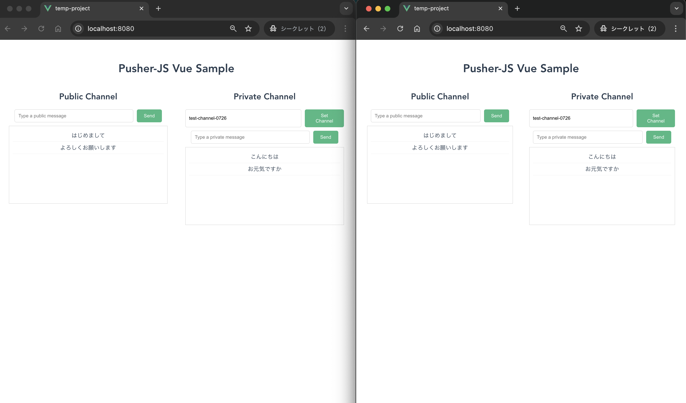

# Pusher-JS を使ったリアルタイム通知機能の実装サンプル

## はじめに

今回は、[Pusher-JS](https://github.com/pusher/pusher-js) を使って、Webアプリケーションにリアルタイム通知機能を実装するサンプルプロジェクトを作成してみました。



## 技術スタック

このサンプルでは、以下の技術を使用しています。

- **フロントエンド:**
  - Vue.js 3
  - pusher-js
- **バックエンド:**
  - Node.js
  - Express
  - pusher
- **パッケージ管理:**
  - npm / yarn

## repo
https://github.com/chanfuku/pusher-sample

## セットアップ方法

### 1. リポジトリをクローン

```bash
git clone https://github.com/chanfuku/pusher-sample
cd pusher-sample
```

### 2. Pusherアプリケーションを作成する
Pusherダッシュボード（`https://dashboard.pusher.com/`）で、Pusherアプリケーションを作成し、App ID, Key, Secret, Clusterを取得します。

### 3. バックエンドのセットアップ

```bash
cd backend
npm install

# .envファイルを作成し、Pusherの情報を設定
cp .env.example .env
# .envファイルに2で取得したPusherのApp ID, Key, Secret, Clusterを記述
```

### 4. フロントエンドのセットアップ

```bash
cd frontend
npm install

# .envファイルを作成し、Pusherの情報を設定
cp .env.example .env
# .envファイルにPusherのKeyとClusterを記述
```

### 4. サーバーの起動

- **バックエンド:** `backend` ディレクトリで `node server.js` を実行
- **フロントエンド:** `frontend` ディレクトリで `npm run serve` を実行

## 機能紹介

`http://localhost:8080/`でチャット画面が表示されます。

めちゃくちゃシンプルなチャットアプリケーションです。

- メッセージを投稿すると、接続しているすべてのクライアントにリアルタイムでメッセージが配信されます。
- バックエンドのAPI (`http://localhost:3000/pusher/trigger/`) が叩かれると、Pusher を通じてフロントエンドにイベントが送信されます。
- フロントエンドは Pusher からのイベントを購読し、新しいメッセージを画面に表示します。
- プライベートチャンネルも使えます。チャンネルルームを設定すると、同じチャンネルルームを設定しているクライアントにのみイベントが送信され、メッセージが表示されます。

## まとめ

Pusher-JS を使うことで、比較的簡単にリアルタイム機能を実装できることがわかりました。チャット以外にもリアルタイムで更新される機能（株価格グラフ、位置情報マップ）等も作っても面白そうです。
